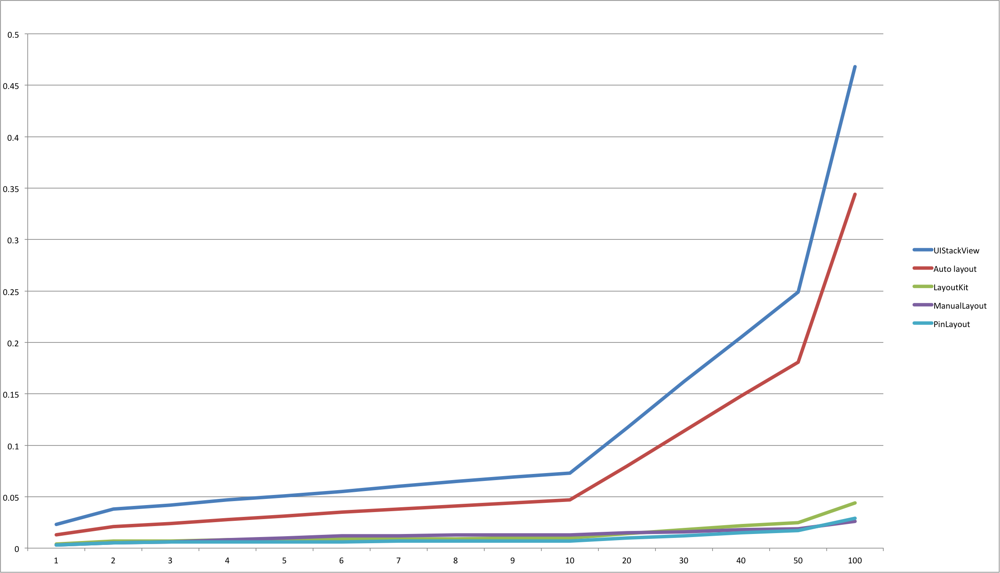
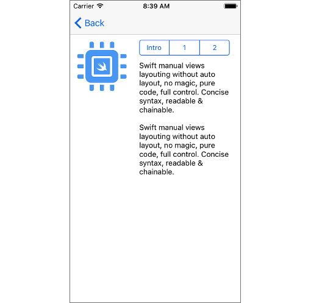

<p align="center">
  <a href="https://github.com/mirego/PinLayout"></a>
</p>

<h1 align="center" style="color: #376C9D; font-family: Arial Black, Gadget, sans-serif; font-size: 3em">PinLayout</h1>
 
<p align="center">
  <a href="https://travis-ci.org/mirego/PinLayout"></a>
  <a href="https://codecov.io/gh/mirego/PinLayout"></a>
  <a href='https://img.shields.io/cocoapods/v/PinLayout.svg'></a>
  <a href="https://github.com/Carthage/Carthage"></a>
  <a href="https://raw.githubusercontent.com/mirego/PinLayout/master/LICENSE"></a>
  <a href=""></a>
  <!--a href="https://github.com/mirego/PinLayout/issues"></a-->
</p>

<br>

Extremely Fast views layouting without auto layout. No magic, pure code, full control and blazing fast. Concise syntax, intuitive, readable & chainable.
  
> "No auto-layout constraints attached"

<br>

* [PinLayout principles and philosophy](#introduction)
* [Performance](#performance)
* [Documentation](#documentation)
    * [Layout using distances from superview’s edges](#distance_from_superview_edge) 	  
    * [Anchors](#anchors)
    * [Edges](#edges)
    * [Relative positionning](#relative_positionning)
   	* [Width, height and size](#width_height_size)
   	* [Margins](#margins)
   	* [Warnings](#warnings)
   	* [More examples](#more_examples)

* [Installation](#installation)
* [FAQ](#faq)
* [Comments, ideas, suggestions, issues, ....](#comments)

<br>

## PinLayout principles and philosophy <a name="introduction"></a>

* Manual layouting (doesn't rely on auto layout).
* Blazing fast. PinLayout exist to be simple and fast as possible! In fact it is fast as manual layouting. See [performance results below.](#performance)
* Layout one view at a time. 
* Concise syntax. Layout most views using a single line. 

* Stateless
	* PinLayout doesn’t add any stored properties to UIViews. It simply computes the UIView.frame property, one view at a time.
	* Since it is stateless, it can be used with any other layout framework without conflicts. 
Each view can use the layout system that better suit it  (PinLayout, constraints, flexbox, grids, …)
A view can be layouted using PinLayout and later with another method/framework.

* No constraints/No auto-layout
	* Constraints are verbose and hard for a human brains to understand when there are many views implicated, even with sugar-syntax frameworks.
	* PinLayout positions views as a designer would explain it (eg: “The TextField is below the Label, aligned left, and is its width matches the other view’s width“). 
	* No priorities, simply layout views in the order that makes sense. No priorities required.

* Before applying the new sets of attributes, PinLayout always start with the view’s current frame. So it’s possible to set the view’s size during the initialization (ex: view.pin.width(100).height(200)), and later only position the view (ex: view.pin.top(10).left(20)). This makes PinLayout really animation friendly.

* Not too intrusive. PinLayout only adds three properties to existing iOS classes: `UIView.pin`, `UIView.anchor` and `UIView.edge`

* Minimize as much as possible calculations and constants when layouting views.

* Methods match as much as possible other layouting systems, including CSS, flexbox, reactive Flexbox, …
	* margin, marginHorizontal, marginVertical, marginTop, marginLeft, marginBottom, marginRight
	* top, left, bottom, right, width, height  
	* As in CSS and flexbox, right and bottom coordinates are offset from container view's right and bottom edges.

* Shorter possible commands to layout views, but keeping english phrasing almost valid.

<br>

# PinLayout's Performance <a name="performance"></a>

PinLayout's performance has been measured using the excellent LayoutKit benchmark. PinLayout has been added to this benchmark to compare its performance. 

As you can see in the following chart, PinLayout's performance is as fast as manual layouting, and up to **12x faster than auto layout**, and **16x faster than UIStackViews**. 

These results also means that **PinLayout is by far faster than any layout frameworks that is built over auto layout**. 

[More details and explanation of the benchmark](docs/Benchmark.md)

<p align="center"> Tested on a iPhone 6S iOS 10.3.2</p>
<p align="center">
  
</p>
<p align="center" style="font-size:9px;">X axis in the number cells in a UICollectionView, and Y axis is the time in miliseconds to layout all cells.</p>
</p> 

<br/>

# Usage sample
###### Example:
This example layout an image, a UISegmentedControl and a label.

* Logo image:
   * Its size is set to 100x100 
   * The logo is layouted below the UINavigationBar with a margin of 10 pixels all around.
* UISegmentedControl 
  * Layout it at the right of the logo
  * Use the remaining horizontal space with a left and right margin of 20 pixels.
* UILabel
  * Layout the label below the UISegmentedControl with a top margin of 10 pixels.
  * Adjust the label's width to match the UISegmentedControl's width.
  * Adjust the label's height to fit its new width. (calls internally UILabel's sizeThatFits() method)




```javascript
override func layoutSubviews() {
   super.layoutSubviews() 
    
   logo.pin.topLeft().size(100).margin(74, 10, 10)
   segmented.pin.right(of: logo, aligned: .top).right().marginHorizontal(20)
   textLabel.pin.below(of: segmented, aligned: .left).width(of: segmented).pinEdges().marginTop(10).sizeToFit()
}
``` 

:pushpin: This example and some other examples are available in the **Example** project. Please note that you must do a `pod install` before running the example project. 

:pushpin: PinLayout doesn't use auto layout constraints, it is a framework that manually layout views. For that reason you need to update the layout inside either `UIView.layoutSubviews()` or `UIViewController.viewDidLayoutSubviews()` to handle container size's changes, including device rotation. You'll also need to handle UITraitCollection changes for app's that support multitask. In the example above PinLayout's commands are inside UIView's `layoutSubviews()` method.

<br/>

# Documentation <a name="documentation"></a>

## Layout using distances from superview’s edges <a name="distance_from_superview_edge"></a>

PinLayout can position a view’s edge relative to its superview edges.

**Methods**:

* `top(_ value: CGFloat)`  
The value specifies the top edge distance from the superview's top edge in pixels.
* `top(_ percent: Percent)`  
The value specifies the top edge distance from the superview's top edge in percentage of its superview's height.
* `left(_ value: CGFloat)`  
The value specifies the left edge distance from the superview's left edge in pixels.
* `left(_ percent: Percent)`  
The value specifies the left edge distance from the superview's left edge in percentage of its superview's width.
* `bottom(_ value: CGFloat)`  
The value specifies the bottom edge distance from the superview's bottom edge in pixels.
* `bottom(_ percent: Percent)`  
The value specifies the bottom edge distance from the superview's bottom edge in percentage of its superview's height.
* `right(_ value: CGFloat)`  
The value specifies the right edge distance from the superview's right edge in pixels.
* `right(_ percent: Percent)`  
The value specifies the right edge distance from the superview's right edge in percentage of its superview's width.
* `hCenter(_ value: CGFloat)`  
The value specifies the horizontal center distance from the superview's left edge in pixels.
* `hCenter(_ percent: Percent)`  
The value specifies the horizontal center distance from the superview's left edge in percentage of its superview's width.
* `vCenter(_ value: CGFloat)`  
The value specifies the vertical center distance from the superview's top edge in pixels.
* `vCenter(_ percent: Percent)`  
The value specifies the vertical center distance from the superview's top edge in percentage of its superview's height.

###### Usage Examples:

```
    view.pin.top(20).left(20)
    view.pin.top(25%).hCenter(0)
    view.pin.left(12).vCenter(100)
```

###### Example:
This example layout the view A to fit its superview frame with a margin of 10 pixels. It pins the top, left, bottom and right edges.


```javascript
    viewA.pin.top(10).left(10).bottom(10).right(10)
``` 
Another possible solution using other PinLayout's methods (more details later):

```javascript
    view.pin.topLeft().bottomRight().margin(10)
```

<br/>

### Position view directly on superview’s edges 

PinLayout also has shorter version that pins a view’s edge **directly** on its superview's corresponding edge.

**Methods**:

* `top()`  
Position the view top edge directly on its superview top edge. Similar to calling `top(0)`.
* `left()`  
Position the view left edge directly on its superview top edge. Similar to calling `left(0)`.
* `bottom()`  
Position the view bottom edge directly on its superview top edge. Similar to calling `bottom(0)`.
* `right()`  
Position the view right edge directly on its superview top edge. Similar to calling `right(0)`.
* `hCenter()`  
Position the view horizontal center directly on its superview horizontal center. Similar to calling `hCenter(superview.frame.width / 2)`.
* `vCenter()`  
Position the view vertical center directly on its superview vertical center. Similar to calling `hCenter(superview.frame.height / 2)`.

###### Usage examples:
```javascript
	view.pin.top().left()
	view.pin.bottom().right()
	view.pin.hCenter().vCenter()
```

###### Example:
This example is similar to the previous example, but pins edges directly on superview’s edges. It will layout the view A to fit its superview frame with a margin of 10 pixels.


```
    viewA.pin.top().left().bottom().right().margin(10)
``` 

<br/>

## Anchors <a name="anchors"></a>

### PinLayout UIView’s anchors

PinLayout add anchors properties to UIViews. These properties are used to reference other view’s anchors.

**PinLayout UIView’s anchors**:

* `UIView.anchor.topLeft`
* `UIView.anchor.topCenter`
* `UIView.anchor.topRight`
* `UIView.anchor.leftCenter`
* `UIView.anchor.centers`
* `UIView.anchor.rightCenter`
* `UIView.anchor.bottomLeft`
* `UIView.anchor.bottomCenter`
* `UIView.anchor.bottomRight`


<br/>

---
### Layout using anchors

PinLayout can use anchors to position view’s related to other views.

Following methods position the corresponding view anchor on another view’s anchor.

**Methods:**

* `topLeft(to anchor: Anchor)`
* `topCenter(to anchor: Anchor)`
* `topRight(to anchor: Anchor)`
* `leftCenter(to anchor: Anchor)`
* `center(to anchor: Anchor)`
* `rightCenter(to anchor: Anchor)`
* `bottomLeft(to anchor: Anchor)`
* `bottomCenter(to anchor: Anchor)`
* `bottomRight(to anchor: Anchor)`

:pushpin: These methods can pin a view’s anchor to any other view's anchor, even if don't have the same direct superview! It works with any views that have at some point the same ancestor. 

###### Usage examples:
```javascript
    view.pin.topCenter(to: view1.anchor.bottomCenter)
    view.pin.topLeft(to: view1.anchor.topLeft).bottomRight(to: view1.anchor.center)
```

###### Example:

Layout using an anchors. This example pins the view B topLeft anchor on the view A topRight anchor.


```javascript
	viewB.pin.topLeft(to: viewA.anchor.topRight)
``` 

<br/>

###### Example:

Layout using multiple anchors.
 
It is also possible to combine two anchors to pin the position and the size of a view. The following example will position the view C between the view A and B with horizontal margins of 10px.


```javascript
	viewC.pin.topLeft(to: viewA.anchor.topRight)
	         .bottomRight(to: viewB.anchor.bottomLeft).marginHorizontal(10)
``` 

<br/>

---
### Layout using superview’s anchors

PinLayout also has a shorter version that pins a view's anchor **directly** on its corresponding superview’s anchor.

The following methods position the corresponding view's anchor on another view’s anchor.

**Methods:**

* `topLeft()`
* `topCenter()`
* `topRight()`
* `leftCenter()`
* `center()`
* `rightCenter()`
* `bottomLeft()`
* `bottomCenter()`
* `bottomRight()`

###### Example:
For example .topRight() will pin the view’s topRight anchor on its superview’s topRight anchor..


```javascript
	viewA.pin.topRight()
``` 

This is equivalent to:

```javascript
	viewA.pin.topRight(to: superview.pin.topRight)
```

<br/>

## Edges <a name="edges"></a>

### PinLayout UIView’s edges

PinLayout adds edges properties to UIViews. These properties are used to reference other view’s edges.

**PinLayout UIView’s edges**:

* `UIView.edge.top`
* `UIView.edge.left`
* `UIView.edge.bottom`
* `UIView.edge.right`


---
### Layout using edges

PinLayout has methods to attach a UIView's edge (top, left, bottom or right edge) to another view’s edge.

**Methods:**

* `top(to edge: VerticalEdge)`
* `left(to: edge: HorizontalEdge)`
* `bottom(to edge: VerticalEdge)`
* `right(to: edge: HorizontalEdge)`

:pushpin: These methods can pin a view’s edge to any other view's edge, even if don't have the same direct superview! It works with any views that have at some point the same ancestor. 

###### Usage examples:
```javascript
	view.pin.left(to: view1.edge.right)
	view.pin.left(to: view1.edge.right).top(to: view2.edge.right)
```

###### Example:
Layout using an edge.

The following example will layout the view B left edge on the view A right edge. It only change the view B left coordinate


```javascript
	viewB.pin.left(to: viewA.edge.right)
```

<br/>

## Relative positionning <a name="relative_positionning"></a>

### Layout using edges relative positioning

PinLayout also has methods to position relative to another view.
This is similar to pinning to an edge with a slightly different syntax.

**Methods:**

* `above(of UIView)`  
Position the view above the specified view. This method is similar to pinning the view’s bottom edge.
* `below(of UIView)`  
Position the view below the specified view. This method is similar to pinning the view’s top edge.
* `left(of UIView)`  
Position the view left of the specified view. This method is similar to pinning the view’s right edge.
* `right(of UIView)`  
Position the view right of the specified view. This method is similar to pinning the view’s left edge.

:pushpin: These methods can pin a view’s relative to any views, even if don't have the same direct superview! It works with any views that have at some point the same ancestor. 

###### Usage examples:
```javascript
	view.pin.above(of: view2)
	view.pin.left(of: view2, aligned: .top)
	view.pin.left(of: view1).above(of: view2).below(of: view3).right(of: view4)
```

###### Example:
The following example will position the view C between the view A and B with margins of 10px using relative positioning methods.


```javascript
	viewC.pin.top().left(of: viewA).right(of: viewB).margin(10)
```
This is an equivalent solution using [edges](#edge):

```javascript
	viewC.pin.top().left(to: viewA.edge.right).right(to: viewB.edge.left).margin(10)
```

This is also an equivalent solution using [relative positioning and alignment](#relative_positionning_w_alignment) explained in the next section:

```javascript
	viewC.pin.left(of: viewA, aligned: .top).right(of: viewB, aligned: top).marginHorizontal(10)
```


<br/>

### Layout using relative positioning and alignment <a name="relative_positionning_w_alignment"></a>

PinLayout also has methods to position relative to another view but with also the ability of specifying the alignment.
This is similar to pinning to an anchor with a more natural syntax.

**Methods:**

* `above(of UIView, aligned: HorizontalAlignment)`
* `below(of UIView, aligned: HorizontalAlignment)`
* `left(of UIView, aligned: VerticalAlignment)`
* `right(of UIView, aligned: VerticalAlignment)`

###### Usage examples:
```javascript
	view.pin.above(of: view2, aligned: .left)
	view.pin.above(of: view2, aligned: .right)
	view.pin.left(of: view2, aligned: .top)
```

###### Example:
The following example layout the view B below the view A aligned on its center.


```javascript
	viewB.pin.below(of: viewA, aligned: .center)
```
This is an equivalent solutions using anchors:

```javascript
	viewB.pin.topCenter(to: viewA.anchor.bottomCenter)
```

<br/>

## Width, height and size <a name="width_height_size"></a>

### Adjust view width, height and size
PinLayout has methods to set the view’s height and width.

**Methods:**

* `width(_ width: CGFloat)`  
The value specifies the width of the view in pixels. Value must be non-negative.
* `width(percent: Percent)`  
The value specifies the width of the view in percentage of its superview. Value must be non-negative.
* `width(of view: UIView)`  
Set the view’s width to match the referenced view’s width.

* `height(_ height: CGFloat)`  
The value specifies the height of the view in pixels.
* `height(percent: Percent)`  
The value specifies the height of the view in percentage of its superview. Value must be non-negative.
* `height(of view: UIView)`  
Set the view’s height to match the referenced view’s height

* `size(_ size: CGSize)`  
The value specifies the size (width and value) of the view in pixels. Values must be non-negative.
* `size(_ percent: Percent)`  
The value specifies the width and the height of the view in percentage of its superview. Values must be non-negative.
* `size(_ sideLength: CGFloat)`  
The value specifies the width and the height of the view in pixels, creating a square view. Values must be non-negative.
* `size(of view: UIView)`  
Set the view’s size to match the referenced view’s size


###### Usage examples:
```javascript
	view.pin.width(50%)
	view.pin.width(100)
	view.pin.width(of: view1)
	
	view.pin.height(100%)
	view.pin.height(200)
	
	view.pin.size(of: view1)
	view.pin.size(50%)
	view.pin.size(250)
```

<br/>

## Margins <a name="margins"></a>
PinLayout applies margins similar to CSS. 


### PinLayout's margins

PinLayout has methods to apply margins.

**Methods:**

* `marginTop(_ value: CGFloat) `
* `marginLeft(_ value: CGFloat)`
* `marginBottom(_ value: CGFloat)`
* `marginRight(_ value: CGFloat)`

* `marginHorizontal(_ value: CGFloat)`
* `marginVertical(_ value: CGFloat)`

* `margin(_ value: CGFloat) `
* `margin(_ vertical: CGFloat, _ horizontal: CGFloat)`
* `margin(_ top: CGFloat, _ horizontal: CGFloat, _ bottom: CGFloat)`
* `margin(_ top: CGFloat, _ left: CGFloat, _ bottom: CGFloat, _ right: CGFloat) `

* `pinEdges()`

###### Usage examples:
```javascript
	view.pin.topLeft().margin(20)
	view.pin.bottom().marginBottom(20)
	view.pin.left().right().marginHorizontal(20)
	view.pin.topLeft().bottomRight().margin(10, 12, 0, 12)
```

<br>

### PinLayout margin rules
The following section explains how CSS/PinLayout margin rules are applied. 

#### When and how horizontal margins are applied in PinLayout?

This table explains how and when **left and right margins** are applied depending on which view’s attribute has been pinned using PinLayout.

| View’s pinned attributes | Left Margin                               | Right Margin                               |
|--------------------------|:-------------------------------------------:|:--------------------------------------------:|
| **Left**                     | *Move view right*                           | *-*                                |
| **Left and Width**           | *Move view right*                           | *-*                                |
| **Right**                    | *-*                               | *Move view left*                             |
| **Right and Width**          | *-*                               | *Move view left*                             |
| **Left and Right**           | *Reduce the width to apply the left margin* | *Reduce the width to apply the right margin* |

NOTE: `-` indicates that the margin is not applied.

<br>

#### When and how does vertical margins are applies in PinLayout?

This table explains how and when **top and bottom margins** are applied depending on which view’s attribute has been pinned using PinLayout.

| View’s pinned attributes | Left Margin                               | Right Margin                               |
|--------------------------|:-------------------------------------------:|:--------------------------------------------:|
| **Top**                     | *Move view down*                           | *-*                                |
| **Top and Height**           | *Move view down*                           | *-*                                |
| **Bottom**                    | *-*                               | *Move view up*                             |
| **Bottom and Height**          | *-*                               | *Move view up*                             |
| **Top and Bottom**           | *Reduce the height to apply the top margin* | *Reduce the height to apply the bottom margin* |

<br>

### Margin examples

###### Example 1:
In this example, only the **left** margin is applied


```javascript
	view.pin.left().margin(10)
```

###### Example 2:
In this example, only the **right** margin is applied


```javascript
	view.pin.right().width(100).marginHorizontal(10)
```

###### Example 3:
In this example, the **left** and **right** margins are applied


```javascript
	view.pin.left().right().margin(10)
```

###### Example 4:
In this example, **left**, **right** and **top** margins are applied. Note that the view’s width has been reduced to apply left and right margins.


```javascript
	view.pin.topLeft().right().height(100).margin(10)
```

###### Example 5:
In this example, **left**, **right**, **top** and **bottom** margins are applied.


```javascript
	view.pin.topLeft().bottomRight().margin(10)
```

<br>

### pinEdges()
The `pinEdges()` method pins the four edges (top, left, bottom and right edges) before applying margins. 

This method is useful in situations where the width and/or the height attributes have been pinned.
This method is an add-on, there is no equivalent in CSS.


###### Example without `pinEdges`
Without `pinEdges()` margins rules would be applied and the view would be moved to the left.


```javascript
	view.pin.left().width(percent: 100).marginHorizontal(20)
```


###### Example with `pinEdges`

With `pinEdges()` the left and right margins are applied even if only the left and width has been set. The reason is the call to pinEdges() has pinned the two horizontal edges at their position before applying margins.


```javascript
	view.pin.left().width(percent: 100).pinEdges().marginHorizontal(20)
```

<br>

NOTE: In that in that particular situation, the same results could have been achieved differently too:


```javascript
	view.pin.left().right().marginHorizontal(20)
```


<br>


## Warnings <a name="warnings"></a>
### PinLayout's warnings
In debug, PinLayout will display warnings when pin rules cannot be applied. 

**Warning reasons**

* The newly pinned attributes conflict with other already pinned attributes.   
Example:  
`view.pin.left(10).right(10).width(200)`  
👉 Layout Conflict: `width(200) won't be applied since it conflicts with the following already set properties: left: 0, right: 10.`
 
* The newly pinned attributes have already been set to another value.  
Example:  
`view.pin.width(100).width(200)`  
👉 Layout Conflict: `width(200) won't be applied since it value has already been set to 100.`

* The view being layout hasn’t been added yet into a superview  
Example:  
`view.pin.width(100)`  
👉 Layout Warning: `width(100) won't be applied, the view must be added as a sub-view before being layouted using this method.`

* A view is used as a reference, either directly or using its anchors or its edges, but hasn’t been added yet to a superview.   
Example:  
`view.pin.left(of: view2)`  
👉 Layout Warning: `left(of: view2) won't be applied, the view must be added as a sub-view before being used as a reference.`

* The width and the height must be non negative values.  
Example:  
`view.pin.width(-100)`  
👉 Layout Warning: `The width (-100) must be greater or equal to 0.`


width and/or height cannot be determined using current PinLaoyout's commands

size(...)'s height won't be aplied...
size(...)'s widht won't be applied....

### Disabling warnings

Warnings can be disabled in debug mode too by setting the boolean PinLayoutLogConflicts to false.

<br/>

## PinLayout style guide

* You should always specifies methods in the same order, it makes layout lines easier to understand. Here is our prefered ordering:  
`view.pin.[EDGE|ANCHOR|RELATIVE].[WIDTH|HEIGHT|SIZE].[pinEdges()].[MARGINS].[sizeToFit()]`  

   This order reflect the logic inside PinLayout. `pinEdges()` is applied before margins and margins are applied before `sizeToFit()`.    

	```javascript
	view.pin.top().left(10%).margin(10, 12, 10, 12)
	view.pin.left().width(100%).pinEdges().marginHorizontal(12)
	view.pin.left().right().margin(0, 12).sizeToFit()
	view.pin.width(100).height(100%)
	```

* If the layout line is too long, you can split in multiple lines:  

	```
	textLabel.pin.below(of: titleLabel)
	   .right(of: statusIcon).left(of: accessoryView)
	   .above(of: button).marginHorizontal(10)
	```

<br/>

## More examples<a name="more_examples"></a>

### Adjust to container size
The following examples show how PinLayout can be used to adjust views size and position to the size of their container. in this case containers are cells.


Cell A:

* A1 is left aligned with a width of 50px
* A2 fills the remaining space

```javascript
	a1.pin.topLeft().bottom().width(50)
	a2.pin.right(of: a1, aligned: .top).bottomRight().marginLeft(10)
```

Cell B:

* B2 is right aligned with a fixed width of 50px
* B1 fills the remaining space

```javascript
	b2.pin.topRight().bottom().width(50)
	b1.pin.left(of: b2, aligned: .top).bottomLeft().marginRight(10)
```

Cell C:

* C2 is centered with a fixed width of 50px
* C1 fills the remaining left space
* C3 fills the remaining right space

```javascript
	c2.pin.topCenter().width(50).bottom()
	c1.pin.left(of: c1, aligned: .top).bottomLeft().marginRight(10)
	c3.pin.right(of: c2, aligned: .top).bottomRight().marginLeft(10)
```

Cell D:

* D1 takes 25% of its container width
* D2 takes 50% of its container width
* D3 fills the remaining space

```javascript
	d1.pin.topLeft().bottom().width(25%)
	d2.pin.right(of: d1, aligned: .top).bottom().width(50%).marginLeft(10)
	d3.pin.right(of: d2, aligned: .top).bottomRight().marginLeft(10)
```

<br>

## Installation <a name="installation"></a>

### CocoaPods

To integrate PinLayout into your Xcode project using CocoaPods, specify it in your `Podfile`:

```ruby
    pod 'PinLayout'
```

Then, run `pod install`.

### Carthage

To integrate PinLayout into your Xcode project using Carthage, specify it in your `Cartfile`:

```ogdl
github "mirego/PinLayout"
```

Then, run `carthage update` to build the framework and drag the built `PinLayout.framework` into your Xcode project.

### Swift Package Manager

Once you have your Swift package set up, you only need to add PinLayout as a dependency of your `Package.swift`.

```ogdl
dependencies: [
    .Package(url: "https://github.com/mirego/PinLayout.git", majorVersion: 1)
]
```

<br>

## Coming soon <a name="coming_soon"></a>
* minWidth/maxWidth, minHeight/maxHeight
* CALayer support
* ...


## FAQ <a name="faq"></a>

*  **Q: When the device rotation change, the layout is not updated.**  
   **R:** PinLayout doesn't use auto layout constraints, it is a framework that manually layout views. For that reason you need to update the layout inside either `UIView.layoutSubviews()` or `UIViewController.viewDidLayoutSubviews()` to handle container size's changes, including device rotation. You'll also need to handle UITraitCollection changes for app's that support multitask.
   
* **Q: How to apply percentage from a CGFloat, a Float or a Int value?**  
  **R:** Many PinLayout's method has a parameter of type `Percent`. You can easily specify this type of parameter simply by adding the `%` operator to your value (eg: `view.pin.left(10%).width(50%)`. It is similar if you have a value of type  CGFloat, Float or Int, simply adds the `%` operator:  
  
	``` 
	let percentageValue: CGFloat = 50
	view.pin.width(percentageValue%)
	``` 
<br>

### Comments, ideas, suggestions, issues, .... <a name="comments"></a>
For any **comments**, **ideas**, **suggestions**, **issues**, simply open an [issue](https://github.com/mirego/PinLayout/issues).


### Thanks
PinLayout was inspired by other great layout frameworks, including:

* [MCUIViewLayout](https://github.com/mirego/MCUIViewLayout)
* HTML's CSS
* [SnapKit](https://github.com/SnapKit/SnapKit)
* [Stevia](https://github.com/freshOS/Stevia)
* ... and even Auto layout :-)


## License
BSD 3-Clause License
