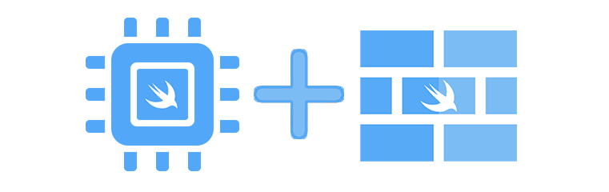
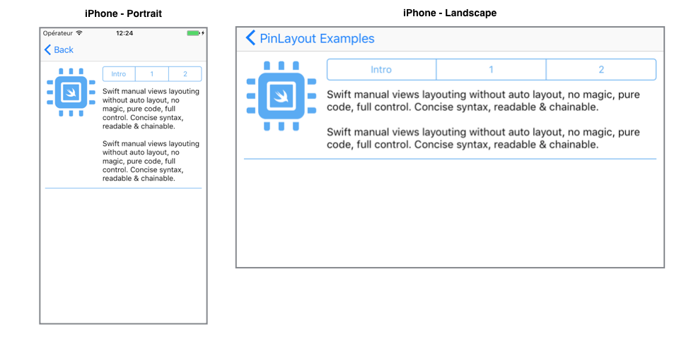
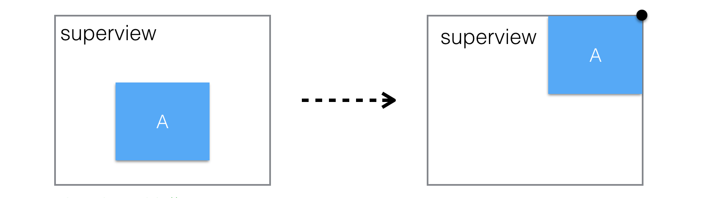
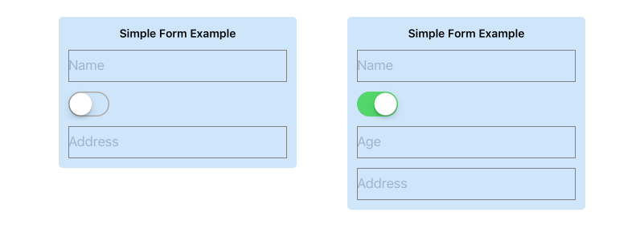
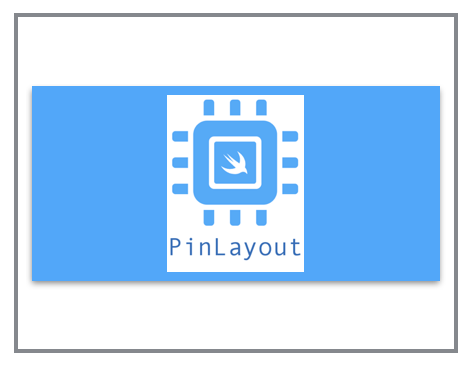
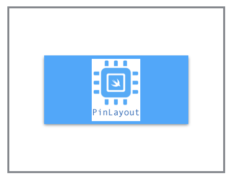
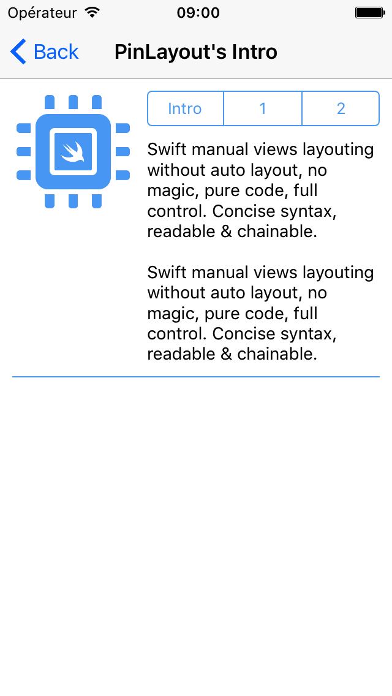

<p align="center">
  <a href="https://github.com/mirego/PinLayout"></a>
</p>
 
<p align="center">
  <a href=""></a>
  <a href="https://travis-ci.org/mirego/PinLayout"></a>
  <a href="https://codecov.io/gh/mirego/PinLayout"></a>
  <a href="https://github.com/Carthage/Carthage"></a>
  <a href="https://raw.githubusercontent.com/mirego/PinLayout/master/LICENSE"></a>
  <a href="https://github.com/mirego/PinLayout/issues"></a>
</p>
<p align="center">
  <a href='https://cocoapods.org/pods/PinLayout'></a>
  <a href='https://cocoapods.org/pods/PinLayout'></a>
  <a href='https://cocoapods.org/pods/PinLayout'></a>
</p>

Extremely Fast views layouting without auto layout. No magic, pure code, full control and blazing fast. Concise syntax, intuitive, readable & chainable.
  
> "No Auto layout constraints attached"


### Requirements
* iOS 8.0+ / tvOS 9.0+
* Xcode 8.0+ / Xcode 9.0
* Swift 3.0+ / Swift 4.0 / Objective-C

### Content

* [Introduction examples](#intro_usage_examples)
* [PinLayout principles and philosophy](#introduction)
* [Performance](#performance)
* [Documentation](#documentation)
  * [Right to left languages (RTL) support](#rtl_support)
  * [Layout using distances from superview’s edges](#distance_from_superview_edge) 
  * [Edges](#edges)
  * [Anchors](#anchors)
  * [Relative positioning](#relative_positioning)
  * [Width, height and size](#width_height_size)
  * [minWidth, maxWidth, minHeight, maxHeight](#minmax_width_height_size)
  * [Aspect Ratio](#aspect_ratio)
  * [justify, align](#justify_align)
  * [Margins](#margins)
  * [UIView's transforms](#uiview_transform)
  * [Warnings](#warnings)
  * [More examples](#more_examples)
* [Examples App](#examples_app)
* [PinLayout in Xcode Playgrounds](#playgrounds)
* [PinLayout using Objective-C](#objective_c_interface)
* [Installation](#installation)
* [FAQ](#faq)
* [Comments, ideas, suggestions, issues, ...](#comments)

<br>

:pushpin: PinLayout is actively updated. So please come often to see latest changes. You can also **Star** it to be able to retrieve it easily later.

Features coming soon:
* Possibilities of layouting multiple views using containers (column / row)
* macOS support


### PinLayout + FlexLayout

<a href="https://github.com/mirego/PinLayout"></a>

**PinLayout** is a companion of **[FlexLayout](https://github.com/layoutBox/FlexLayout)**. They share a similar syntax and method names. FlexLayout is a flexbox implementation.

* A view can layouts its subviews using PinLayout, FlexLayout, or both!
* FlexLayout it is particularly useful in situations where you need to layouts many views but don't require the PinLayout's finest control nor complex animations.
* A view layouted using PinLayout can be embedded inside a FlexLayout's container and reversely. You choose the best layout framework for your situation. 

<br>

<a name="intro_usage_examples"></a>
# Introduction examples 

###### Example 1:
This example layout an image, a UISegmentedControl, a label and a line separator. This example adjusts its content to match the device's size and orientation changes.

* **UIImageView**'s size is 100x100 and layouted below the UINavigationBar with a margin of 10 pixels all around.
* **UISegmentedControl** is at the right of the logo image, use the remaining horizontal space with a left and right margin of 20 pixels.
* **UILabel** is below the UISegmentedControl with a top margin of 10 pixels. Its width matched the UISegmentedControl's width. The label is multiline, so its height must be adjusted to fit its width.
* **Separator** is below the UIImageView and the UILabel, i.e. below the tallest one. The separator has a top margin of 10 pixels, left-aligned to the UIImageView and right-aligned to the UISegmentedControl.


<a href="https://github.com/mirego/PinLayout/blob/master/Example/PinLayoutSample/UI/Examples/Intro/IntroView.swift"></a>

```swift
override func layoutSubviews() {
   super.layoutSubviews() 
    
   logo.pin.top().left().width(100).aspectRatio().margin(10)
   segmented.pin.after(of: logo, aligned: .top).right().marginHorizontal(10)
   textLabel.pin.below(of: segmented, aligned: .left).right().marginTop(10).marginRight(10).sizeToFit(.width)
   separatorView.pin.below(of: [logo, textLabel], aligned: .left).right(to: segmented.edge.right).marginTop(10)
}
``` 

:pushpin: 4 views, 4 lines!

:pushpin: PinLayout doesn't use auto layout constraints, it is a framework that manually layout views. For that reason you need to update the layout inside either `UIView.layoutSubviews()` or `UIViewController.viewDidLayoutSubviews()` to handle container size's changes, including device rotation. You'll also need to handle UITraitCollection changes for app's that support multitasking. In the example above PinLayout's commands are inside UIView's `layoutSubviews()` method.

:pushpin: This example is available in the [Examples App](#examples_app). See example complete [source code](https://github.com/mirego/PinLayout/blob/master/Example/PinLayoutSample/UI/Examples/Intro/IntroView.swift)

<br/>

###### Example 2:
This example shows how easily PinLayout can adjust its layout based on the view's container size. 

* If the container's width is smaller than 500 pixels, the label takes the full width and the UISegmentedControl is placed below it.
* If the container's width is greater or equal to 500 pixels, the UISegmentedControl is at the top-right corner and the label takes the remaining horizontal space.

<a href="https://github.com/mirego/PinLayout/blob/master/Example/PinLayoutSample/UI/Examples/AdjustToContainer/Subviews/ChoiceSelectorView.swift"></a>


```swift
  let margin: CGFloat = 12
        
  if frame.width < 500 {
      textLabel.pin.top().left().right().margin(margin).sizeToFit(.width)
      segmentedControl.pin.below(of: textLabel).right().margin(margin)
  } else {
      segmentedControl.pin.top().right().margin(margin)
      textLabel.pin.top().left().before(of: segmentedControl).margin(margin).sizeToFit(.width)
  }
``` 

:pushpin: Would it be easier using auto layout?

:pushpin: This example is available in the [Examples App](#examples_app). See example complete [source code](https://github.com/mirego/PinLayout/blob/master/Example/PinLayoutSample/UI/Examples/AdjustToContainer/Subviews/ChoiceSelectorView.swift)

<br/>

<a name="introduction"></a>
## PinLayout principles and philosophy 

* Manual layouting (doesn't rely on auto layout).
* PinLayout exist to be simple and fast as possible! In fact, it is fast as manual layouting. See [performance results below.](#performance)
* Full control: You're in the middle of the layout process, no magic black box. 
	* You can add conditions (if/switch/guard/...) related to the device orientation, device type, traitCollection, animations, ...
	* You can add iterations and enumerations (for/while/forEach/...)
* Layout one view at a time. Make it simple to code and debug.
* Concise syntax. Layout most views using a single line. 

* Stateless
	* PinLayout doesn’t add any stored properties to UIViews. It simply computes the UIView.frame property, one view at a time.
	* Since it is stateless, it can be used with any other layout framework without conflicts. 
Each view can use the layout system that better suit it  (PinLayout, constraints, flexbox, grids, …)

* No Auto layout and constraints
	* Constraints are verbose and hard for a human brains to understand when there are many views implicated, even with sugar-syntax frameworks.
	* PinLayout positions views as a designer would explain it (eg: “The TextField is below the Label, aligned left, and is its width matches the other view’s width“). 
	* No priorities, simply layout views in the order that makes sense. No priorities required.

* Before applying the new sets of attributes, PinLayout always start with the view’s current frame. So its possible to set the view’s size during the initialization (ex: view.pin.width(100).height(200)), and later only position the view (ex: view.pin.top(10).left(20)). This makes PinLayout really animation friendly.

* Not too intrusive. PinLayout only adds three properties to existing iOS classes: `UIView.pin`, `UIView.anchor` and `UIView.edge`

* Minimize as much as possible calculations and constants when layouting views. But it is always possible to add advanced computation if required.

* Method's name match as much as possible other layout frameworks, including [FlexLayout](https://github.com/layoutBox/FlexLayout)/flexbox, CSS, React Native, …

<br>

:pushpin: PinLayout doesn't support Auto layout nor Storyboard. Interesting quote:
> "UIKit Auto Layout and InterfaceBuilder are not supported by Texture. It is worth noting that both of these technologies are not permitted in established and disciplined iOS development teams, such as at Facebook, Instagram, and Pinterest"
>
> -- <cite>[Pinterest/Facebook Texture's documentation](http://texturegroup.org/docs/faq.html#asyncdisplaykit-does-not-support-uikit-auto-layout-or-interfacebuilder)</cite>

<br>

<a name="performance"></a>
# PinLayout's Performance 

PinLayout's performance has been measured using the [Layout Framework Benchmark](https://github.com/layoutBox/LayoutFrameworkBenchmark). FlexLayout and [PinLayout](https://github.com/mirego/PinLayout) has been added to this benchmark to compare their performance. 

As you can see in the following chart, PinLayout are faster or equal to manual layouting, and **between 12x and 16x faster than auto layout**, and this for all types of iPhone (5/6/6S/7/8)

[See here a more complete details, results and explanation of the benchmark](docs/Benchmark.md).

<p align="center">
  
</p>

<br/>

<a name="documentation"></a>
# Documentation 

<a name="rtl_support"></a>
## Right to left languages (RTL) support 
PinLayout supports left-to-right (LTR) and right-to-left (RTL) languages. 

Every method/properties with a name containing `left`/`right`, has RTL enabled equivalent methods with a name containing `start`/`end`.

Using `start` or `end` methods, you can position views without having to think about whether your item will show up on the left or the right side of the screen (depending on the person’s language). 

:pushpin: In this documentation all methods that support RTL languages are marked using the following icon :left_right_arrow: 

**Method**:

* **`Pin.layoutDirection(direction: LayoutDirection)`**:left_right_arrow::  
Set the PinLayout layout direction. Note that this set PinLayout's layout direction globally. By default PinLayout use the left-to-right direction.

	Layout direction modes:
	* `.ltr`: Layout views from left to right. (Default)
	* `.rtl`: Layout views from right to left.
	* `.auto`: Layout views based on `UIView.userInterfaceLayoutDirection(for: semanticContentAttribute)` (>= iOS 9) or `UIApplication.shared.userInterfaceLayoutDirection` (< iOS 9). If you want to control the layout direction individually for each views, you should use this mode and control the view's layout direction using `UIView.userInterfaceLayoutDirection` property.

RTL full documentation coming soon....

:pushpin: See the RTL enabled "Introduction example" [source code](https://github.com/mirego/PinLayout/blob/master/Example/PinLayoutSample/UI/Examples/IntroRTL/IntroRTLView.swift). This example is available in the [Examples App](#examples_app)

<br/>

<a name="distance_from_superview_edge"></a>
## Layout using distances from superview’s edges 

PinLayout can position a view’s edge relative to its superview edges.

**Methods**:

* **`top(_ value: CGFloat)`**  / **`top(_ percent: Percent)`**  / **`top()`**  
The value specifies the top edge distance from the superview's top edge in pixels (or in percentage of its superview's height).  
`top()` is similar to calling `top(0)`, it position the view top edge directly on its superview top edge.

* **`vCenter(_ value: CGFloat)`** / **`vCenter(_ percent: Percent)`** / **`vCenter()`**  
The value specifies the distance vertically of the view's center related to the superview's center in pixels (or in percentage of its superview's height). A positive value move the view down and a negative value move it up relative to the superview's center.  
`vCenter()` is similar to calling `vCenter(0)`, it position vertically the view's center directly on its superview vertical center.

* **`bottom(_ value: CGFloat)`** / **`bottom(_ percent: Percent)`** / **`bottom()`**     
The value specifies the bottom edge **distance from the superview's bottom edge** in pixels (or in percentage of its superview's height).  
`bottom()` is similar to calling `bottom(0)`, it position the view bottom edge directly on its superview top edge.

* **`left(_ value: CGFloat)`** / **`left(_ percent: Percent)`** / **`left()`**   
The value specifies the left edge distance from the superview's left edge in pixels (or in percentage of its superview's width).  
`left()` is similar to calling `left(0)`, it position the view left edge directly on its superview left edge.

* **`hCenter(_ value: CGFloat)`** /**`hCenter(_ percent: Percent)`** / **`hCenter()`**   
The value specifies the distance horizontally of the view's center related to the superview's center in pixels (or in percentage of its superview's width). A positive value move the view to the right  and a negative value move it to the left relative to the superview's center.  
`hCenter()` is similar to calling `hCenter(0)`, it position horizontally the view's center directly on its superview horizontal center. 

* **`right(_ value: CGFloat)`** / **`right(_ percent: Percent)`** / **`right()`**  
The value specifies the right edge **distance from the superview's right edge** in pixels (or in percentage of its superview's width).  
`right()` is similar to calling `right(0)`, it position the view right edge directly on its superview right edge.

* **`start(_ value: CGFloat)`** / **`start(_ percent: Percent)`** / **`start()`** :left_right_arrow:  
In LTR direction the value specifies the left edge distance from the superview's left edge in pixels (or in percentage of its superview's width).   
In RTL direction the value specifies the right edge distance from the superview's right edge in pixels (or in percentage of its superview's width).  
`start()` is similar to calling `start(0)`.

* **`end(_ value: CGFloat)`** /  **`end(_ percent: Percent)`** / **`end()`** :left_right_arrow:  
In LTR direction the value specifies the right edge distance from the superview's right edge in pixels (or in percentage of its superview's width).  
In RTL direction the value specifies the left edge distance from the superview's left edge in pixels (or in percentage of its superview's width).   
`end()` is similar to calling `end(0)`.

**Methods pinning multiple edges**:

* **`all(_ value: CGFloat)`** / **`all()`**  
The value specifies the **top, bottom, left and right edges** distance from the superview's corresponding edge in pixels. 
Similar to calling `view.top(value).bottom(value).left(value).right(value)`.  
`all()` is similar to calling `all(0)`. 

* **`horizontally(_ value: CGFloat)`** / **`horizontally(_ percent: Percent)`** / **`horizontally()`**   
The value specifies the **left and right edges** on its superview's corresponding edges in pixels (or in percentage of its superview's width).  
`horizontally()` is similar to calling `horizontally(0)`. 

* **`vertically(_ value: CGFloat)`**  / **`vertically(_ percent: Percent)`** / **`vertically()`** 
The value specifies the ** top and bottom edges** on its superview's corresponding edges in pixels (or in percentage of its superview's height).  
`vertically()` is similar to calling `vertically(0)`. 


###### Usage Examples:

```swift
   view.pin.top(20).bottom(20)   // The view has a top margin and a bottom margin of 20 pixels 
   view.pin.top().left()         // The view is pinned directly on its parent top and left edge
   view.pin.top(25%).hCenter()   // The view is centered horizontally with a top margin of 25%
   view.pin.left(12).vCenter()   // The view is centered vertically
   view.pin.start(20).end(20)    // Support right-to-left languages.
   view.pin.all()                // The view fill completely its parent (horizontally and vertically)
   view.pin.horizontally(20)     // The view is filling its parent width with a left and right margin.
   view.pin.top().horizontally() // The view is pinned at the top edge of its parent and fill it horizontally.
```

###### Example:
This example layout the view A to fit its superview frame with a margin of 10 pixels. It pins the top, left, bottom and right edges.


```swift
    viewA.pin.top(10).bottom(10).left(10).right(10)
``` 

Another shorter possible solution using `all()`:

```swift
    view.pin.all(10)
```

<br/>

<a name="edges"></a>
## Edges 

### PinLayout UIView’s edges

PinLayout adds edges properties to UIViews. These properties are used to reference other view’s edges.

**PinLayout UIView’s edges**:

* `UIView.edge.top`
* `UIView.edge.vCenter`
* `UIView.edge.bottom`
* `UIView.edge.left`
* `UIView.edge.hCenter`
* `UIView.edge.right`
* `UIView.edge.start`:left_right_arrow:
* `UIView.edge.end`:left_right_arrow:


<br/>

### Layout using edges

PinLayout has methods to attach a UIView's edge (top, left, bottom, right, start or end edge) to another view’s edge.

**Methods:**

* **`top(to edge: ViewEdge)`**:  
Position the view's top edge directly on another view’s edge (top/vCenter/bottom).

* **`vCenter(to edge: ViewEdge)`**:  
Position vertically the view's center directly on another view’s edge (top/vCenter/bottom).

* **`bottom(to edge: ViewEdge)`**:  
Position the view's bottom edge directly on another view’s edge (top/vCenter/bottom).

* **`left(to: edge: ViewEdge)`**:  
Position the view's left edge directly on another view’s edge (left/hCenter/right).

* **`hCenter(to: edge: ViewEdge)`**:  
Position horizontally the view's center directly on another view’s edge (left/hCenter/right).

* **`right(to: edge: ViewEdge)`**:  
Position the view's right edge directly on another view’s edge (left/hCenter/right).

* **`start(to: edge: ViewEdge)`**:left_right_arrow:
In LTR direction it position the view's left edge directly on another view’s edge.  
In RTL direction it position the view's right edge directly on another view’s edge. 
 
* **`end(to: edge: ViewEdge)`**:left_right_arrow:  
In LTR direction it position the view's top edge directly on another view’s edge.  
In RTL direction it position the view's bottom edge directly on another view’s edge.  

:pushpin: These methods can pin a view’s edge to any other view's edge, even if don't have the same direct superview! It works with any views that have at some point the same ancestor. 

###### Usage examples:
```swift
	view.pin.left(to: view1.edge.right)
	view.pin.left(to: view1.edge.right).top(to: view2.edge.right)
```

###### Example 1:
This example layout the view B left edge on the view A right edge. It only changes the view B left coordinate.


```swift
	viewB.pin.left(to: viewA.edge.right)
```

###### Example 2:
This example center horizontally the view B inside the view A with a top margin of 10 from the same view.


```swift
    aView.pin.top(to: bView.edge.top).hCenter(to: bView.edge.hCenter).marginTop(10)
``` 

<br/>

<a name="anchors"></a>
## Anchors 

### PinLayout UIView’s anchors

PinLayout adds anchors properties to UIViews. These properties are used to reference other view’s anchors.

**PinLayout UIView’s anchors**:

* `UIView.anchor.topLeft`
* `UIView.anchor.topCenter`
* `UIView.anchor.topRight`
* `UIView.anchor.topStart`:left_right_arrow:
* `UIView.anchor.topEnd`:left_right_arrow:
* `UIView.anchor.centerLeft`
* `UIView.anchor.centers`
* `UIView.anchor.centerRight`
* `UIView.anchor.centerStart`:left_right_arrow:
* `UIView.anchor.centerEnd`:left_right_arrow:
* `UIView.anchor.bottomLeft`
* `UIView.anchor.bottomCenter`
* `UIView.anchor.bottomRight`
* `UIView.anchor.bottomStart`:left_right_arrow:
* `UIView.anchor.bottomEnd`:left_right_arrow:


<br/>

### Layout using anchors

PinLayout can use anchors to position view’s related to other views.

Following methods position the corresponding view anchor on another view’s anchor.

**Methods:**

* `topLeft(to anchor: Anchor)`
* `topCenter(to anchor: Anchor)`
* `topRight(to anchor: Anchor)`
* `topStart(to anchor: Anchor)`:left_right_arrow:
* `topEnd(to anchor: Anchor)`:left_right_arrow:
* `centerLeft(to anchor: Anchor)`
* `center(to anchor: Anchor)`
* `centerRight(to anchor: Anchor)`
* `centerStart(to anchor: Anchor)`:left_right_arrow:
* `centerEnd(to anchor: Anchor)`:left_right_arrow:
* `bottomLeft(to anchor: Anchor)`
* `bottomCenter(to anchor: Anchor)`
* `bottomRight(to anchor: Anchor)`
* `bottomStart(to anchor: Anchor)`:left_right_arrow:
* `bottomEnd(to anchor: Anchor)`:left_right_arrow:

:pushpin: These methods can pin a view’s anchor to any other view's anchor, even if don't have the same direct superview! It works with any views that have at some point the same ancestor. 

###### Usage examples:
```swift
    view.pin.topCenter(to: view1.anchor.bottomCenter)
    view.pin.topLeft(to: view1.anchor.topLeft).bottomRight(to: view1.anchor.center)
```

###### Example:

Layout using an anchor. This example pins the view B topLeft anchor on the view A topRight anchor.


```swift
	viewB.pin.topLeft(to: viewA.anchor.topRight)
``` 

<br/>

###### Example:

Layout using multiple anchors.
 
It is also possible to combine two anchors to pin the position and the size of a view. The following example will position the view C between the view A and B with horizontal margins of 10px.


```swift
	viewC.pin.topLeft(to: viewA.anchor.topRight)
	         .bottomRight(to: viewB.anchor.bottomLeft).marginHorizontal(10)
``` 

<br/>

### Layout using superview’s anchors

PinLayout also has a shorter version that pins a view's anchor **directly** on it's corresponding superview’s anchor.

The following methods position the corresponding view's anchor on another view’s anchor.

**Methods:**

* `topLeft()`
* `topCenter()`
* `topRight()`
* `topStart()`:left_right_arrow:
* `topEnd()`:left_right_arrow:
* `centerLeft()`
* `center()`
* `centerRight()`
* `centerStart()`:left_right_arrow:
* `centerEnd()`:left_right_arrow:
* `bottomLeft()`
* `bottomCenter()`
* `bottomRight()`
* `bottomStart()`:left_right_arrow:
* `bottomEnd()`:left_right_arrow:

###### Example:
For example .topRight() will pin the view’s topRight anchor on its superview’s topRight anchor.




```swift
	viewA.pin.topRight()
``` 

This is equivalent to:

```swift
	viewA.pin.topRight(to: superview.anchor.topRight)
	// OR
	viewA.pin.top().right()
```

<br/>

<a name="relative_positioning"></a>
## Relative positioning 

### Layout using edges relative positioning

PinLayout also has methods to position relative to other views. The view can be layouted relative to **one or many relative views**.

**Methods:**

* **`above(of: UIView)`**  / **`above(of: [UIView])`**  
Position the view above the specified view(s). One or many relative views can be specified. This method is similar to pinning the view’s bottom edge.  
  
* **`below(of: UIView)`** / **`below(of: [UIView])`**  
Position the view below the specified view(s). One or many relative views can be specified. This method is similar to pinning the view’s top edge.  
  
* **`before(of: UIView)`** / **`before(of: [UIView])`** :left_right_arrow:  
In LTR direction the view is positioned at the left of the specified view(s). In RTL direction the view is positioned at the right. One or many relative views can be specified. 

* **`after(of: UIView)`** / **`after(of: [UIView])`**:left_right_arrow:  
In LTR direction the view is positioned at the right of the specified view(s). In RTL direction the view is positioned at the left. One or many relative views can be specified. 

* **`left(of: UIView)`** / **`left(of: [UIView])`**  
Position the view left of the specified view(s). Similar to `before(of:)`. One or many relative views can be specified. This method is similar to pinning the view’s right edge.  
  
* **`right(of: UIView)`** / **`right(of: [UIView])`**  
Position the view right of the specified view(s). Similar to `after(of:)`. One or many relative views can be specified. This method is similar to pinning the view’s left edge.

:pushpin: **Multiple relative views**: If for example a call to `below(of: [...]) specify multiple relative views, the view will be layouted below *ALL* these views. 

:pushpin: These methods **set the position of a view's edge**: top, left, bottom or right. For example `below(of ...)` set the view's top edge, `right(of ...) set the view's left edge, ...

:pushpin: These methods can pin a view’s relative to any views, even if don't have the same direct superview! It works with any views that have at some point the same ancestor. 

###### Usage examples:
```swift
	view.pin.after(of: view4).before(of: view1).below(of: view3)
	view.pin.left(of: view2)
	view.pin.below(of: [view2, view3, view4])
	view.pin.left(of: view1).above(of: view2).right(of: view4).below(of: view3)
```

###### Example:
The following example will position the view C between the view A and B with margins of 10px using relative positioning methods.


```swift
	viewC.pin.top().after(of: viewA).before(of: viewB).margin(10)
```
This is an equivalent solution using [edges](#edge):

```swift
	viewC.pin.top().left(to: viewA.edge.right).right(to: viewB.edge.left).margin(10)
```

This is also an equivalent solution using [relative positioning and alignment](#relative_positioning_w_alignment) explained in the next section:

```swift
	viewC.pin.after(of: viewA, aligned: .top).before(of: viewB, aligned: top).marginHorizontal(10)
```


<br/>

<a name="relative_positioning_w_alignment"></a>
### Layout using relative positioning and alignment 

PinLayout also has methods to position relative to other views but with also the ability to specify the **alignment**. The view can be layouted relative to **one or many relative views**.


**Methods:**

* **`above(of: UIView, aligned: HorizontalAlignment)`**  
**`above(of: [UIView], aligned: HorizontalAlignment)`**  
Position the view above the specified view(s) and aligned it using the specified HorizontalAlignment. One or many relative views can be specified. This method is similar to pinning one view’s anchor: bottomLeft, bottomCenter or bottomRight.  
  
* **`below(of: UIView, aligned: HorizontalAlignment)`**  
**`below(of: [UIView], aligned: HorizontalAlignment)`**  
Position the view below the specified view(s) and aligned it using the specified HorizontalAlignment. One or many relative views can be specified. This method is similar to pinning one view’s anchor: topLeft, topCenter or topRight.  
  
* **`before(of: UIView, aligned: HorizontalAlignment)`**:left_right_arrow:  
**`before(of: [UIView], aligned: HorizontalAlignment)`**:left_right_arrow:  
In LTR direction the view is positioned at the left of the specified view(s). In RTL direction the view is positioned at the right. One or many relative views can be specified. 

* **`after(of: UIView, aligned: HorizontalAlignment)`**:left_right_arrow:  
**`after(of: [UIView], aligned: HorizontalAlignment)`**:left_right_arrow:  
In LTR direction the view is positioned at the right of the specified view(s). In RTL direction the view is positioned at the left. One or many relative views can be specified. 

* **`left(of: UIView, aligned: VerticalAlignment)`**  
**`left(of: [UIView], aligned: HorizontalAlignment)`**  
Position the view left of the specified view(s) and aligned it using the specified VerticalAlignment. Similar to `before(of:)`. One or many relative views can be specified. This method is similar to pinning one view’s anchor: topRight, centerRight or bottomRight.  
  
* **`right(of: UIView, aligned: VerticalAlignment)`**  
**`right(of: [UIView], aligned: HorizontalAlignment)`**  
Position the view right of the specified view(s) and aligned it using the specified VerticalAlignment. Similar to `after(of:)`. One or many relative views can be specified. This method is similar to pinning one view’s anchor: topLeft, centerLeft or bottomLeft.


**How alignment is applied:**

* **`HorizontalAlignment.left`**: The view's left edge will be aligned to the left most relative view.
* **`HorizontalAlignment.center`**: The view's hCenter edge will be aligned with the average hCenter of all relative views.
*  **`HorizontalAlignment.right`**: The view's right edge will be aligned to the right most relative view.
* **`HorizontalAlignment.start`**:left_right_arrow::  
In LTR direction the view's left edge will be aligned to the left most relative view.  
In RTL direction the view's right edge will be aligned to the right most relative view.
* **`HorizontalAlignment.end`**:left_right_arrow::  
In LTR direction the view's right edge will be aligned to the right most relative view.  
In RTL direction the view's left edge will be aligned to the right most relative view.
*  **`VerticalAlignment.top`**: The view's top edge will be aligned to the top most relative view.
*  **`VerticalAlignment.center`**: The view's vCenter edge will be aligned with the average vCenter of all relative views.
*  **`VerticalAlignment.bottom`**: The view's bottom edge will be aligned to the bottom most relative view.

:pushpin: **Multiple relative views**: If for example a call to `below(of: [...], aligned:) specify multiple relative views, the view will be layouted below *ALL* these views. The alignment will be applied using all relative view

:pushpin: These methods **set the position of a view's anchor**: topLeft, topCenter, topRight, centerLeft, .... For example `below(of ..., aligned: .right)` set the view's topRight anchor, `right(of ..., aligned: .center) set the view's centerLeft anchor, ...

:pushpin: These methods **set the position of a view's edge**: top, left, bottom or right. For example `below(of ...)` set the view's top edge, `right(of ...) set the view's left edge, ...


###### Usage examples:
```swift
	view.pin.above(of: view2, aligned: .left)
	view.pin.below(of: [view2, view3, view4], aligned: .left)
	view.pin.after(of: view2, aligned: .top).before(of: view3, aligned: .bottom)
```

###### Example:
The following example layout the view B below the view A aligned on its center.


```swift
	viewB.pin.below(of: viewA, aligned: .center)
```
This is an equivalent solution using anchors:

```swift
	viewB.pin.topCenter(to: viewA.anchor.bottomCenter)
```

###### Example:
The following example layout the view A **below the UIImageView and the UILabel**.
View A should be left aligned to the UIImageView and right aligned to the UILabel, with a top margin of 10 pixels.


```swift
	a.pin.below(of: [imageView, label], aligned: .left).right(to: label.edge.right).marginTop(10)
```
This is an equivalent solutions using other methods:

```swift
   let maxY = max(imageView.frame.maxY, label.frame.maxY)  // Not so nice
   a.pin.top(maxY).left(to: imageView.edge.left).right(to: label.edge.right).marginTop(10)
```

<br/>


### Positioning using only visible relative UIViews 

All PinLayout's relative methods can accept an array of UIViews (ex: `below(of: [UIView])`). Using these methods its possible to filter the list of relative UIViews before the list is used by PinLayout.

PinLayout has a filter method called `visible` that can be used to layout a view related to only visible views. This can be really useful when some views may be visible or hidden depending on the situation.

###### Example:
The following example contains a UISwitch. Below a UITextField that is visible only when the UISwitch is set to ON. And then follow another UITextField. This example use the `visible(views: [UIView]) -> [UIView]` filter method that returns only views with `UIView.isHidden` set to false or `UIView.alpha` greater than 0.




```swift
   formTitleLabel.pin.topCenter().marginTop(margin)
   nameField.pin.below(of: formTitleLabel).left().right().height(40).margin(margin)
        
   ageSwitch.pin.below(of: nameField).left().right().height(40).margin(margin)
   ageField.pin.below(of: ageSwitch).left().right().height(40).margin(margin)
       
   // Layout the Address UITextField below the last visible view, either ageSwitch or ageField.
   addressField.pin.below(of: visibles([ageSwitch, ageField])).left().right().height(40).margin(margin)
``` 

Note that this example is extracted from the **Form** example, see [Examples App](#examples_app)

<br/>

<a name="width_height_size"></a>
## Width, height and size 

### Adjust view width, height and size
PinLayout has methods to set the view’s height and width.

**Methods:**

* **`width(_ width: CGFloat)`** / **`width(percent: Percent)`**  
The value specifies the view's width in pixels (or in percentage of its superview). The value must be non-negative.
* **`width(of view: UIView)`**  
Set the view’s width to match the referenced view’s width.
* **`height(_ height: CGFloat)`** / **`height(percent: Percent)`**  
The value specifies the view's height in pixels (or in percentage of its superview). The value must be non-negative.
* **`height(of view: UIView)`**  
Set the view’s height to match the referenced view’s height
* **`size(_ size: CGSize)`** / **`size(_ percent: Percent)`**  
The value specifies view's width and the height in pixels (or in percentage of its superview). Values must be non-negative.
* **`size(_ sideLength: CGFloat)`**  
The value specifies the width and the height of the view in pixels, creating a square view. Values must be non-negative.
* **`size(of view: UIView)`**  
Set the view’s size to match the referenced view’s size

:pushpin: width/height/size have a higher priority than edges and anchors positioning. 

###### Usage examples:
```swift
	view.pin.width(50%)
	view.pin.width(100)
	view.pin.width(of: view1)
	
	view.pin.height(100%)
	view.pin.height(200)
	
	view.pin.size(of: view1)
	view.pin.size(50%)
	view.pin.size(250)
```

<br/>

### sizeToFit

**Method:**

* **`sizeToFit(_ fitType: FitType)`**  
The method adjust the view's size based on the view's `sizeThatFits()` method result.  
     PinLayout will adjust either the view's width or height based on the `fitType` parameter value.
     
     Notes:
     * If margin rules apply, margins will be applied when determining the reference dimension (width/height).
     * The resulting size will always respect `minWidth` / `maxWidth` / `minHeight` / `maxHeight`.
     
	**Parameter `fitType`:** Identify the reference dimension (width / height) that will be used to adjust the view's size.  

 * **`.width`**: The method adjust the view's size based on the **reference width**.  
     * If properties related to the width have been pinned (e.g: width, left & right, margins, ...), the **reference width will be determined by these properties**, if not the **current view's width** will be used.
     * The resulting width will always **match the reference width**.
     
 * **`.height`**: The method adjust the view's size based on the **reference height**.  
 
     * If properties related to the height have been pinned (e.g: height, top & bottom, margins, ...), the **reference height will be determined by these properties**, if not the **current view's height**  will be used.
     * The resulting height will always **match the reference height**.
     
 * **`.widthFlexible`**: Similar to `.width`, except that PinLayout won't constrain the resulting width to match the reference width. The resulting width may be smaller of bigger depending on the view's sizeThatFits(..) method result. For example a single line UILabel may returns a smaller width if it's string is smaller than the reference width.
     
 * **`.heightFlexible`**: Similar to `.height`, except that PinLayout won't constrain the resulting height to match the reference height. The resulting height may be smaller of bigger depending on the view's sizeThatFits(..) method result.
     
###### Usage examples:

```swift
     // Adjust the view's size based on a width of 100 pixels.
     // The resulting width will always match the pinned property `width(100)`.
     view.pin.width(100).sizeToFit(.width)
 
     // Adjust the view's size based on view's current width.
     // The resulting width will always match the view's original width.
     // The resulting height will never be bigger than the specified `maxHeight`.
     view.pin.sizeToFit(.width).maxHeight(100)
 
     // Adjust the view's size based on 100% of the superview's height.
     // The resulting height will always match the pinned property `height(100%)`.
     view.pin.height(100%).sizeToFit(.height)
 
    // Adjust the view's size based on view's current height.
    // The resulting width will always match the view's original height.
    view.pin.sizeToFit(.height)

    // Since `.widthFlexible` has been specified, its possible that the resulting
    // width will be smaller or bigger than 100 pixels, based of the label's sizeThatFits()
    // method result.
    label.pin.width(100).sizeToFit(.widthFlexible)
```

###### Example:
The following example layout the UILabel on the right side of the UIImageView with a margin of 10px all around and also adjust the UILabel’t height to fit the text size. Note that the UILabel’s height has changed to fit its content.


```javascript
	label.pin.after(of: image, aligned: .top).right().marginHorizontal(10).sizeToFit(.width)
```


<br/>

<a name="minmax_width_height_size"></a>
## minWidth, maxWidth, minHeight, maxHeight 

PinLayout has methods to set the view’s minimum and maximum width, and minimum and maximum height. 

:pushpin: minWidth/maxWidth & minHeight/maxHeight have the highest priority. Higher than sizes (width/height/size, sizeToFit, aspectRatio) and edges positioning (top/left/bottom/right). Their values are always fulfilled.  


**Methods:**

* **`minWidth(_ width: CGFloat)`** / **`minWidth(_ percent: Percent)`**  
The value specifies the view's minimum width of the view in pixels (or in percentage of its superview). The value must be non-negative.

* **`maxWidth(_ width: CGFloat)`** / **`maxWidth(_ percent: Percent)`**  
The value specifies the view's maximum width of the view in pixels (or in percentage of its superview). The value must be non-negative.

* **`minHeight(_ height: CGFloat)`** / **`minHeight(_ percent: Percent)`**  
The value specifies the view's minimum height of the view in pixels (or in percentage of its superview). The value must be non-negative.

* **`maxHeight(_ height: CGFloat)`** / **`maxHeight(_ percent: Percent)`**  
The value specifies the view's maximum height of the view in pixels (or in percentage of its superview). The value must be non-negative.
   
###### Usage examples:
```swift
	view.pin.left(10).right(10).maxWidth(200)
	view.pin.width(100%).maxWidth(250)
	
	view.pin.top().bottom().maxHeight(100)
	view.pin.top().height(50%).maxHeight(200)
```

###### Example:
This example layout a view 20 pixels from the top, and horizontally from left to right with a maximum width of 200 pixels. If the superview is smaller than 200 pixels, the view will take the full horizontal space, but for a larger superview, the view will be centered.


```swift
   viewA.pin.top(20).hCenter().width(100%).maxWidth(200)
``` 

This is an equivalent solutions using the `justify()` method. This method is explained in the next section:

```swift
   viewA.pin.top(20).left().right().maxWidth(200).justify(.center)
```

<br/>


<a name="aspect_ratio"></a>
## Aspect Ratio 
Set the view aspect ratio. 
AspectRatio solves the problem of knowing one dimension of an element and an aspect ratio, this is particularly useful for images. 
     
AspectRatio is applied only if a single dimension (either width or height) can be determined, in that case the aspect ratio will be used to compute the other dimension.

* AspectRatio is defined as the ratio between the width and the height (width / height).
* An aspect ratio of 2 means the width is twice the size of the height.
* AspectRatio respects the min (minWidth/minHeight) and the max (maxWidth/maxHeight) 
 dimensions of an item.
     
**Methods:**

* **`aspectRatio(_ ratio: CGFloat)`**:  
Set the view aspect ratio using a CGFloat. AspectRatio is defined as the ratio between the width and the height (width / height). 

* **`aspectRatio(of view: UIView)`**:  
Set the view aspect ratio using another UIView's aspect ratio.      

* **`aspectRatio()`**:  
If the layouted view is an UIImageView, this method will set the aspectRatio using the UIImageView's image dimension. For other types of views, this method as no impact.
     
###### Usage examples:
```swift
	aView.pin.left().width(100%).aspectRatio(2)
	imageView.pin.left().width(200).aspectRatio()
```

###### Example:
This example layout an UIImageView at the top and center it horizontally, it also adjust its width to 50%. The view’s height will be adjusted automatically using the image aspect ratio.


```swift
   imageView.pin.top().hCenter().width(50%).aspectRatio()
```


</br>

<a name="aspect_ratio"></a>
## justify() / align() x

**Methods:**

* **`justify(_ : HorizontalAlign)`**  
Justify the view horizontally. This method justifies horizontally a view in situations where the left, right and the width has been set (using either width/minWidth/maxWidth). In this situation, the view may be smaller than the space available between the left and the right edges. A view can be justified **left**, **center**, **right**, **start***, **end***. 

* **`align(_ : VerticalAlign)`**  
Align the view vertically. This method aligns vertically a view in situations where the top, bottom and the height has been set (using either height/minHeight/maxHeight). In this situation, the view may be smaller than the space available between the top and the bottom edges. A view can be aligned **top**, **center** or **bottom**. 

###### Usage examples:
```swift
	view.pin.left().right().marginHorizontal(20).maxWidth(200).justify(.center)
	view.pin.below(of: A).above(of: B).width(40).align(.center)
```


###### Example:
This example layout a view between its superview left and right edges with a maximum size of 200 pixels. Without the usage of the `justify(:HorizontalAlign)` method, the view will be justified on the left:


```swift
   viewA.pin.left().right().maxWidth(200)
```


The same example, but using `justify(.center)`:


```swift
   viewA.pin.left().right().maxWidth(200).justify(.center)
```

And finally using `justify(.right)`:


```swift
   viewA.pin.left().right().maxWidth(200).justify(.right)
```

###### Example:
This example centered horizontally the view B in the space remaining at the right of the view A. The view B has a width of 100 pixels.


```swift
   viewB.pin.after(of: viewA, aligned: .top).right().width(100).justify(.center)
```

<br/>

<a name="margins"></a>
## Margins 
PinLayout applies margins similar to CSS. 


### PinLayout's margins

PinLayout has methods to apply margins.

**Methods:**

* **`marginTop(_ value: CGFloat)`**  
Set the top margin.
* **`marginLeft(_ value: CGFloat)`**  
Set the left margin.
* **`marginBottom(_ value: CGFloat)`**  
Set the bottom margin.
* **`marginRight(_ value: CGFloat)`**  
Set the right margin.
* **`marginStart(_ value: CGFloat)`**:left_right_arrow:  
Set the start margin. Depends on the value of `Pin.layoutDirection(...)`. In LTR direction, start margin specify the **left** margin. In RTL direction, start margin specify the **right** margin.
* **`marginEnd(_ value: CGFloat)`**:left_right_arrow:  
Set the end margin. Depends on the value of `Pin.layoutDirection(...)`. In LTR direction, end margin specify the **right** margin. In RTL direction, end margin specify the **left** margin.
* **`marginHorizontal(_ value: CGFloat)`**  
Set the left, right, start and end margins to the specified value
* **`marginVertical(_ value: CGFloat)`**  
Set the top and bottom margins to the specified value.
* **`margin(_ value: CGFloat)`**  
Apply the value to all margins (top, left, bottom, right)
* **`margin(_ insets: UIEdgeInsets)`**  
Set all margins using an UIEdgeInsets. This method is particularly useful to set all margins using iOS 11 `UIView.safeAreaInsets`.
* **`margin(_ insets: NSDirectionalEdgeInsets) `**  
Set all margins using an NSDirectionalEdgeInsets. This method is useful to set all margins using iOS 11 `UIView. directionalLayoutMargins` when layouting a view supporting RTL/LTR languages.
* **`margin(_ vertical: CGFloat, _ horizontal: CGFloat)`**  
Set the individually vertical margins (top, bottom) and horizontal margins (left, right, start, end)
* **`margin(_ top: CGFloat, _ horizontal: CGFloat, _ bottom: CGFloat)`**  
Set individually top, horizontal margins and bottom margin
* **`margin(_ top: CGFloat, _ right: CGFloat, _ bottom: CGFloat, _ left: CGFloat)`**

###### Usage examples:
```swift
	view.pin.top().left().margin(20)
	view.pin.bottom().marginBottom(20)
	view.pin.left().right().marginHorizontal(20)
	view.pin.top().bottom().left().right().margin(10, 12, 0, 12)
```

<br>

### PinLayout margin rules
The following section explains how CSS/PinLayout margin rules are applied. 

#### When and how horizontal margins are applied in PinLayout?

This table explains how and when **left and right margins** are applied depending on which view’s attribute has been pinned.

| View’s pinned attributes | Left Margin                           | Right Margin                                   |
|--------------------------|:-------------------------------------:|:----------------------------------------------:|
| **Left**                 | Move view right                       | -                                              |
| **Left and Width**       | Move view right                       | -                                              |
| **Right**                | -                                     | Move view left                                 |
| **Right and Width**      | -                                     | Move view left                                 |
| **Left and Right**       | Reduce the width to apply the left margin | Reduce the width to apply the right margin |
| **hCenter**              | Move view right                       | Movie view left                                |

NOTE: `-` indicates that the margin is not applied.

<br>

#### When and how does vertical margins are applied in PinLayout?

This table explains how and when **top and bottom margins** are applied depending on which view’s attribute has been pinned.

| View’s pinned attributes | Top Margin                               | Bottom Margin                               |
|--------------------------|:----------------------------------------:|:-------------------------------------------:|
| **Top**                  | Move view down                           | -                                           |
| **Top and Height**       | Move view down                           | -                                           |
| **Bottom**               | -                                        | Move view up                                |
| **Bottom and Height**    | -                                        | Move view up                                |
| **Top and Bottom**       | Reduce the height to apply the top margin | Reduce the height to apply the bottom margin |
| **vCenter**              | Move view down                          | Movie view up                                |

<br>

### Margin examples

###### Example 1:
In this example, only the **left** margin is applied


```swift
	view.pin.left().margin(10)
```

###### Example 2:
In this example, only the **right** margin is applied


```swift
	view.pin.right().width(100).marginHorizontal(10)
```

###### Example 3:
In this example, the **left** and **right** margins are applied


```swift
	view.pin.left().right().margin(10)
```

###### Example 4:
In this example, **left**, **right** and **top** margins are applied. Note that the view’s width has been reduced to apply left and right margins.


```swift
	view.pin.top().left().right().height(100).margin(10)
```

###### Example 5:
In this example, **left**, **right**, **top** and **bottom** margins are applied.


```swift
	view.pin.top().bottom().left().right().margin(10)
```

<br>

### pinEdges() and margins
The `pinEdges()` method pins the four edges (top, left, bottom and right edges) before applying margins. 

This method is useful in situations where the width and/or the height attributes have been pinned.
This method is an add-on, there is no equivalent in CSS.


###### Example without `pinEdges`
Without `pinEdges()` margins rules would be applied and the view would be moved to the left.


```swift
	view.pin.left().width(100%).marginHorizontal(20)
```


###### Example with `pinEdges`

With `pinEdges()` the left and right margins are applied even if only the left and width has been set. The reason is the call to pinEdges() has pinned the two horizontal edges at their position before applying margins.


```swift
	view.pin.left().width(100%).pinEdges().marginHorizontal(20)
```

<br>

NOTE: In that in that particular situation, the same results could have been achieved differently too:


```swift
	view.pin.left().right().marginHorizontal(20)
```

</br>

<a name="uiview_transform"></a>
## UIView's transforms

#### **`UIView.pin`** versus **`UIView.pinFrame`**
Until now `UIView.pin` was used to layout views, but there's also another property called `UIView.pinFrame` that does something slightly different in situations where the view has a transform (`UIView.transform`, scaling, rotation, ...).

* `pin`: Set the position and the size of the **non-transformed view**. The size and position is applied **before the transform**. This is particularly useful when you want to animate a view using a transform without modifying its layout.

* `.pinFrame`: Set the position and the size on the **transformed view**. The size and position is applied **after the transform**.


#### Examples 

The following examples use this view initial size and position:


##### Example using a **Rotation transform**
Using `pin`:

```swift
  view.transform = .init(rotationAngle: CGFloat.pi / 2)
  view.pin.center().width(100).height(50)
```

Using `pinFrame`:

```swift
  view.transform = .init(rotationAngle: CGFloat.pi / 2)
  view.pinFrame.center().width(100).height(50)
```

| | Result using `pin` | result using `pinFrame` |
|---------------------|:------------------|:---------|
| **Rotation transform** |   |   |


* Using `pin` the view is layouted and after the rotation transform is applied. 
* Using `pinFrame` the rotation transform is applied and after the view is layouted.


##### Example using a **Scale transform**
Similar example using a Scale transform.

Using `pin`:

```swift
  view.transform = .init(scaleX: 1.5, y: 1.5)
  view.pin.center().width(100).height(50)
```

Using `pinFrame`:

```swift
  view.transform = .init(scaleX: 1.5, y: 1.5)
  view.pinFrame.center().width(100).height(50)
```

| | Result using `pin` | result using `pinFrame` |
|---------------------|:------------------|:---------|
| **Scale transform** |  |  |

* Using `pin` the view is layouted and after the scale transform is applied.
* Using `pinFrame` the scale transform is applied and after the view is layouted.

</br>


<a name="warnings"></a>
## Warnings 
### PinLayout's warnings
In debug, PinLayout will display warnings when pin rules cannot be applied. 

**Warning reasons**

* The newly pinned attributes conflict with other already pinned attributes.   
Example:  
`view.pin.left(10).right(10).width(200)`  
👉 Layout Conflict: `width(200) won't be applied since it conflicts with the following already set properties: left: 0, right: 10.`


* The newly pinned attributes have already been set to another value.  
Example:  
`view.pin.width(100).width(200)`  
👉 Layout Conflict: `width(200) won't be applied since it value has already been set to 100.`

* The view being layout hasn’t been added yet into a superview  
Example:  
`view.pin.width(100)`  
👉 Layout Warning: `width(100) won't be applied, the view must be added as a sub-view before being layouted using this method.`

* A view is used as a reference, either directly or using its anchors or its edges, but hasn’t been added yet to a superview.   
Example:  
`view.pin.left(of: view2)`  
👉 Layout Warning: `left(of: view2) won't be applied, the view must be added as a sub-view before being used as a reference.`

* The width and the height must be positive values.  
Example:  
`view.pin.width(-100)`  
👉 Layout Warning: `The width (-100) must be greater or equal to 0.`

* `justify(.left|.center|.right)` is used without having set the left and the right coordinates.  
Example:  
`view.pin.left().width(250).justify(.center)`  
👉 PinLayout Warning: justify(center) won't be applied, the left and right coordinates must be set to justify the view.

* Layout must be executed from the **Main thread**.  
👉 PinLayout Warning: Layout must be executed from the Main Thread!


### Disabling warnings

Warnings can be disabled also in debug mode by setting the boolean Pin.logWarnings to false.

<br/>

## PinLayout style guide

* You should always specifies methods in the same order, it makes layout lines easier to understand. Here is our preferred ordering:  
`view.pin.[EDGE|ANCHOR|RELATIVE].[WIDTH|HEIGHT|SIZE].[pinEdges()].[MARGINS].[sizeToFit()]`  

   This order reflect the logic inside PinLayout. `pinEdges()` is applied before margins and margins are applied before `sizeToFit()`.    

	```swift
	view.pin.top().left(10%).margin(10, 12, 10, 12)
	view.pin.left().width(100%).pinEdges().marginHorizontal(12)
	view.pin.horizontally().margin(0, 12).sizeToFit(.width)
	view.pin.width(100).height(100%)
	```

* You should specify edges always in the same order, this is our proposed order:  
`TOP, BOTTOM, LEFT, RIGHT`

	```swift
	view.pin.top().bottom().left(10%).right(10%)
	```

* If the layout line is too long, you can split into multiple lines:  

	```swift
	textLabel.pin.below(of: titleLabel)
	   .before(of: statusIcon).after(of: accessoryView)
	   .above(of: button).marginHorizontal(10)
	```

:pushpin: PinLayout's method call order is irrelevant, the layout result will always be the same. 

<br/>

<a name="more_examples"></a>
## More examples

### Adjust to container size
The following examples show how PinLayout can be used to adjust views size and position to the size of their container. In this case containers are cells.


Cell A:

* A1 is left aligned with a width of 50px
* A2 fills the remaining space

```swift
	a1.pin.top().bottom().left().width(50)
	a2.pin.after(of: a1, aligned: .top).bottom().right().marginLeft(10)
```

Cell B:

* B2 is right aligned with a fixed width of 50px
* B1 fills the remaining space

```swift
	b2.pin.top().bottom().right().width(50)
	b1.pin.before(of: b2, aligned: .top).bottom().left().marginRight(10)
```

Cell C:

* C2 is centered with a fixed width of 50px
* C1 fills the remaining left space
* C3 fills the remaining right space

```swift
	c2.pin.topCenter().width(50).bottom()
	c1.pin.before(of: c2, aligned: .top).bottom().left().marginRight(10)
	c3.pin.after(of: c2, aligned: .top).bottom().right().marginLeft(10)
```

Cell D:

* D1 takes 25% of its container width
* D2 takes 50% of its container width
* D3 fills the remaining space

```swift
	d1.pin.topLeft().bottom().width(25%)
	d2.pin.after(of: d1, aligned: .top).bottom().width(50%).marginLeft(10)
	d3.pin.after(of: d2, aligned: .top).bottom().right().marginLeft(10)
```

<br>

<a name="installation"></a>
## Installation 

### CocoaPods

To integrate PinLayout into your Xcode project using CocoaPods, specify it in your `Podfile`:

```ruby
    pod 'PinLayout'
```

Then, run `pod install`.

### Carthage

To integrate PinLayout into your Xcode project using Carthage, specify it in your `Cartfile`:

```
github "mirego/PinLayout"
```

Then, run `carthage update` to build the framework and drag the built `PinLayout.framework` into your Xcode project.

### Swift Package Manager

Once you have your Swift package set up, you only need to add PinLayout as a dependency of your `Package.swift`.

```swift
dependencies: [
    .Package(url: "https://github.com/mirego/PinLayout.git", majorVersion: 1)
]
```

<br>

<a name="examples_app"></a>
## Examples App 
There is an Example app that expose some usage example on PinLayout, including:

* The [introduction example](#intro_usage_example) presented previously in this README.
* An RTL enabled version of the [introduction example](#intro_usage_example)
* An example showing of the right-to-left (RTL) language support. Similar to the Intro example.
* UITableView example with variable height cells.
* UICollectionView example.
* Example showing a form
* Example showing relative positioning.
* Example using Objective-C
* ...

:pushpin: Tap on images to see the example's source code.

<p align="center">
  <a href="https://github.com/mirego/PinLayout/blob/master/Example/PinLayoutSample/UI/Examples/Intro/IntroView.swift"></a>
  <a href="https://github.com/mirego/PinLayout/blob/master/Example/PinLayoutSample/UI/Examples/AdjustToContainer/Subviews/ChoiceSelectorView.swift"></a>
  <a href="https://github.com/mirego/PinLayout/blob/master/Example/PinLayoutSample/UI/Examples/TableViewExample/TableViewExampleView.swift"></a>
  <a href="https://github.com/mirego/PinLayout/blob/master/Example/PinLayoutSample/UI/Examples/CollectionViewExample/HouseCell.swift"></a>  
  <a href="https://github.com/mirego/PinLayout/blob/master/Example/PinLayoutSample/UI/Examples/Form/FormView.swift"></a>
  <a href="https://github.com/mirego/PinLayout/blob/master/Example/PinLayoutSample/UI/Examples/AutoAdjustingSize/AutoAdjustingSizeView.swift"></a>
  <a href="https://github.com/mirego/PinLayout/blob/master/Example/PinLayoutSample/UI/Examples/RelativeView/RelativeView.swift"> </a> 
  <a href="https://github.com/mirego/PinLayout/tree/master/Example/PinLayoutSample/UI/Examples/MultiRelativeView"></a>
</p>

This app is available in the `Example` folder. Note that you must do a `pod install` before running the example project.

<br>

<a name="playgrounds"></a>
## PinLayout in Xcode Playgrounds 

PinLayout layouts views immediately after the line containing `.pin` has been fully executed, thanks to ARC (Automatic Reference Counting) this works perfectly on iOS/tvOS/macOS simulators and devices. But in Xcode Playgrounds, ARC doesn't work as expected, object references are kept much longer. This is a well documented issue and have a little impact on the PinLayout behaviour.

[See here for more details about using PinLayout in Xcode playgrounds](docs/xcode_playground.md)

<br>

<a name="objective_c_interface"></a>
## PinLayout using Objective-C 
PinLayout also expose an Objective-C interface slightly different than the Swift interface. 

[See here for more details](docs/objective_c.md)

<br>

<a name="faq"></a>
## FAQ 

*  **Q: When the device rotation change, the layout is not updated.**  
   **R:** PinLayout doesn't use auto layout constraints, it is a framework that manually layout views. For that reason you need to update the layout inside either `UIView.layoutSubviews()` or `UIViewController.viewDidLayoutSubviews()` to handle container size's changes, including device rotation. You'll also need to handle UITraitCollection changes for app's that support multitasking.
   
*  **Q: How to handle new iOS 11 `UIView.safeAreaInsets` and the iPhone X .**  
   **R:** iOS 11 has introduced `UIView.safeAreaInsets` to particularly support the iPhone X landscape mode. In this mode `UIView.safeAreaInsets` has a left and right insets. The easiest way the handle this situation with PinLayout is to add a contentView that will contains all your view's child, and simply adjust this contentView view to match the `safeAreaInsets`. All example in the [Examples App](#examples_app) handle correctly the `safeAreaInsets` and works on iPhone X in landscape mode. 
   
   Note that **only the UIViewController's main view** must handle the `safeAreaInsets`, sub-views don't have to handle it.  
   
*  **Q: How can we adjust a UIView container to match all its children?**  
   **R:** The proposed solution is used by the **Form** example for its rounded corner background. Suppose you want to adjust a container height to match all its child (subviews). 
   1. First set the container width and its position:  
`containerView.pin.topCenter().width(100%).marginTop(10)`
   2. Layout all its children.
   3. Finally, set the container height to match its last child Y position:  
`containerView.pin.height(child6.frame.maxY + 10)` 
   
* **Q: How to apply percentage from a CGFloat, a Float or an Int value?**  
  **R:** Many PinLayout's method has a parameter of type `Percent`. You can easily specify this type of parameter simply by adding the `%` operator to your value (eg: `view.pin.left(10%).width(50%)`. It is similar if you have a value of type  CGFloat, Float or Int, simply adds the `%` operator:  
  
	```swift
	let percentageValue: CGFloat = 50
	view.pin.width(percentageValue%)
	``` 
<br>

<a name="comments"></a>
## Questions, comments, ideas, suggestions, issues, .... 
If you have questions, you can checks already [answered questions here.](https://github.com/mirego/PinLayout/issues?q=is%3Aissue+is%3Aclosed+label%3Aquestion)

For any **comments**, **ideas**, **suggestions**, **issues**, simply open an [issue](https://github.com/mirego/PinLayout/issues).

If you find PinLayout interesting, thanks to **Star** it. You'll be able to retrieve it easily later.

If you'd like to contribute, you're welcome!

<br>


## Thanks
PinLayout was inspired by other great layout frameworks, including:

* HTML's CSS: Management of margins in absolute positioning and bottom/right position coordinates.
* [MCUIViewLayout](https://github.com/mirego/MCUIViewLayout): Nice absolute and relative positioning.
* Qt: Anchors and edges management.
* [SnapKit](https://github.com/SnapKit/SnapKit): Clean interface for anchors.

<br>

## History
PinLayout recent history is available in the [CHANGELOG](CHANGELOG.md) also in [GitHub Releases](https://github.com/mirego/PinLayout/releases).

<br>

## License
BSD 3-Clause License
