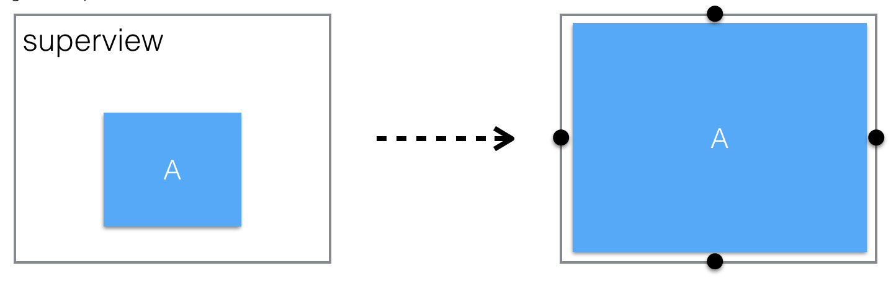

<p align="center">
  <a href="https://github.com/mirego/PinLayout"></a>
</p>

<h1 align="center" style="color: #376C9D; font-family: Arial Black, Gadget, sans-serif; font-size: 3em">PinLayout</h1>
 
<p align="center">
  <a href=""></a>
  <a href="https://travis-ci.org/mirego/PinLayout"></a>
  <a href="https://codecov.io/gh/mirego/PinLayout"></a>
  <a href='https://img.shields.io/cocoapods/v/PinLayout.svg'></a>
  <a href="https://github.com/Carthage/Carthage"></a>
  <a href="https://raw.githubusercontent.com/mirego/PinLayout/master/LICENSE"></a>
  <!--a href="https://github.com/mirego/PinLayout/issues"></a-->
</p>

<br>

Extremely Fast views layouting without auto layout. No magic, pure code, full control and blazing fast. Concise syntax, intuitive, readable & chainable.
  
> "No Auto layout constraints attached"

<br>

### Requirements
* iOS 8.0+ / tvOS 9.0+
* Xcode 8.0+
* Swift 3.0+

### Content

* [PinLayout principles and philosophy](#introduction)
* [Performance](#performance)
* [Usage example](#intro_usage_example)
* [Documentation](#documentation)
  * [Layout using distances from superview’s edges](#distance_from_superview_edge) 	  
  * [Anchors](#anchors)
  * [Edges](#edges)
  * [Relative positionning](#relative_positionning)
  * [Width, height and size](#width_height_size)
  * [minWidth, maxWidth, minHeight, maxHeight](#minmax_width_height_size)
  * [justify, align](#justify_align)
  * [Margins](#margins)
  * [Warnings](#warnings)
  * [More examples](#more_examples)
* [Examples App](#examples_app)
* [Installation](#installation)
* [FAQ](#faq)
* [Comments, ideas, suggestions, issues, ....](#comments)


<br>

:pushpin: PinLayout is actively updated, adding more features weekly. So please come often to see latest changes. You can also **Star** it to be able to retrieve it easily later.

## PinLayout principles and philosophy <a name="introduction"></a>

* Manual layouting (doesn't rely on auto layout).
* PinLayout exist to be simple and fast as possible! In fact it is fast as manual layouting. See [performance results below.](#performance)
* Full control: You're in the middle of the layout process, no magic black box. 
	* You can add conditions (if/switch/guard/...) related to device orientation, device type, traitCollection, animations, ...
	* You can add iterations and enumerations (for/while/forEach/...)
* Layout one view at a time. Make it simple to code and debug.
* Concise syntax. Layout most views using a single line. 

* Stateless
	* PinLayout doesn’t add any stored properties to UIViews. It simply computes the UIView.frame property, one view at a time.
	* Since it is stateless, it can be used with any other layout framework without conflicts. 
Each view can use the layout system that better suit it  (PinLayout, constraints, flexbox, grids, …)
A view can be layouted using PinLayout and later with another method/framework.

* No Auto layout and constraints
	* Constraints are verbose and hard for a human brains to understand when there are many views implicated, even with sugar-syntax frameworks.
	* PinLayout positions views as a designer would explain it (eg: “The TextField is below the Label, aligned left, and is its width matches the other view’s width“). 
	* No priorities, simply layout views in the order that makes sense. No priorities required.

* Before applying the new sets of attributes, PinLayout always start with the view’s current frame. So it’s possible to set the view’s size during the initialization (ex: view.pin.width(100).height(200)), and later only position the view (ex: view.pin.top(10).left(20)). This makes PinLayout really animation friendly.

* Not too intrusive. PinLayout only adds three properties to existing iOS classes: `UIView.pin`, `UIView.anchor` and `UIView.edge`

* Minimize as much as possible calculations and constants when layouting views. But it is always possible to add advanced computation if required.

* Methods match as much as possible other layouting systems, including CSS, flexbox, reactive Flexbox, …
	* margin, marginHorizontal, marginVertical, marginTop, marginLeft, marginBottom, marginRight
	* top, left, bottom, right, width, height  
	* As in CSS and flexbox, right and bottom coordinates are offset from container view's right and bottom edges.

* Shorter possible commands to layout views, but keeping english phrasing almost valid.

<br>

:pushpin: PinLayout doesn't support Auto layout nor Storyboard. Interresting quote:
> "UIKit Auto Layout and InterfaceBuilder are not supported by Texture. It is worth noting that both of these technologies are not permitted in established and disciplined iOS development teams, such as at Facebook, Instagram, and Pinterest"
>
> -- <cite>[Pinterest/Facebook Texture's documentation](http://texturegroup.org/docs/faq.html#asyncdisplaykit-does-not-support-uikit-auto-layout-or-interfacebuilder)</cite>

<br>

# PinLayout's Performance <a name="performance"></a>

PinLayout's performance has been measured using the nice and simple LayoutKit benchmark. PinLayout has been added to this benchmark to compare its performance. 

As you can see in the following chart, PinLayout's performance is as fast as manual layouting, and **between 12x and 16x faster than auto layout**, for all types of iPhone (5/6/6S/7)

These results also means that **PinLayout is faster than any layout frameworks that is built over auto layout**. 

[See here more complete details, results and explanation of the benchmark](docs/Benchmark.md).

<p align="center"> Tested on a iPhone 6 iOS 10.3.2</p>
<p align="center">
  
</p>


<br/>

# Usage sample <a name="intro_usage_example"></a>
###### Example:
This example layout an image, a UISegmentedControl, a label and a line separator. This example adjust its content to match the device'size and orientation changes.

* **UIImageView**'s size is 100x100 and layouted below the UINavigationBar with a margin of 10 pixels all around.
* **UISegmentedControl** is at the right of the logo image, use the remaining horizontal space with a left and right margin of 20 pixels.
* **UILabel** is below the UISegmentedControl with a top margin of 10 pixels. It's width matched the UISegmentedControl's width. The label is multiline, so its height must be adjusted to fit its width.
* **Separator** is below the UIImageView and the UILabel, i.e. below the tallest one. The separator has a top margin of 10 pixels, left-aligned to the UIImageView and right-aligned to the UISegmentedControl.


```swift
override func layoutSubviews() {
   super.layoutSubviews() 
    
   logo.pin.topLeft().size(100).marginTop(10).marginLeft(10)
   segmented.pin.right(of: logo, aligned: .top).right().marginHorizontal(10)
   textLabel.pin.below(of: segmented, aligned: .left).right().marginTop(10).marginRight(10).sizeToFit()
   separatorView.pin.below(of: [logo, textLabel], aligned: .left).right(to: segmented.edge.right).marginTop(10)
}
``` 

:pushpin: 4 views, 4 lines!

:pushpin: PinLayout doesn't use auto layout constraints, it is a framework that manually layout views. For that reason you need to update the layout inside either `UIView.layoutSubviews()` or `UIViewController.viewDidLayoutSubviews()` to handle container size's changes, including device rotation. You'll also need to handle UITraitCollection changes for app's that support multitask. In the example above PinLayout's commands are inside UIView's `layoutSubviews()` method.

:pushpin: This example and some other examples are available in the [Examples App](#examples_app) documented below. 

<br/>

# Documentation <a name="documentation"></a>

## Layout using distances from superview’s edges <a name="distance_from_superview_edge"></a>

PinLayout can position a view’s edge relative to its superview edges.

**Methods**:

* `top(_ value: CGFloat)`  
The value specifies the top edge distance from the superview's top edge in pixels.
* `top(_ percent: Percent)`  
The value specifies the top edge distance from the superview's top edge in percentage of its superview's height.
* `left(_ value: CGFloat)`  
The value specifies the left edge distance from the superview's left edge in pixels.
* `left(_ percent: Percent)`  
The value specifies the left edge distance from the superview's left edge in percentage of its superview's width.
* `bottom(_ value: CGFloat)`  
The value specifies the bottom edge **distance from the superview's bottom edge** in pixels.
* `bottom(_ percent: Percent)`  
The value specifies the bottom edge **distance from the superview's bottom edge** in percentage of its superview's height.
* `right(_ value: CGFloat)`  
The value specifies the right edge **distance from the superview's right edge** in pixels.
* `right(_ percent: Percent)`  
The value specifies the right edge **distance from the superview's right edge** in percentage of its superview's width.
* `hCenter(_ value: CGFloat)`  
The value specifies the horizontal center distance from the superview's left edge in pixels.
* `hCenter(_ percent: Percent)`  
The value specifies the horizontal center distance from the superview's left edge in percentage of its superview's width.
* `vCenter(_ value: CGFloat)`  
The value specifies the vertical center distance from the superview's top edge in pixels.
* `vCenter(_ percent: Percent)`  
The value specifies the vertical center distance from the superview's top edge in percentage of its superview's height.

###### Usage Examples:

```swift
    view.pin.top(20).left(20)
    view.pin.top(25%).hCenter(0)
    view.pin.left(12).vCenter(100)
```

###### Example:
This example layout the view A to fit its superview frame with a margin of 10 pixels. It pins the top, left, bottom and right edges.


```swift
    viewA.pin.top(10).left(10).bottom(10).right(10)
``` 
Another possible solution using other PinLayout's methods (more details later):

```swift
    view.pin.topLeft().bottomRight().margin(10)
```

<br/>

### Position view directly on superview’s edges 

PinLayout also has shorter version that pins a view’s edge **directly** on its superview's corresponding edge.

**Methods**:

* `top()`  
Position the view top edge directly on its superview top edge. Similar to calling `top(0)`.
* `left()`  
Position the view left edge directly on its superview top edge. Similar to calling `left(0)`.
* `bottom()`  
Position the view bottom edge directly on its superview top edge. Similar to calling `bottom(0)`.
* `right()`  
Position the view right edge directly on its superview top edge. Similar to calling `right(0)`.
* `hCenter()`  
Position the view horizontal center directly on its superview horizontal center. Similar to calling `hCenter(superview.frame.width / 2)`.
* `vCenter()`  
Position the view vertical center directly on its superview vertical center. Similar to calling `hCenter(superview.frame.height / 2)`.

###### Usage examples:
```swift
	view.pin.top().left()
	view.pin.bottom().right()
	view.pin.hCenter().vCenter()
```

###### Example:
This example is similar to the previous example, but pins edges directly on superview’s edges. It will layout the view A to fit its superview frame with a margin of 10 pixels.



```swift
    viewA.pin.top().left().bottom().right().margin(10)
``` 

<br/>

## Anchors <a name="anchors"></a>

### PinLayout UIView’s anchors

PinLayout add anchors properties to UIViews. These properties are used to reference other view’s anchors.

**PinLayout UIView’s anchors**:

* `UIView.anchor.topLeft`
* `UIView.anchor.topCenter`
* `UIView.anchor.topRight`
* `UIView.anchor.leftCenter`
* `UIView.anchor.centers`
* `UIView.anchor.rightCenter`
* `UIView.anchor.bottomLeft`
* `UIView.anchor.bottomCenter`
* `UIView.anchor.bottomRight`


<br/>

### Layout using anchors

PinLayout can use anchors to position view’s related to other views.

Following methods position the corresponding view anchor on another view’s anchor.

**Methods:**

* `topLeft(to anchor: Anchor)`
* `topCenter(to anchor: Anchor)`
* `topRight(to anchor: Anchor)`
* `leftCenter(to anchor: Anchor)`
* `center(to anchor: Anchor)`
* `rightCenter(to anchor: Anchor)`
* `bottomLeft(to anchor: Anchor)`
* `bottomCenter(to anchor: Anchor)`
* `bottomRight(to anchor: Anchor)`

:pushpin: These methods can pin a view’s anchor to any other view's anchor, even if don't have the same direct superview! It works with any views that have at some point the same ancestor. 

###### Usage examples:
```swift
    view.pin.topCenter(to: view1.anchor.bottomCenter)
    view.pin.topLeft(to: view1.anchor.topLeft).bottomRight(to: view1.anchor.center)
```

###### Example:

Layout using an anchors. This example pins the view B topLeft anchor on the view A topRight anchor.


```swift
	viewB.pin.topLeft(to: viewA.anchor.topRight)
``` 

<br/>

###### Example:

Layout using multiple anchors.
 
It is also possible to combine two anchors to pin the position and the size of a view. The following example will position the view C between the view A and B with horizontal margins of 10px.


```swift
	viewC.pin.topLeft(to: viewA.anchor.topRight)
	         .bottomRight(to: viewB.anchor.bottomLeft).marginHorizontal(10)
``` 

<br/>

### Layout using superview’s anchors

PinLayout also has a shorter version that pins a view's anchor **directly** on its corresponding superview’s anchor.

The following methods position the corresponding view's anchor on another view’s anchor.

**Methods:**

* `topLeft()`
* `topCenter()`
* `topRight()`
* `leftCenter()`
* `center()`
* `rightCenter()`
* `bottomLeft()`
* `bottomCenter()`
* `bottomRight()`

###### Example:
For example .topRight() will pin the view’s topRight anchor on its superview’s topRight anchor..


```swift
	viewA.pin.topRight()
``` 

This is equivalent to:

```swift
	viewA.pin.topRight(to: superview.pin.topRight)
```

<br/>

## Edges <a name="edges"></a>

### PinLayout UIView’s edges

PinLayout adds edges properties to UIViews. These properties are used to reference other view’s edges.

**PinLayout UIView’s edges**:

* `UIView.edge.top`
* `UIView.edge.left`
* `UIView.edge.bottom`
* `UIView.edge.right`


<br/>

### Layout using edges

PinLayout has methods to attach a UIView's edge (top, left, bottom or right edge) to another view’s edge.

**Methods:**

* `top(to edge: VerticalEdge)`
* `left(to: edge: HorizontalEdge)`
* `bottom(to edge: VerticalEdge)`
* `right(to: edge: HorizontalEdge)`

:pushpin: These methods can pin a view’s edge to any other view's edge, even if don't have the same direct superview! It works with any views that have at some point the same ancestor. 

###### Usage examples:
```swift
	view.pin.left(to: view1.edge.right)
	view.pin.left(to: view1.edge.right).top(to: view2.edge.right)
```

###### Example:
Layout using an edge.

The following example will layout the view B left edge on the view A right edge. It only change the view B left coordinate


```swift
	viewB.pin.left(to: viewA.edge.right)
```

<br/>

## Relative positionning <a name="relative_positionning"></a>

### Layout using edges relative positioning

PinLayout also has methods to position relative to other views. The view can be layouted relative to **one or many relative views**.

**Methods:**

* `above(of: UIView)`  
`above(of: [UIView])`  
Position the view above the specified view(s). One or many relative views can be specied. This method is similar to pinning the view’s bottom edge.  
  
* `below(of: UIView)`  
`below(of: [UIView])`  
Position the view below the specified view(s). One or many relative views can be specied. This method is similar to pinning the view’s top edge.  
  
* `left(of: UIView)`  
`left(of: [UIView])`  
Position the view left of the specified view(s). One or many relative views can be specied. This method is similar to pinning the view’s right edge.  
  
* `right(of: UIView)`  
`right(of: [UIView])`  
Position the view right of the specified view(s). One or many relative views can be specied. This method is similar to pinning the view’s left edge.

:pushpin: **Multiple relative views**: If for example a call to `below(of: [...]) specify multiple relative views, the view will be layouted below *ALL* these views. 

:pushpin: These methods **set the position of a view's edge**: top, left, bottom or right. For example `below(of ...)` set the view's top edge, `right(of ...) set the view's left edge, ...

:pushpin: These methods can pin a view’s relative to any views, even if don't have the same direct superview! It works with any views that have at some point the same ancestor. 

###### Usage examples:
```swift
	view.pin.left(of: view2)
	view.pin.below(of: [view2, view3, view4])
	view.pin.left(of: view1).above(of: view2).below(of: view3).right(of: view4)
```

###### Example:
The following example will position the view C between the view A and B with margins of 10px using relative positioning methods.


```swift
	viewC.pin.top().left(of: viewA).right(of: viewB).margin(10)
```
This is an equivalent solution using [edges](#edge):

```swift
	viewC.pin.top().left(to: viewA.edge.right).right(to: viewB.edge.left).margin(10)
```

This is also an equivalent solution using [relative positioning and alignment](#relative_positionning_w_alignment) explained in the next section:

```swift
	viewC.pin.left(of: viewA, aligned: .top).right(of: viewB, aligned: top).marginHorizontal(10)
```


<br/>

### Layout using relative positioning and alignment <a name="relative_positionning_w_alignment"></a>

PinLayout also has methods to position relative to other views but with also the ability of specifying the **alignment**. The view can be layouted relative to **one or many relative views**.


**Methods:**

* `above(of: UIView, aligned: HorizontalAlignment)`  
`above(of: [UIView], aligned: HorizontalAlignment)`  
Position the view above the specified view(s) and aligned it using the specified HorizontalAlignment. One or many relative views can be specied. This method is similar to pinning one view’s anchor: bottomLeft, bottomCenter or bottomRight.  
  
* `below(of: UIView, aligned: HorizontalAlignment)`  
`below(of: [UIView], aligned: HorizontalAlignment)`  
Position the view below the specified view(s) and aligned it using the specified HorizontalAlignment. One or many relative views can be specied. This method is similar to pinning one view’s anchor: topLeft, topCenter or topRight.  
  
* `left(of: UIView, aligned: VerticalAlignment)`  
`left(of: [UIView], aligned: HorizontalAlignment)`  
Position the view left of the specified view(s) and aligned it using the specified VerticalAlignment. One or many relative views can be specied. This method is similar to pinning one view’s anchor: topRight, rightCenter or bottomRight.  
  
* `right(of: UIView, aligned: VerticalAlignment)`  
`right(of: [UIView], aligned: HorizontalAlignment)`  
Position the view right of the specified view(s) and aligned it using the specified VerticalAlignment. One or many relative views can be specied. This method is similar to pinning one view’s anchor: topLeft, leftCenter or bottomLeft.

**How alignment is applied:**

*  `HorizontalAlignment.left`: The view's left edge will be aligned to the left most relative view.
*  `HorizontalAlignment.center`: The view's hCenter edge will be aligned with the average hCenter of all  relative views.
*  `HorizontalAlignment.right`: The view's right edge will be aligned to the right most relative view.
*  `VerticalAlignment.top`: The view's top edge will be aligned to the top most relative view.
*  `VerticalAlignment.center`: The view's vCenter edge will be aligned with the average vCenter of all  relative views.
*  `VerticalAlignment.bottom`: The view's bottom edge will be aligned to the bottom most relative view.

:pushpin: **Multiple relative views**: If for example a call to `below(of: [...], aligned:) specify multiple relative views, the view will be layouted below *ALL* these views. The alignment will be applied using all relative view

:pushpin: These methods **set the position of a view's anchor**: topLeft, topCenter, topRight, leftCenter, .... For example `below(of ..., aligned: .right)` set the view's topRight anchor, `right(of ..., aligned: .center) set the view's centerLeft anchor, ...

:pushpin: These methods **set the position of a view's edge**: top, left, bottom or right. For example `below(of ...)` set the view's top edge, `right(of ...) set the view's left edge, ...


###### Usage examples:
```swift
	view.pin.above(of: view2, aligned: .left)
	view.pin.below(of: [view2, view3, view4], aligned: .left)
	view.pin.left(of: view2, aligned: .top).right(of: view3, aligned: .bottom)
```

###### Example:
The following example layout the view B below the view A aligned on its center.


```swift
	viewB.pin.below(of: viewA, aligned: .center)
```
This is an equivalent solutions using anchors:

```swift
	viewB.pin.topCenter(to: viewA.anchor.bottomCenter)
```

###### Example:
The following example layout the view A **below the UIImageView and the UILabel**.
View A should be left aligned to the UIImageView and right aligned to the UILabel, with a top margin of 10 pixels.


```swift
	a.pin.below(of: [imageView, label], aligned: .left).right(to: label.edge.right).marginTop(10)
```
This is an equivalent solutions using other methods:

```swift
   let maxY = max(imageView.frame.maxY, label.frame.maxY)  // Not so nice
   a.pin.top(maxY).left(to: imageView.edge.left).right(to: label.edge.right).marginTop(10)
```

<br/>


### Positioning using only visible relative UIViews 

All PinLayout's relative methods can accept an array of UIViews (ex: `below(of: [UIView])`). Usign these methods it's possible to filter the list of relative UIViews before the list is used by PinLayout.

PinLayout has a filter method called `visible` that can be used to layout a view related to only visible views. This can be really useful when some views may be visible or hidden depending on the situation.

###### Example:
The following example contains a UISwitch. Below a UITextField that is visible only when the UISwitch is set to ON. And then follow another UITextField. This example use the `visible(views: [UIView]) -> [UIView]` filter method that returns only views with `UIView.isHidden` set to false or `UIView.alpha` greater than 0.


```swift
   formTitleLabel.pin.topCenter().marginTop(margin)
   nameField.pin.below(of: formTitleLabel).left().right().height(40).margin(margin)
        
   ageSwitch.pin.below(of: nameField).left().right().height(40).margin(margin)
   ageField.pin.below(of: ageSwitch).left().right().height(40).margin(margin)
       
   // Layout the Address UITextField below the last visible view, either ageSwitch or ageField.
   addressField.pin.below(of: visibles([ageSwitch, ageField])).left().right().height(40).margin(margin)
``` 

Note that this example is extracted from the **Form** example, see [Examples App](#examples_app)

<br/>

## Width, height and size <a name="width_height_size"></a>

### Adjust view width, height and size
PinLayout has methods to set the view’s height and width.

**Methods:**

* `width(_ width: CGFloat)` / `width(percent: Percent)`  
The value specifies the view's width in pixels or in percentage of its superview. Value must be non-negative.
* `width(of view: UIView)`  
Set the view’s width to match the referenced view’s width.

* `height(_ height: CGFloat)` / `height(percent: Percent)`  
The value specifies the view's height in pixels or in percentage of its superview. Value must be non-negative.
* `height(of view: UIView)`  
Set the view’s height to match the referenced view’s height
* `size(_ size: CGSize)` / `size(_ percent: Percent)`  
The value specifies view's width and the height in pixels or in percentage of its superview. Values must be non-negative.
* `size(_ sideLength: CGFloat)`  
The value specifies the width and the height of the view in pixels, creating a square view. Values must be non-negative.
* `size(of view: UIView)`  
Set the view’s size to match the referenced view’s size

:pushpin: width/height/size have a higher priority than edges and anchors positionning. 

###### Usage examples:
```swift
	view.pin.width(50%)
	view.pin.width(100)
	view.pin.width(of: view1)
	
	view.pin.height(100%)
	view.pin.height(200)
	
	view.pin.size(of: view1)
	view.pin.size(50%)
	view.pin.size(250)
```

<br/>

## minWidth, maxWidth, minHeight, maxHeight <a name="minmax_width_height_size"></a>

PinLayout has methods to set the view’s minimum and maximum width, and minimum and maximum height. 

**Methods:**

* `minWidth(_ width: CGFloat)` / `minWidth(_ percent: Percent)`  
The value specifies the view's minimum width of the view in pixels or in percentage of its superview. Value must be non-negative.

* `maxWidth(_ width: CGFloat)` / `maxWidth(_ percent: Percent)`  
The value specifies the view's maximum width of the view in pixels or in percentage of its superview. Value must be non-negative.

* `minHeight(_ height: CGFloat)` / `minHeight(_ percent: Percent)`  
The value specifies the view's minimum height of the view in pixels or in percentage of its superview. Value must be non-negative.

* `maxHeight(_ height: CGFloat)` / `maxHeight(_ percent: Percent)`  
The value specifies the view's maximum height of the view in pixels or in percentage of its superview. Value must be non-negative.
   
###### Usage examples:
```swift
	view.pin.left(10).right(10).maxWidth(200)
	view.pin.width(100%).maxWidth(250)
	
	view.pin.top().bottom().maxHeight(100)
	view.pin.top().height(50%).maxHeight(200)
```

:pushpin: minWidth/maxWidth & minHeight/maxHeight have the highest priority. Higher than sizes (width/height/size) and edges positionning (top/left/bottom/right). Their values are always fullfilled.  


###### Example:
This example layout a view 20 pixels from the top, and horizontally from left to right with a maximum width of 200 pixels. If the superview is smaller than 200 pixels, the view will take the full horizontal space, but for a larger superview, the view will be centered.


```swift
   viewA.pin.top(20).hCenter().width(100%).maxWidth(200)
``` 

This is an equivalent solutions using the `justify()` method. This method is explained in the next section:

```swift
   viewA.pin.top(20).left().right().maxWidth(200).justify(.center)
```

<br/>

## justify() / align() <a name="justify_align"></a>

**Method:**

* `justify(_ : HorizontalAlign)`  
Justify the view horizontally. This method justify horizontally a view in situations where the left, right and the width has been set (using either width/minWidth/maxWidth). In this situation the view may be smaller than the space available between the left and the right edges. A view can be justified **left**, **center** or **right**. 

* `align(_ : VerticalAlign)`  
Align the view vertically. This method align vertically a view in situations where the top, bottom and the height has been set (using either height/minHeight/maxHeight). In this situation the view may be smaller than the space available between the top and the bottom edges. A view can be aligned **top**, **center** or **bottom**. 

###### Usage examples:
```swift
	view.pin.left().right().marginHorizontal(20).maxWidth(200).justify(.center)
	view.pin.below(of: A).above(of: B).width(40).align(.center)
```


###### Example:
This example layout a view between its superview left and right edges with a maximum size of 200 pixels. Without the usage of the `justify(:HorizontalAlign)` method, the view will be justified on the left:


```swift
   viewA.pin.left().right().maxWidth(200)
```


The same example, but using `justify(.center)`:


```swift
   viewA.pin.left().right().maxWidth(200).justify(.center)
```

And finally using `justify(.right)`:


```swift
   viewA.pin.left().right().maxWidth(200).justify(.right)
```

###### Example:
This example centered horizontally the view B in the space remaining at the right of the view A. The view B has a width of 100 pixels..


```swift
   viewB.pin.left(of: viewA, aligned: .top).right().width(100).justify(.center)
```

<br/>


## Margins <a name="margins"></a>
PinLayout applies margins similar to CSS. 


### PinLayout's margins

PinLayout has methods to apply margins.

**Methods:**

* `marginTop(_ value: CGFloat)`
* `marginLeft(_ value: CGFloat)`
* `marginBottom(_ value: CGFloat)`
* `marginRight(_ value: CGFloat)`
* `marginHorizontal(_ value: CGFloat)`
* `marginVertical(_ value: CGFloat)`
* `margin(_ value: CGFloat) `
* `margin(_ vertical: CGFloat, _ horizontal: CGFloat)`
* `margin(_ top: CGFloat, _ horizontal: CGFloat, _ bottom: CGFloat)`
* `margin(_ top: CGFloat, _ right: CGFloat, _ bottom: CGFloat, _ left: CGFloat) `

* `pinEdges()`

###### Usage examples:
```swift
	view.pin.topLeft().margin(20)
	view.pin.bottom().marginBottom(20)
	view.pin.left().right().marginHorizontal(20)
	view.pin.topLeft().bottomRight().margin(10, 12, 0, 12)
```

<br>

### PinLayout margin rules
The following section explains how CSS/PinLayout margin rules are applied. 

#### When and how horizontal margins are applied in PinLayout?

This table explains how and when **left and right margins** are applied depending on which view’s attribute has been pinned using PinLayout.

| View’s pinned attributes | Left Margin                               | Right Margin                               |
|--------------------------|:-------------------------------------------:|:--------------------------------------------:|
| **Left**                     | *Move view right*                           | *-*                                |
| **Left and Width**           | *Move view right*                           | *-*                                |
| **Right**                    | *-*                               | *Move view left*                             |
| **Right and Width**          | *-*                               | *Move view left*                             |
| **Left and Right**           | *Reduce the width to apply the left margin* | *Reduce the width to apply the right margin* |

NOTE: `-` indicates that the margin is not applied.

<br>

#### When and how does vertical margins are applies in PinLayout?

This table explains how and when **top and bottom margins** are applied depending on which view’s attribute has been pinned using PinLayout.

| View’s pinned attributes | Left Margin                               | Right Margin                               |
|--------------------------|:-------------------------------------------:|:--------------------------------------------:|
| **Top**                     | *Move view down*                           | *-*                                |
| **Top and Height**           | *Move view down*                           | *-*                                |
| **Bottom**                    | *-*                               | *Move view up*                             |
| **Bottom and Height**          | *-*                               | *Move view up*                             |
| **Top and Bottom**           | *Reduce the height to apply the top margin* | *Reduce the height to apply the bottom margin* |

<br>

### Margin examples

###### Example 1:
In this example, only the **left** margin is applied


```swift
	view.pin.left().margin(10)
```

###### Example 2:
In this example, only the **right** margin is applied


```swift
	view.pin.right().width(100).marginHorizontal(10)
```

###### Example 3:
In this example, the **left** and **right** margins are applied


```swift
	view.pin.left().right().margin(10)
```

###### Example 4:
In this example, **left**, **right** and **top** margins are applied. Note that the view’s width has been reduced to apply left and right margins.


```swift
	view.pin.topLeft().right().height(100).margin(10)
```

###### Example 5:
In this example, **left**, **right**, **top** and **bottom** margins are applied.


```swift
	view.pin.topLeft().bottomRight().margin(10)
```

<br>

### pinEdges()
The `pinEdges()` method pins the four edges (top, left, bottom and right edges) before applying margins. 

This method is useful in situations where the width and/or the height attributes have been pinned.
This method is an add-on, there is no equivalent in CSS.


###### Example without `pinEdges`
Without `pinEdges()` margins rules would be applied and the view would be moved to the left.


```swift
	view.pin.left().width(percent: 100).marginHorizontal(20)
```


###### Example with `pinEdges`

With `pinEdges()` the left and right margins are applied even if only the left and width has been set. The reason is the call to pinEdges() has pinned the two horizontal edges at their position before applying margins.


```swift
	view.pin.left().width(percent: 100).pinEdges().marginHorizontal(20)
```

<br>

NOTE: In that in that particular situation, the same results could have been achieved differently too:


```swift
	view.pin.left().right().marginHorizontal(20)
```


<br>


## Warnings <a name="warnings"></a>
### PinLayout's warnings
In debug, PinLayout will display warnings when pin rules cannot be applied. 

**Warning reasons**

* The newly pinned attributes conflict with other already pinned attributes.   
Example:  
`view.pin.left(10).right(10).width(200)`  
👉 Layout Conflict: `width(200) won't be applied since it conflicts with the following already set properties: left: 0, right: 10.`


* The newly pinned attributes have already been set to another value.  
Example:  
`view.pin.width(100).width(200)`  
👉 Layout Conflict: `width(200) won't be applied since it value has already been set to 100.`

* The view being layout hasn’t been added yet into a superview  
Example:  
`view.pin.width(100)`  
👉 Layout Warning: `width(100) won't be applied, the view must be added as a sub-view before being layouted using this method.`

* A view is used as a reference, either directly or using its anchors or its edges, but hasn’t been added yet to a superview.   
Example:  
`view.pin.left(of: view2)`  
👉 Layout Warning: `left(of: view2) won't be applied, the view must be added as a sub-view before being used as a reference.`

* The width and the height must be non negative values.  
Example:  
`view.pin.width(-100)`  
👉 Layout Warning: `The width (-100) must be greater or equal to 0.`

* `justify(.left|.center|.right)` is used without having set the left and the right coordinates.  
Example:  
`view.pin.left().width(250).justify(.center)`  
👉 PinLayout Warning: justify(center) won't be applied, the left and right coordinates must be set to justify the view.

### Disabling warnings

Warnings can be disabled in debug mode too by setting the boolean PinLayoutLogConflicts to false.

<br/>

## PinLayout style guide

* You should always specifies methods in the same order, it makes layout lines easier to understand. Here is our prefered ordering:  
`view.pin.[EDGE|ANCHOR|RELATIVE].[WIDTH|HEIGHT|SIZE].[pinEdges()].[MARGINS].[sizeToFit()]`  

   This order reflect the logic inside PinLayout. `pinEdges()` is applied before margins and margins are applied before `sizeToFit()`.    

	```swift
	view.pin.top().left(10%).margin(10, 12, 10, 12)
	view.pin.left().width(100%).pinEdges().marginHorizontal(12)
	view.pin.left().right().margin(0, 12).sizeToFit()
	view.pin.width(100).height(100%)
	```

* If the layout line is too long, you can split in multiple lines:  

	```swift
	textLabel.pin.below(of: titleLabel)
	   .right(of: statusIcon).left(of: accessoryView)
	   .above(of: button).marginHorizontal(10)
	```

<br/>

## More examples<a name="more_examples"></a>

### Adjust to container size
The following examples show how PinLayout can be used to adjust views size and position to the size of their container. in this case containers are cells.


Cell A:

* A1 is left aligned with a width of 50px
* A2 fills the remaining space

```swift
	a1.pin.topLeft().bottom().width(50)
	a2.pin.right(of: a1, aligned: .top).bottomRight().marginLeft(10)
```

Cell B:

* B2 is right aligned with a fixed width of 50px
* B1 fills the remaining space

```swift
	b2.pin.topRight().bottom().width(50)
	b1.pin.left(of: b2, aligned: .top).bottomLeft().marginRight(10)
```

Cell C:

* C2 is centered with a fixed width of 50px
* C1 fills the remaining left space
* C3 fills the remaining right space

```swift
	c2.pin.topCenter().width(50).bottom()
	c1.pin.left(of: c1, aligned: .top).bottomLeft().marginRight(10)
	c3.pin.right(of: c2, aligned: .top).bottomRight().marginLeft(10)
```

Cell D:

* D1 takes 25% of its container width
* D2 takes 50% of its container width
* D3 fills the remaining space

```swift
	d1.pin.topLeft().bottom().width(25%)
	d2.pin.right(of: d1, aligned: .top).bottom().width(50%).marginLeft(10)
	d3.pin.right(of: d2, aligned: .top).bottomRight().marginLeft(10)
```

<br>

## Installation <a name="installation"></a>

### CocoaPods

To integrate PinLayout into your Xcode project using CocoaPods, specify it in your `Podfile`:

```ruby
    pod 'PinLayout'
```

Then, run `pod install`.

### Carthage

To integrate PinLayout into your Xcode project using Carthage, specify it in your `Cartfile`:

```ogdl
github "mirego/PinLayout"
```

Then, run `carthage update` to build the framework and drag the built `PinLayout.framework` into your Xcode project.

### Swift Package Manager

Once you have your Swift package set up, you only need to add PinLayout as a dependency of your `Package.swift`.

```swift
dependencies: [
    .Package(url: "https://github.com/mirego/PinLayout.git", majorVersion: 1)
]
```

<br>

## Examples App <a name="examples_app"></a>
There is a tiny Example app that expose some usage example on PinLayout, including:

* An example of UITableView with variable height cells.
* The [example](#intro_usage_example) presented priviously in this README.
* Example showing a form
* Example showing relative positionning.
* ...

<p align="center">
  
  
  
  
    
  
</p>

This app is available in the `Example` folder. Note that you must do a `pod install` before running the example project.

<br>

## FAQ <a name="faq"></a>

*  **Q: When the device rotation change, the layout is not updated.**  
   **R:** PinLayout doesn't use auto layout constraints, it is a framework that manually layout views. For that reason you need to update the layout inside either `UIView.layoutSubviews()` or `UIViewController.viewDidLayoutSubviews()` to handle container size's changes, including device rotation. You'll also need to handle UITraitCollection changes for app's that support multitask.
   
*  **Q: How can we adjust a UIView container to match all its children?**  
   **R:** The proposed solution is used by the **Form** example for its rounded corner background. Suppose you want to adjust a container height to match all its child (subviews). 
   1. First set the container width and its position:  
`containerView.pin.topCenter().width(100%).marginTop(10)`
   2. Layout all its children.
   3. Finally, set the container height to match its last child Y position:  
`containerView.pin.height(child6.frame.maxY + 10)` 
   
* **Q: How to apply percentage from a CGFloat, a Float or a Int value?**  
  **R:** Many PinLayout's method has a parameter of type `Percent`. You can easily specify this type of parameter simply by adding the `%` operator to your value (eg: `view.pin.left(10%).width(50%)`. It is similar if you have a value of type  CGFloat, Float or Int, simply adds the `%` operator:  
  
	```swift
	let percentageValue: CGFloat = 50
	view.pin.width(percentageValue%)
	``` 
<br>


### Contributing, comments, ideas, suggestions, issues, .... <a name="comments"></a>
For any **comments**, **ideas**, **suggestions**, **issues**, simply open an [issue](https://github.com/mirego/PinLayout/issues).

If you find PinLayout interresting, thanks to **Star** it. You'll be able to retrieve it easily later.

If you'd like to contribute, you're welcome!

<br>


### Thanks
PinLayout was inspired by other great layout frameworks, including:

* [MCUIViewLayout](https://github.com/mirego/MCUIViewLayout): Nice absolute and relative positionning.
* HTML's CSS: Management of margins in absolute positionning and bottom/right position coordinates.
* Qt:Anchors and edges management.
* [SnapKit](https://github.com/SnapKit/SnapKit): Clean interface for anchors.
* ... and even Auto layout :-)

<br>

## History
PinLayout recent history is available in the [CHANGELOG](CHANGELOG.md).

<br>

## License
BSD 3-Clause License
