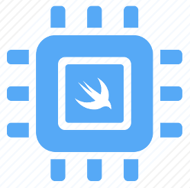
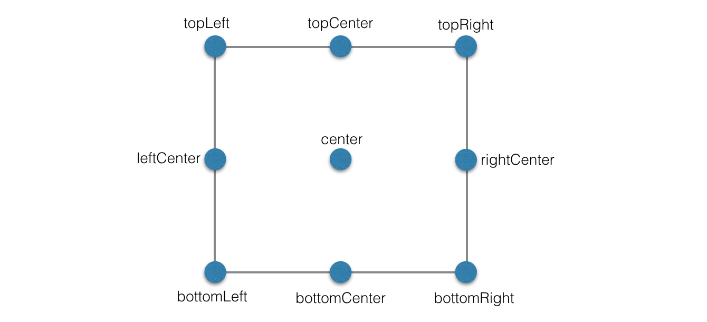
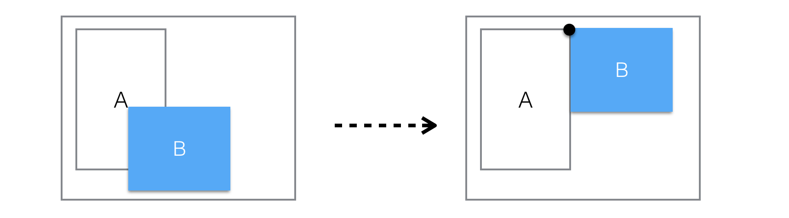
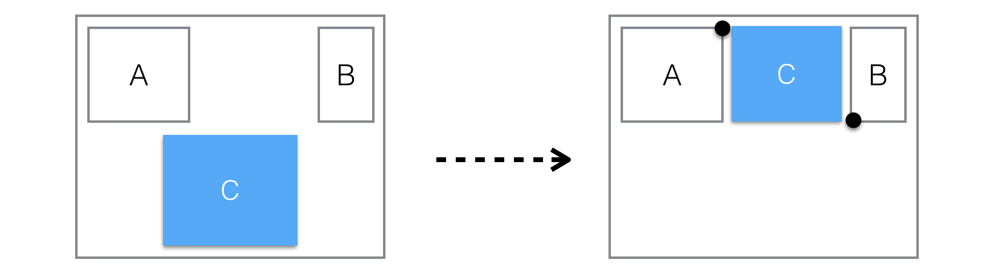
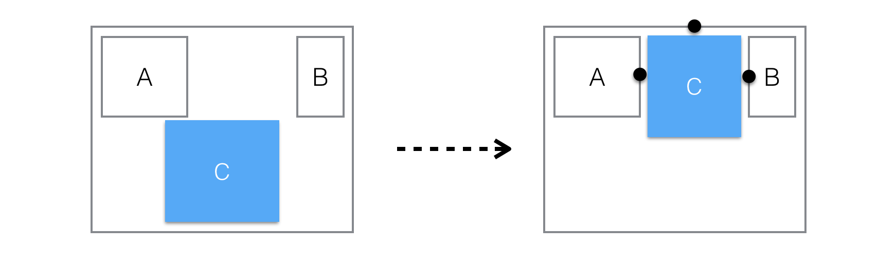
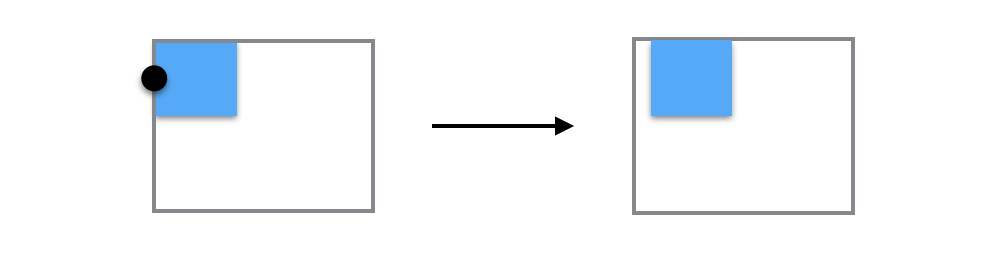
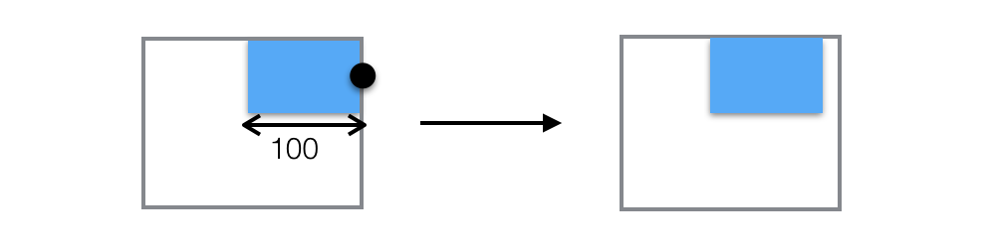
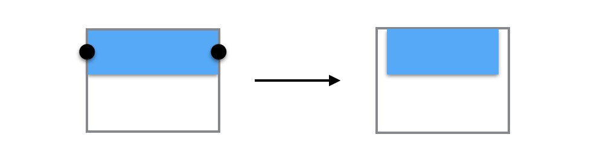
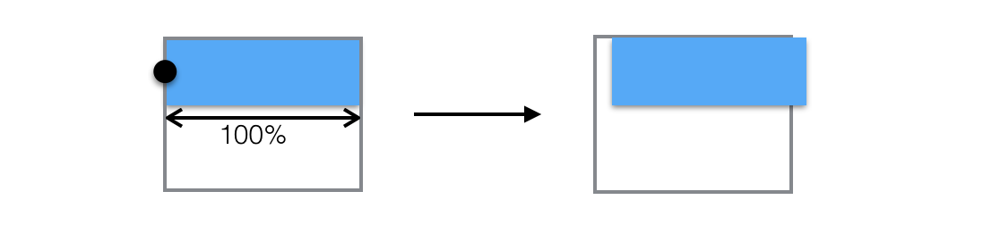

# PinLayout

Simple Swift iOS layouting without using NSLayoutConstraint.

> "No constraints attached"


[](https://travis-ci.org/mirego/PinLayout)


* [PinLayout principles and philosophy](#introduction)
* [Installation](#installation)
* [Documentation](#documentation)
    * [Layout using distances from superview’s edges](#distance_from_superview_edge) 	  
    * [Anchors](#anchors)
    * [Edges](#edges)
    * [Relative positionning](#relative_positionning)
   	* [Width, height and size](#width_height_size)
   	* [Margins](#margins)
   	* [Warnings](#warnings)
   	* [More examples](#more_examples)

## PinLayout principles and philosophy <a name="introduction"></a>

* Layout one view at a time. 
* Layout most views using a single line
* Stateless
	* The layout system doesn’t add any stored properties to UIViews. It simply compute the UIView.frame property, one view at a time.
	* Since it is stateless, it can be used with any other layout framework without conflicts. 
Each view can use the layout system that better suit it  (PinLayout, constraint, flexbox, grids, …)
A view can be layouted using PinLayout and later with another method.
	* REWORK THAT!!! Stateless also means that if a view reference other views, the view should be re-layouted in layoutSubViews()  layouted with PinLayout use other views as referenced view change (size/position) 

* No constraints
	* Constraints are very verbose and hard for a human brains to understand. Too much information.
	* PinLayout positions views as a designer would explain it (eg: “The TextField is below the Label, aligned left, and is its width match the other view’s width“). 
	* No priorities, simply layout views in the order that make sense. No priority required.

* Before applying the new sets of attributes, PinLayout always start with the view’s current frame. So it’s possible to set the view’s size during the initialization (ex: view.pin.width(100).height(200)), and later only position the view (ex: view.pin.top(10).left(20))

* Minimize as much as possible calculations and constants when layouting views.

* Methods matches as much as possible other layouting system, including CSS, flexbox, reactive Flexbox, …
	* margin, marginHorizontal, marginVertical, marginTop, marginLeft, marginBottom, marginRight
	* top, left, bottom, right, width, height  
	* As in CSS and flexbox, right and bottom coordinates are offset from container’s view right and bottom edges.

* Shorter possible commands to layout views, but keeping english phrasing almost valid.


## Installation <a name="installation"></a>

* Carthage

<br/>


# Documentation <a name="documentation"></a>

## Layout using distances from superview’s edges <a name="distance_from_superview_edge"></a>

PinLayout can position a view’s edge relative to its superview edges.

**Methods**:

* `top(_ value: CGFloat)`  
The value specifies the distance in pixels between the top edge of the view and the top edge of its to superview
* `left(_ value: CGFloat)`  
The value specifies the distance in pixels between the left edge of the view and the left edge of its to superview
* `bottom(_ value: CGFloat)`  
The value specifies the distance in pixels between the bottom edge of the view and the bottom edge of its to superview.
* `right(_ value: CGFloat)`  
The value specifies the distance in pixels between the right edge of the view and the right edge of its to superview.
* `hCenter(_ value: CGFloat)`  
The value specifies the distance in pixels between the horizontal center of the view and the left edge of its to superview.
* `vCenter(_ value: CGFloat)`  
The value specifies the distance in pixels between the vertical center of the view and the top edge of its to superview.  

###### Usage Examples:

```
    view.pin.top(20).left(20)
    view.pin.left(0).right(0)
    view.pin.left(12).vCenter(100)
```

###### Example:
This example layout the view A to fit its superview frame with a margin of 10 pixels. It pins the top, left, bottom and right edges.


```javascript
    viewA.pin.top(10).left(10).bottom(10).right(10)
``` 
Another possible solution using other PinLayout's methods (more details later):

```javascript
    view.pin.topLeft().bottomRight().margin(10)
```

<br/>

### Layout directly on superview’s edges 

PinLayout also have shorten version that pin a view’s edge **directly** on its superview corresponding edge.

**Methods**:

* `top()`  
Position the view top edge directly on its superview top edge. Similar to calling top(0)
* `left()`  
Position the view left edge directly on its superview top edge. Similar to calling left(0)
* `bottom()`  
Position the view bottom edge directly on its superview top edge. Similar to calling bottom(0)
* `right()`  
Position the view right edge directly on its superview top edge. Similar to calling right(0)

###### Usage examples:
```javascript
	view.pin.top().left()
	view.pin.bottom().right()
```

###### Example:
This example is similar to the previous example, but pin edges directly on superview’s edges. It layout the view A to fit its superview frame with a margin of 10 pixels.


```
    viewA.pin.top().left().bottom().right().margin(10)
``` 

<br/>

## Anchors <a name="anchors"></a>

### PinLayout UIView’s anchors

PinLayout add anchors properties to UIViews. These properties are used to reference other view’s anchors.

**PinLayout UIView’s anchors**:

* `UIView.anchor.topLeft`
* `UIView.anchor.topCenter`
* `UIView.anchor.topRight`
* `UIView.anchor.leftCenter`
* `UIView.anchor.centers`
* `UIView.anchor.rightCenter`
* `UIView.anchor.bottomLeft`
* `UIView.anchor.bottomCenter`
* `UIView.anchor.bottomRight`



<br/>

---
### Layout using anchors

PinLayout can use anchors to position view’s related to other views.

Following methods position the corresponding view anchor on another view’s anchor.

**Methods:**

* `topLeft(to anchor: Anchor)`
* `topCenter(to anchor: Anchor)`
* `topRight(to anchor: Anchor)`
* `leftCenter(to anchor: Anchor)`
* `center(to anchor: Anchor)`
* `rightCenter(to anchor: Anchor)`
* `bottomLeft(to anchor: Anchor)`
* `bottomCenter(to anchor: Anchor)`
* `bottomRight(to anchor: Anchor)`

NOTE: These methods can also pin a view’s anchor to another view that is not a direct sibling. It works with any views that have at some point the same ancestor. 

###### Usage examples:
```javascript
    view.pin.topCenter(to: view1.anchor.bottomCenter)
    view.pin.topLeft(to: view1.anchor.topLeft).bottomRight(to: view1.anchor.center)
```

###### Example:

Layout using an anchors. This example pins the view B topLeft anchor on the view A topRight anchor.



```javascript
	viewB.pin.topLeft(to: viewA.anchor.topRight)
``` 

<br/>

###### Example:

Layout using multiple anchors.
 
It is also possible to combine two anchors to pin the position and the size of a view. The following example will position the view C between the view A and B with an horizontal margins of 10px.



```javascript
	viewC.pin.topLeft(to: viewA.anchor.topRight)
	         .bottomRight(to: viewB.anchor.bottomLeft).marginHorizontal(10)
``` 

<br/>

---
### Layout using superview’s anchors

PinLayout also have shorten version that pin a view's anchor **directly** on its corresponding superview’s anchor.

Following methods position the corresponding view anchor on another view’s anchor.

**Methods:**

* `topLeft()`
* `topCenter()`
* `topRight()`
* `leftCenter()`
* `center()`
* `rightCenter()`
* `bottomLeft()`
* `bottomCenter()`
* `bottomRight()`

###### Example:
For example .topRight() will pin the view’s topRight anchor on its superview’s topRight anchor..


```javascript
	viewA.pin.topRight()
``` 

This is equivalent to:

```javascript
	viewA.pin.topRight(to: superview.pin.topRight)
```

<br/>

## Edges <a name="edges"></a>

### PinLayout UIView’s edges

PinLayout add edges properties to UIViews. These properties are used to reference other view’s edges.

**PinLayout UIView’s edges**:

* `UIView.edge.top`
* `UIView.edge.left`
* `UIView.edge.bottom`
* `UIView.edge.right`


---
### Layout using edges

PinLayout have methods to attach a UIView's edge (top, left, bottom or right edge) to another view’s edge.

**Methods:**

* `top(to edge: VerticalEdge)`
* `left(to: edge: HorizontalEdge)`
* `bottom(to edge: VerticalEdge)`
* `right(to: edge: HorizontalEdge)`

###### Usage examples:
```javascript
	view.pin.left(to: view1.edge.right)
	view.pin.left(to: view1.edge.right).top(to: view2.edge.right)
```

###### Example:
Layout using an edge.

The following example layout the view B left edge on the view A right edge. It only change the view B left coordinate


```javascript
	viewB.pin.left(to: viewA.edge.right)
```

<br/>

## Relative positionning <a name="relative_positionning"></a>

### Layout using edges relative positioning

PinLayout also have method to position relative to another view.
This is similar to pinning to an edge with a slittly different syntax.

**Methods:**

* `above(of UIView)`  
Position the view above the specified view. This method is similar to pinning the view’s bottom edge.
* `below(of UIView)`  
Position the view below the specified view. This method is similar to pinning the view’s top edge.
* `left(of UIView)`  
Position the view left of the specified view. This method is similar to pinning the view’s right edge.
* `right(of UIView)`  
Position the view right of the specified view. This method is similar to pinning the view’s left edge.

###### Usage examples:
```javascript
	view.pin.above(of: view2)
	view.pin.left(of: view2, aligned: .top)
	view.pin.left(of: view1).above(of: view2).below(of: view3).right(of: view4)
```

###### Example:
The following example will position the view C between the view A and B with margins of 10px using relative positioning methods.



```javascript
	viewC.pin.top().left(of: viewA).right(of: viewB).margin(10)
```
This is an equivalent solutions using [edges](#edge):

```javascript
	viewC.pin.top().left(to: viewA.edge.right).right(to: viewB.edge.left).margin(10)
```

This is also an equivalent solutions using [relative positioning and alignment](#relative_positionning_w_alignment) explained in the next section:

```javascript
	viewC.pin.top().left(of: viewA, aligned: .top).right(of: viewB, aligned: top).marginHorizontal(10)
```


<br/>

### Layout using relative positioning and alignment <a name="relative_positionning_w_alignment"></a>

PinLayout also have method to position relative to another view but with also the ability of specifying the alignment.
This is similar to pinning to an anchor with a more natural syntax.

**Methods:**

* `above(of UIView, aligned: HorizontalAlignment)`
* `below(of UIView, aligned: HorizontalAlignment)`
* `left(of UIView, aligned: VerticalAlignment)`
* `right(of UIView, aligned: VerticalAlignment)`

###### Usage examples:
```javascript
	view.pin.above(of: view2, aligned: .left)
	view.pin.above(of: view2, aligned: .right)
	view.pin.left(of: view2, aligned: .top)
```

###### Example:
The following example layout the view B below the view A aligned on its center.


```javascript
	viewB.pin.below(of: viewA, aligned: .center)
```
This is an equivalent solutions using anchors:

```javascript
	viewB.pin.topCenter(to: viewA.anchor.bottomCenter)
```

<br/>

## Width, height and size <a name="width_height_size"></a>

### Adjust view width, height and size
PinLayout have methods to set the view’s height and width.

**Methods:**

* `width(_ width: CGFloat)`  
The value specifies the width of the view in pixels. Value must be non-negative.
* `width(percent: CGFloat)`  
The value specifies the width of the view in percent relative to its superview (container). Value must be non-negative.
* `width(of view: UIView)`  
Set the view’s width to match the referenced view’s width.

* `height(_ height: CGFloat)`  
The value specifies the height of the view in pixels.
* `height(percent: CGFloat)`  
The value specifies the height of the view in percent relative to its superview (container). Value must be non-negative.
* `height(of view: UIView)`  
Set the view’s height to match the referenced view’s height

* `size(_ size: CGSize)`  
The value specifies the size (width and value) of the view in pixels. Values must be non-negative.
* `size(of view: UIView)`  
Set the view’s size to match the referenced view’s size

* `sizeToFit()`


###### Usage examples:
```javascript
	view.pin.width(100)
	view.pin.width(of: view1)
	view.pin.width(percent: 50)
	
	view.pin.height(200)
	view.pin.height(percent: 100)
	
	view.pin.size(view1.size)
	view.pin.size(of: view1)
```


### sizeToFit()

sizeToFit() is the equivalent of calling sizeThatFits() on the size of the view once PinLayout has computed the size and have applied margins.

###### Usage examples:
```javascript
	label.pin.width(200).sizeToFit()
```

###### Example:
The following example layout the UILabel on the right side of the UIImageView with a margin of 10px all around and also adjust the UILabel’t height to fit the text size. Note on the result that the UILabel’s height has changed to fit its content.


```javascript
	label.pin.right(of: image, aligned: .top).right().marginHorizontal(10).sizeToFit()
```

<br/>

## Margins <a name="margins"></a>
PinLayout applies margins similar to CSS. 


### PinLayout's margins

PinLayout have methods to apply margin.

**Methods:**

* `marginTop(_ value: CGFloat) `
* `marginLeft(_ value: CGFloat)`
* `marginBottom(_ value: CGFloat)`
* `marginRight(_ value: CGFloat)`

* `marginHorizontal(_ value: CGFloat)`
* `marginVertical(_ value: CGFloat)`

* `margin(_ value: CGFloat) `
* `margin(_ vertical: CGFloat, _ horizontal: CGFloat)`
* `margin(_ top: CGFloat, _ horizontal: CGFloat, _ bottom: CGFloat)`
* `margin(_ top: CGFloat, _ left: CGFloat, _ bottom: CGFloat, _ right: CGFloat) `

* `pinEdges()`

###### Usage examples:
```javascript
	view.pin.topLeft().margin(20)
	view.pin.bottom().marginBottom(20)
	view.pin.left().right().marginHorizontal(20)
	view.pin.topLeft().bottomRight().margin(10, 12, 0, 12)
```

</br>

### PinLayout margin rules
The following section explains how CSS/PinLayout margin rules are applied. 

#### When and how horizontal margins are applies in PinLayout?

This table explain how and when **left and right margins** are applied depending of which view’s attribute has been pinned using PinLayout.

| View’s pinned attributes | Left Margin                               | Right Margin                               |
|--------------------------|:-------------------------------------------:|:--------------------------------------------:|
| **Left**                     | *Move view right*                           | *-*                                |
| **Left and Width**           | *Move view right*                           | *-*                                |
| **Right**                    | *-*                               | *Move view left*                             |
| **Right and Width**          | *-*                               | *Move view left*                             |
| **Left and Right**           | *Reduce the width to apply the left margin* | *Reduce the width to apply the right margin* |

NOTE: `-` indicates that the margin is not applied.

</br>

#### When and how does vertical margins are applies in PinLayout?

This table explain how and when **top and bottom margins** are applied depending of which view’s attribute has been pinned using PinLayout.

| View’s pinned attributes | Left Margin                               | Right Margin                               |
|--------------------------|:-------------------------------------------:|:--------------------------------------------:|
| **Top**                     | *Move view down*                           | *-*                                |
| **Top and Height**           | *Move view down*                           | *-*                                |
| **Bottom**                    | *-*                               | *Move view up*                             |
| **Bottom and Height**          | *-*                               | *Move view up*                             |
| **Top and Bottom**           | *Reduce the height to apply the top margin* | *Reduce the height to apply the bottom margin* |

</br>

### Margin examples

###### Example 1:
In this example, only the **left** margin is applied


```javascript
	view.pin.left().margin(10)
```

###### Example 2:
In this example, only the **right** margin is applied


```javascript
	view.pin.right().width(100).marginHorizontal(10)
```

###### Example 3:
In this example, the **left** and **right** margins are applied


```javascript
	view.pin.left().right().margin(10)
```

###### Example 4:
In this example, **left**, **right** and **top** margins are applied. Note that the view’s width has been reduce to apply left and right margins.


```javascript
	view.pin.topLeft().right().height(100).margin(10)
```

###### Example 5:
In this example, **left**, **right**, **top** and **bottom** margins are applied.


```javascript
	view.pin.topLeft().bottomRight().margin(10)
```

</br>

### pinEdges()
The `pinEdges()` method pin the four edges (top, left, bottom and right edges) before applying margins. 

This method is useful in situations where the width and/or the height attributes have been pinned.
This method is a add-on, there is no equivalent in CSS.


###### Example without `pinEdges`
Without `pinEdges()` margins rules has been applied and has moved the view to the left.



```javascript
	view.pin.left().width(percent: 100).marginHorizontal(20)
```


###### Example with `pinEdges`

With `pinEdges()` the left and right margins are applied even if only the left and width has been set. The reason is the call to pinEdges() have pinned the two horizontal edges at their position before applying margins.


```javascript
	view.pin.left().width(percent: 100).pinEdges().marginHorizontal(20)
```

</br>

NOTE: In that in that particular situation, the same results could have been achieved differently too:


```javascript
	view.pin.left().right().marginHorizontal(20)
```


</br>


## Warnings <a name="warnings"></a>
### PinLayout's warnings
In debug, PinLayout will displays warning when pin rules cannot be applied. 

**Warning reasons**

* The newly pinned attributes conflict with other already pinned attributes.   
Example:  
`view.pin.left(10).right(10).width(200)`  
👉 Layout Conflict: `width(200) won't be applied since it conflicts with the following already set properties: left: 0, right: 10.`
 
* The newly pinned attributes was already set to another value.  
Example:  
`view.pin.width(100).width(200)`  
👉 Layout Conflict: `width(200) won't be applied since it value has already been set to 100.`

* The view being layout hasn’t been added yet into a superview  
Example:  
`view.pin.width(100)`  
👉 Layout Warning: `width(100) The view must be added to a UIView before being layouted using this method`

* A view is used as a reference, either directly or using its anchors or its edges, but hasn’t been added yet to a superview.   
Example:  
`view.pin.left(of: view2)`  
👉 Layout Warning: `left(of: view2) The view must be added to a UIView before being used as a reference.`

* The width and the height must be non negative values.  
Example:  
`view.pin.width(-100)`  
👉 Layout Warning: `The width (-100) must be greater or equal to 0.`

###Disabling warning
Warnings can be disabled in debug mode too by setting the boolean PinLayoutLogConflicts to false.

<br/>

## More examples<a name="more_examples"></a>

### Adjust to container size
The following examples show how PinLayout can be used to adjust views size and position to the size of their container, in this case containers are cells.


Cell A:

* A1 is left aligned with a fixed width of 50px
* A2 fill the remaining space

```javascript
	a1.pin.topLeft().bottom().width(50)
	a2.pin.right(of: a1, aligned: .top).bottomRight().marginLeft(10)
```

Cell B:

* B2 is right aligned with a fixed width of 50px
* B1 fill the remaining space

```javascript
	b2.pin.topRight().bottom().width(50)
	b1.pin.left(of: b2, aligned: .top).bottomLeft().marginRight(10)
```

Cell C:

* C2 is centered with a fixed width of 50px
* C1 fill the remaining left space
* C3 fill the remaining right space

```javascript
	c2.pin.topCenter().width(50).bottom()
	c1.pin.left(of: c1, aligned: .top).bottomLeft().marginRight(10)
	c3.pin.right(of: c2, aligned: .top).bottomRight().marginLeft(10)
```

Cell D:

* D1 takes 25% of its container width
* D2 takes 50% of its container width
* D3 fill the remaining space

```javascript
	d1.pin.topLeft().width(percent: 25).bottom()
	d2.pin.right(of: d1, aligned: .top).width(percent: 50).bottom().marginLeft(10)
	d3.pin.right(of: d2, aligned: .top).bottomRight().marginLeft(10)
```

</br>

### Display a view below the UINavigationBar
TODO


## Contributing
1. Fork it!
2. Create your feature branch: `git checkout -b my-new-feature`
3. Commit your changes: `git commit -am 'Add some feature'`
4. Push to the branch: `git push origin my-new-feature`
5. Submit a pull request :D

## History
TODO

## Credits
TODO

## License
BSD 3-Clause License
