<p align="center">
  <a href="https://github.com/layoutBox/PinLayout">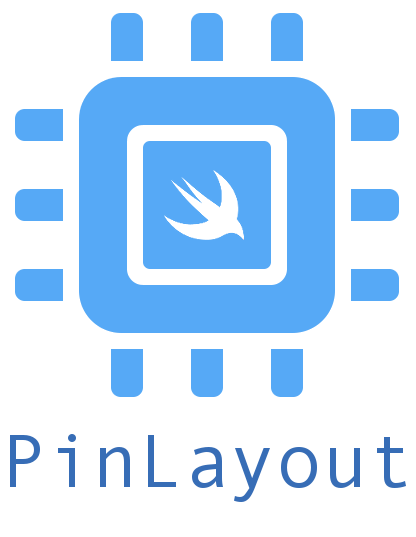</a>
</p>
 
<p align="center">
  <a href="https://github.com/layoutBox/PinLayout"></a>
  <a href="https://github.com/layoutBox/PinLayout"></a>
</p>

<p align="center">
  <a href='https://cocoapods.org/pods/PinLayout'>	 
  <a href="https://github.com/Carthage/Carthage"></a>
  <a href="https://swift.org/package-manager/"></a>
  <a href="https://travis-ci.org/layoutBox/PinLayout"></a>
  <a href="https://codecov.io/gh/layoutBox/PinLayout"></a>
  <a href="https://raw.githubusercontent.com/layoutBox/PinLayout/master/LICENSE"></a>
</p>

<!--p align="center">
  <a href='https://cocoapods.org/pods/PinLayout'></a>
  <a href='https://cocoapods.org/pods/PinLayout'></a>
  <a href='https://cocoapods.org/pods/PinLayout'></a>
  <a href='https://cocoapods.org/pods/PinLayout'></a>
</p-->

<!--<a href="https://github.com/layoutBox/PinLayout/issues"></a>-->


Extremely Fast views layouting without auto layout. No magic, pure code, full control and blazing fast. Concise syntax, intuitive, readable & chainable. PinLayout can layouts UIView, NSView and CALayer.

  
> "No Auto layout constraints attached"


### Requirements
* iOS 8.0+ / tvOS 9.0+ / macOS 10.9+
* Swift 4.* / Swift 3.* / Objective-C
* Xcode 10 / Xcode 9.* / Xcode 8.* 

### Recent changes/features
* :star: Add methods to position a view between two other views. See [Layout between other views](#layout_between).
* :star: Add [`pin.readableMargins` and `pin.layoutMargins`](#safeAreaInsets) properties.
* :star: Add `sizeToFit()` method. See [Adjusting size](#adjusting_size).
* :star: PinLayout can now layout CALayer. See [CALayer Support](#calayer_support) for more information.
* :star: PinLayout is in the Top 10 of Swift Layout frameworks on [Awesome Swift](https://swift.libhunt.com/categories/714-layout) 
* :star: PinLayout has moved to the **[layoutBox](https://github.com/layoutBox)** organization.
* :star: Add [`wrapContent()`](#wrapContent) methods that adjust view's width and height to wrap all its subviews.
* :star: PinLayout expose the `safeAreaInsets` through [`pin.safeArea`](#safeAreaInsets), this property support not only iOS 11, but is also backward compatible for earlier iOS releases (7/8/9/10). See [safeAreaInsets support](#safeAreaInsets) for more information.
* See [Changelog](https://github.com/layoutBox/PinLayout/blob/master/CHANGELOG.md) for all changes.


### Content

* [Introduction examples](#intro_usage_examples)
* [PinLayout principles and philosophy](#introduction)
* [Performance](#performance)
* [Documentation](#documentation)
  * [Right to left languages (RTL) support](#rtl_support)
  * [Edges layout](#layout_edges) 
  * [Relative Edges layout](#relative_edges_layout)
	  * [Relative Edges layout with alignment](#relative_edges_layout_w_alignment)
  * [Layout between other views](#layout_between)
	  * [Layout between other views with alignment](#layout_between_w_alignment)
  * [Edges](#edges)
  * [Anchors](#anchors)
  * [Width, height and size](#width_height_size)
  * [Adjusting size](#adjusting_size)
  * [minWidth, maxWidth, minHeight, maxHeight](#minmax_width_height_size)
  * [Margins](#margins)
  * [Aspect Ratio](#aspect_ratio)
  * [safeArea, readable and layout margins](#safeAreaInsets)
  * [WrapContent](#wrapContent)
  * [justify, align](#justify_align)
  * [UIView's transforms](#uiview_transform)
  * [Warnings](#warnings)
  * [Animations using PinLayout](#animations)
  * [More examples](#more_examples)
* [Examples App](#examples_app)
* [macOS Support](#macos_support)
* [CALayer Support](#calayer_support)
* [PinLayout in Xcode Playgrounds](#playgrounds)
* [PinLayout using Objective-C](#objective_c_interface)
* [Installation](#installation)
* [FAQ](#faq)
* [Comments, ideas, suggestions, issues, ...](#comments)

<br>

:pushpin: PinLayout is actively updated. So please come often to see latest changes. You can also **Star** it to be able to retrieve it easily later.


### PinLayout and layoutBox

<a href="https://github.com/layoutBox/PinLayout">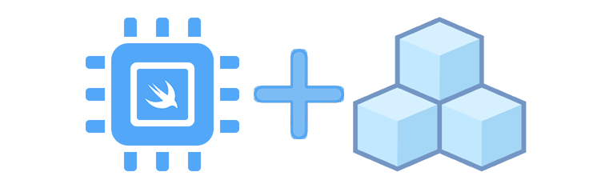</a>

**PinLayout** is part of the **layoutBox** organization containing few Open Source projects related to layout using Swift. See  **[layoutBox](https://github.com/layoutBox)**. 

### PinLayout + Autolayout
You don't need to choose, you can layout some views using PinLayout and some other with autolayout. Your views just to need to implement the autolayout `intrinsicContentSize` properties.

<br>

<a name="intro_usage_examples"></a>
# Introduction examples 

###### Example 1:
This example layout an image, a UISegmentedControl, a label and a line separator. This example adjusts its content to match the device's size and orientation changes.

* **UIImageView**'s size is 100x100 and layouted below the UINavigationBar with a margin of 10 pixels all around.
* **UISegmentedControl** is at the right of the logo image, use the remaining horizontal space with a left and right margin of 20 pixels.
* **UILabel** is below the UISegmentedControl with a top margin of 10 pixels. Its width matched the UISegmentedControl's width. The label is multiline, so its height must be adjusted to fit its width.
* **Separator** is below the UIImageView and the UILabel, i.e. below the tallest one. The separator has a top margin of 10 pixels, left-aligned to the UIImageView and right-aligned to the UISegmentedControl.


<a href="https://github.com/layoutBox/PinLayout/blob/master/Example/PinLayoutSample/UI/Examples/Intro/IntroView.swift">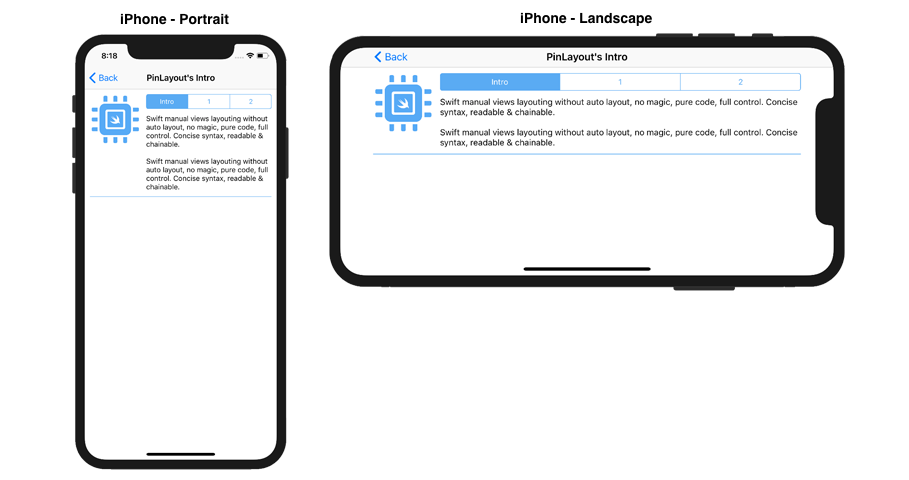</a>  

```swift
override func layoutSubviews() {
   super.layoutSubviews() 
   let padding: CGFloat = 10
    
   logo.pin.top(pin.safeArea).left(pin.safeArea).width(100).aspectRatio().margin(padding)
   segmented.pin.after(of: logo, aligned: .top).right(pin.safeArea).marginHorizontal(padding)
   textLabel.pin.below(of: segmented, aligned: .left).width(of: segmented).pinEdges().marginTop(10).sizeToFit(.width)
   separatorView.pin.below(of: [logo, textLabel], aligned: .left).right(to: segmented.edge.right).marginTop(10)
}
``` 

* 4 views, 4 lines
* PinLayout expose the `safeAreaInsets` through [`UIView.pin.safeArea`](#safeAreaInsets), this property support not only iOS 11, but is also backward compatible for earlier iOS releases (7/8/9/10). See [safeAreaInsets support](#safeAreaInsets) for more information.
* PinLayout doesn't use auto layout constraints, it is a framework that manually layout views. For that reason you need to update the layout inside either `UIView.layoutSubviews()` or `UIViewController.viewDidLayoutSubviews()` to handle container size's changes, including device rotation. You'll also need to handle UITraitCollection changes for app's that support multitasking. In the example above PinLayout's commands are inside UIView's `layoutSubviews()` method.
* This example is available in the [Examples App](#examples_app). See example complete [source code](https://github.com/layoutBox/PinLayout/blob/master/Example/PinLayoutSample/UI/Examples/Intro/IntroView.swift)

<br/>

###### Example 2:
This example shows how easily PinLayout can adjust its layout based on the view's container size. 

* If the container's width is smaller than 500 pixels, the label takes the full width and the UISegmentedControl is placed below it.
* If the container's width is greater or equal to 500 pixels, the UISegmentedControl is at the top-right corner and the label takes the remaining horizontal space.

<a href="https://github.com/layoutBox/PinLayout/blob/master/Example/PinLayoutSample/UI/Examples/AdjustToContainer/Subviews/ChoiceSelectorView.swift">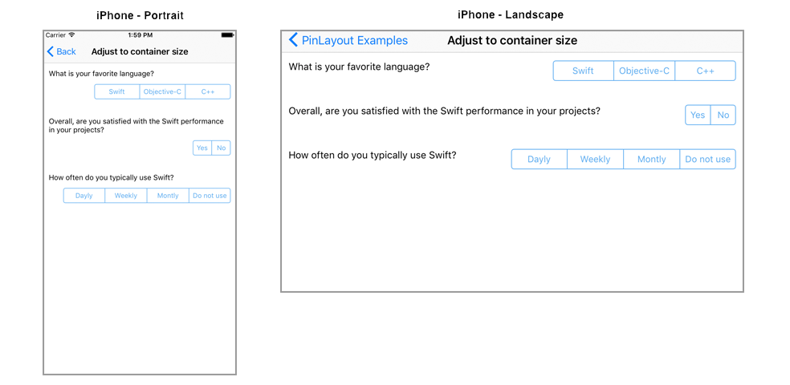</a>


```swift
  let margin: CGFloat = 12
        
  if frame.width < 500 {
      textLabel.pin.top().horizontally().margin(margin).sizeToFit(.width)
      segmentedControl.pin.below(of: textLabel).right().margin(margin)
  } else {
      segmentedControl.pin.top().right().margin(margin)
      textLabel.pin.top().left().before(of: segmentedControl).margin(margin).sizeToFit(.width)
  }
``` 

:pushpin: This example is available in the [Examples App](#examples_app). See example complete [source code](https://github.com/layoutBox/PinLayout/blob/master/Example/PinLayoutSample/UI/Examples/AdjustToContainer/Subviews/ChoiceSelectorView.swift)


<a name="introduction"></a>
## PinLayout principles and philosophy 

* Manual layouting (doesn't rely on auto layout).
* PinLayout exist to be simple and fast as possible! In fact, it is fast as manual layouting. See [performance results below.](#performance)
* Full control: You're in the middle of the layout process, no magic black box. 
* Layout one view at a time. Make it simple to code and debug.
* Concise syntax. Layout most views using a single line. 
* [**See the complete list here....**](docs/PinLayout_principles.md)

<a name="performance"></a>
# PinLayout's Performance 

PinLayout's performance has been measured using the [Layout Framework Benchmark](https://github.com/layoutBox/LayoutFrameworkBenchmark). 

As you can see in the following chart, PinLayout are faster or equal to manual layouting, and **between 8x and 12x faster than auto layout**, and this for all types of iPhone (5S/6/6S/7/8/X)

#### [See here for more details, results and explanation of the benchmark](docs/Benchmark.md).

<p align="center">
	<a href="docs/Benchmark.md">
	  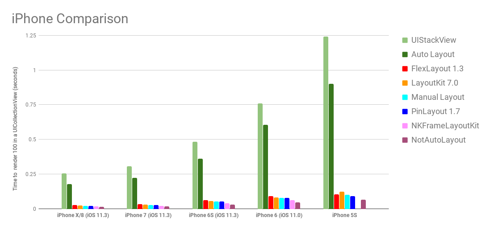
	  </a>
</p>

<a name="documentation"></a>
# Documentation 

### UIKit safeAreaInsets support 
PinLayout can easily handle iOS 11 `UIView.safeAreaInsets`, but it goes even further by supporting safeAreaInsets for previous iOS releases (including iOS 7/8/9/10) by adding a property `UIView.pin.safeArea`. [See here for more details](#safeAreaInsets)

### macOS support 
PinLayout support macOS 10.9+.

:pushpin: In this documentation, any methods with parameters of type UIView or UIEdgeInsets are also supported on macOS, using NSView and NSEdgeInsets. See [macOS Support](#macos_support) for more information.

<a name="rtl_support"></a>
### Right to left languages (RTL) support 
PinLayout supports left-to-right (LTR) and right-to-left (RTL) languages. 
#### [See here for more details](docs/rtl_support.md).

<br/>


<a name="layout_edges"></a>
## Edges layout

PinLayout can position a view’s edge relative to its superview edges.

###### Example:
This example layout the view A to fit its superview frame with a margin of 10 pixels. It pins the top, left, bottom and right edges.

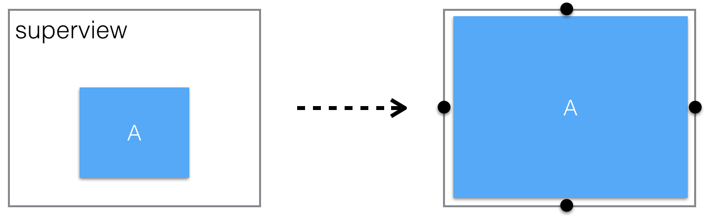


```swift
    viewA.pin.top(10).bottom(10).left(10).right(10)
``` 

Another shorter possible solution using `all()`:

```swift
    view.pin.all(10)
```

**Methods**:

The following methods are used to position a view’s edge relative to its superview edges. 

:pushpin: The offset/margin parameter in the following methods can be either positive and negative. In general cases positive values are used.

* **`top(_ offset: CGFloat)`** / **`top(_ offset: Percent)`** /  **`top()`** / **`top(_ margin: UIEdgeInsets)`**  
Position the top edge. The offset specifies the top edge distance from the superview's top edge in pixels (or in percentage of its superview's height). `top()` is similar to calling `top(0)`, it position the view top edge directly on its superview top edge. `top(:UIEdgeInsets)` use the `UIEdgeInsets.top` property, is particularly useful with [safeArea, readable and layout margins](#safeAreaInsets).

* **`bottom(_ offset: CGFloat)`** / **`bottom(_ offset: Percent)`** / **`bottom()`** / **`bottom(_ margin: UIEdgeInsets)`**   
Position the bottom edge. The offset specifies the bottom edge **distance from the superview's bottom edge** in pixels (or in percentage of its superview's height). `bottom()` is similar to calling `bottom(0)`, it position the view bottom edge directly on its superview top edge. `bottom(:UIEdgeInsets)` use the `UIEdgeInsets.bottom` property, it is is particularly useful with [safeArea, readable and layout margins](#safeAreaInsets).

* **`left(_ offset: CGFloat)`** / **`left(_ offset: Percent)`** / **`left()`** / **`left(_ margin: UIEdgeInsets)`**   
Position the left edge. The offset specifies the left edge distance from the superview's left edge in pixels (or in percentage of its superview's width). `left()` is similar to calling `left(0)`, it position the view left edge directly on its superview left edge. `left(:UIEdgeInsets)` use the `UIEdgeInsets.left` property, it is particularly useful with [safeArea, readable and layout margins](#safeAreaInsets).

* **`right(_ offset: CGFloat)`** / **`right(_ offset: Percent)`** / **`right()`** / **`right(_ margin: UIEdgeInsets)`**   
Position the right edge. The offset specifies the right edge **distance from the superview's right edge** in pixels (or in percentage of its superview's width). `right()` is similar to calling `right(0)`, it position the view right edge directly on its superview right edge. `right(:UIEdgeInsets)` use the `UIEdgeInsets. right` property, it is particularly useful with [safeArea, readable and layout margins](#safeAreaInsets).

* **`vCenter(_ offset: CGFloat)`** / **`vCenter(_ offset: Percent)`** / **`vCenter()`**  
Position the vertical center (center.y). The offset specifies the distance vertically of the view's center related to the superview's center in pixels (or in percentage of its superview's height). A positive offset move the view down and a negative value move it up relative to the superview's center. `vCenter()` is similar to calling `vCenter(0)`, it position vertically the view's center directly on its superview vertical center.

* **`hCenter(_ offset: CGFloat)`** / **`hCenter(_ offset: Percent)`** / **`hCenter()`**  
Position the horizontal center (center.x). The offset specifies the distance horizontally of the view's center related to the superview's center in pixels (or in percentage of its superview's width). A positive offset move the view to the right and a negative offset move it to the left relative to the superview's center. `hCenter()` is similar to calling `hCenter(0)`, it position horizontally the view's center directly on its superview horizontal center. 

##### Methods supporting LTR (left-to-right) and RTL (right-to-left) languages.

* **`start(_ offset: CGFloat)`** / **`start(_ offset: Percent)`** / **`start()`** / **`start(_ margin: UIEdgeInsets)`** :left_right_arrow:  
Position the left or right edge depending of the LTR language direction. In LTR direction the offset specifies the left edge distance from the superview's left edge in pixels (or in percentage of its superview's width). In RTL direction the offset specifies the right edge distance from the superview's right edge in pixels (or in percentage of its superview's width).  
`start()` is similar to calling `start(0)`. `start(:UIEdgeInsets)` use the `UIEdgeInsets.left` property in LTR direction and `UIEdgeInsets.right` in RTL direction.

* **`end(_ offset: CGFloat)`** / **`end(_ offset: Percent)`** / **`end()`** / **`end(_ margin: UIEdgeInsets)`** :left_right_arrow:  
Position the left or right edge depending of the LTR language direction. In LTR direction the offset specifies the right edge distance from the superview's right edge in pixels (or in percentage of its superview's width). In RTL direction the offset specifies the left edge distance from the superview's left edge in pixels (or in percentage of its superview's width).  `end()` is similar to calling `end(0)`. `end(:UIEdgeInsets)` use the `UIEdgeInsets.right` property in LTR direction and `UIEdgeInsets.left` in RTL direction.

<a name="pin_multiple_edges"></a>
**Methods pinning multiple edges**:

* **`all(_ margin: CGFloat)`** / **`all()`** / **`all(_ margin: UIEdgeInsets)`**   
Position the top, left, bottom and right edges. The margin specifies the **top, bottom, left and right edges** distance from the superview's corresponding edge in pixels. Similar to calling `view.top(value).bottom(value).left(value).right(value)`.  
`all()` is similar to calling `all(0)`.  
`all(:UIEdgeInsets)` is particularly useful with [safeArea, readable and layout margins](#safeAreaInsets).

* **`horizontally(_ margin: CGFloat)`** / **`horizontally(_ margin: Percent)`** / **`horizontally()`** / **`horizontally(_ margin: UIEdgeInsets)`**   
Position the left and right edges. The margin specifies the **left and right edges** distance from its superview's corresponding edges in pixels (or in percentage of its superview's width).  
`horizontally()` is similar to calling `horizontally(0)`.  
`horizontally(:UIEdgeInsets)` use the UIEdgeInsets's left and right value to pin left and right edges.

* **`vertically(_ margin: CGFloat)`** / **`vertically(_ margin: Percent)`** / **`vertically()`** / **`vertically(_ margin: UIEdgeInsets)`**  
Position the top and bottom edges. The margin specifies the **top and bottom edges** distance from on its superview's corresponding edges in pixels (or in percentage of its superview's height).  
`vertically()` is similar to calling `vertically(0)`.  
`vertically(:UIEdgeInsets)` use the UIEdgeInsets's top and bottom value to pin top and bottom edges.


###### Usage Examples:

```swift
   view.pin.top(20).bottom(20)   // The view has a top margin and a bottom margin of 20 pixels 
   view.pin.top().left()         // The view is pinned directly on its parent top and left edge
   view.pin.all()                // The view fill completely its parent (horizontally and vertically)
   view.pin.all(pin.safeArea)    // The view fill completely its parent safeArea 
   view.pin.top(25%).hCenter()   // The view is centered horizontally with a top margin of 25%
   view.pin.left(12).vCenter()   // The view is centered vertically
   view.pin.start(20).end(20)    // Support right-to-left languages.
   view.pin.horizontally(20)     // The view is filling its parent width with a left and right margin.
   view.pin.top().horizontally() // The view is pinned at the top edge of its parent and fill it horizontally.
```

<br/>

#### Layout multiple edges relative to superview

This section describe methods that are similar to methods describe in the previous section [Edges layout](#layout_edges), except that they position 2 edges simultaneously. They can be used as shortcuts to set 2 consecutive edges.


###### Example:
This example position the view’s on the top-right corner of its superview’s topRight and set its size to 100 pixels.

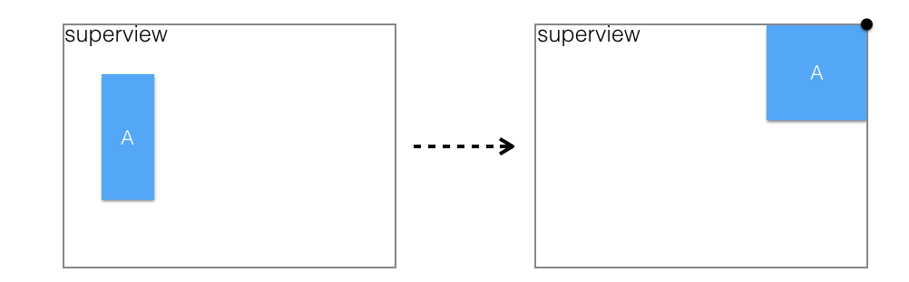


```swift
	viewA.pin.topRight().size(100)
``` 

This is equivalent to:

```swift
	viewA.pin.top().right().size(100)
```
**Methods:**

:pushpin: The offset parameter in the following methods can be either positive and negative. In general cases positive values are used.

* **`topLeft(_ offset: CGFloat)`** / **`topLeft()`**  
Position the top and left edges. The offset specifies the distance from their superview's corresponding edges in pixels. `topLeft()` is similar to calling `topLeft(0)`.

* **`topCenter(_ topOffset: CGFloat)`** / **`topCenter()`**  
Position the top and horizontal center (center.x). The offset specifies the top edge distance from the superview's top edge in pixels. `topCenter()` is similar to calling `topCenter(0)`.

* **`topRight(_ offset: CGFloat)`** / **`topRight()`**  
Position the top and right edges. The offset specifies the distance from their superview's corresponding edges in pixels. `topRight()` is similar to calling `topRight(0)`.


* **`centerLeft(_ leftOffset: CGFloat)`** / **`centerLeft()`**  
Position the vertical center (center.y) and the left edge. The offset specifies the left edge distance from the superview's left edge in pixels. `centerLeft()` is similar to calling `centerLeft(0)`.

* **`center(_ offset: CGFloat)`** / **`center()`**  
Position the horizontal and vertical center (center.y). The offset specifies an offset from the superview's center in pixels. `center()` is similar to calling `center(0)`.

* **`centerRight(_ rightOffset: CGFloat)`** / **`centerRight()`**  
Position the vertical center (center.y) and the right edge. The offset specifies the right edge distance from the superview's right edge in pixels. `centerRight()` is similar to calling `centerRight(0)`.


* **`bottomLeft(_ offset: CGFloat)`** / **`bottomLeft()`**  
Position the bottom and left edges. The offset specifies the distance from their superview's corresponding edges in pixels. `bottomLeft()` is similar to calling `bottomLeft(0)`.

* **`bottomCenter(_ bottomOffset: CGFloat)`** / **`bottomCenter()`**  
Position the bottom and horizontal center (center.x). The offset specifies the bottom edge distance from the superview's bottom edge in pixels. `bottomCenter()` is similar to calling `bottomCenter(0)`.

* **`bottomRight(_ offset: CGFloat)`** / **`bottomRight()`**  
Position the bottom and right edges. The offset specifies the distance from their superview's corresponding edges in pixels. `bottomRight()` is similar to calling `bottomRight(0)`.


##### Methods supporting LTR (left-to-right) and RTL (right-to-left) languages.

* **`topStart(_ offset: CGFloat)`** / **`topStart()`** :left_right_arrow:  
In LTR direction position the top and left edges.
In RTL direction position the top and right edges.

* **`topEnd(_ offset: CGFloat)`** / **`topEnd()`** :left_right_arrow:  
In LTR direction position the top and right edges.
In RTL direction position the top and left edges.

* **`bottomStart(_ offset: CGFloat)`** / **`bottomStart()`** :left_right_arrow:  
In LTR direction position the bottom and left edges.
In RTL direction position the bottom and right edges.

* **`bottomEnd(_ offset: CGFloat)`** / **`bottomEnd()`** :left_right_arrow:  
In LTR direction position the bottom and right edges.
In RTL direction position the bottom and left edges.

* **`centerStart(_ offset: CGFloat)`** / **`centerStart()`** :left_right_arrow:  
In LTR direction position the vertical center (center.y) and the left edge.
In RTL direction position the vertical center (center.y) and the right edge.

* **`centerEnd(_ offset: CGFloat)`** / **`centerEnd()`** :left_right_arrow:  
In LTR direction position the vertical center (center.y) and the right edge.
In RTL direction position the vertical center (center.y) and the left edge.


###### Usage Examples:

```swift
   // Position a view at the top left corner with a top and left margin of 10 pixels
   view.pin.topLeft(10)

   // Position the 4 edges with a margin of 10 pixels.
   view.pin.topLeft(10).bottomCenter(10)
```

<br/>

<a name="relative_edges_layout"></a>
## Relative Edges layout 

### Layout using relative positioning

PinLayout has methods to position relative to other views. The view can be layouted relative to **one or many relative views**. The following methods layout one view's edge (top, bottom, left or right).

**Methods:**

* **`above(of: UIView)`**  / **`above(of: [UIView])`**  
Position the view above the specified view(s). One or many relative views can be specified. This method position the view’s bottom edge.  

* **`below(of: UIView)`** / **`below(of: [UIView])`**  
Position the view below the specified view(s). One or many relative views can be specified. This method position the view’s top edge.  

* **`before(of: UIView)`** / **`before(of: [UIView])`** :left_right_arrow:  
In LTR direction the view is positioned at the left of the specified view(s). In RTL direction the view is positioned at the right. One or many relative views can be specified.

* **`after(of: UIView)`** / **`after(of: [UIView])`**:left_right_arrow:  
In LTR direction the view is positioned at the right of the specified view(s). In RTL direction the view is positioned at the left. One or many relative views can be specified. 

* **`left(of: UIView)`** / **`left(of: [UIView])`**  
Position the view left of the specified view(s). Similar to `before(of:)`. One or many relative views can be specified. This method position the view’s right edge.  

* **`right(of: UIView)`** / **`right(of: [UIView])`**  
Position the view right of the specified view(s). Similar to `after(of:)`. One or many relative views can be specified. This method position the view’s left edge.

:pushpin: **Multiple relative views**: If for example a call to `below(of: [...]) specify multiple relative views, the view will be layouted below *ALL* these views. 

:pushpin: These methods can pin a view’s relative to any views, even if they don't have the same direct superview! It works with any views that have a shared ancestor. 

###### Usage examples:
```swift
	view.pin.after(of: view4).before(of: view1).below(of: view3)
	view.pin.after(of: view2)
	view.pin.below(of: [view2, view3, view4])
```

###### Example:
The following example will position the view C between the view A and B with margins of 10px using relative positioning methods.


```swift
	viewC.pin.top().after(of: viewA).before(of: viewB).margin(10)
```
This is an equivalent solution using [edges](#edge):

```swift
	viewC.pin.top().left(to: viewA.edge.right).right(to: viewB.edge.left). margin(10)
```

This is also an equivalent solution using [horizontallyBetween()](#layout_between_w_alignment). See section [Layout between other views](#layout_between):

```swift
	viewC.pin.horizontallyBetween(viewA, and: viewB, aligned: .top).marginHorizontal(10)
```

<br/>

<a name="relative_edges_layout_w_alignment"></a>
### Layout using Relative Edges and alignment 

PinLayout also has methods to position relative to other views but with also the ability to specify an **alignment**. The view can be layouted relative to **one or many relative views**. 

This is really similar to [Relative Edges layout](#relative_edges_layout) except that here two edges are being layouted. 

**Methods:**

* **`above(of: UIView, aligned: HorizontalAlignment)`**  
**`above(of: [UIView], aligned: HorizontalAlignment)`**  
Position the view above the specified view(s) and aligned it using the specified HorizontalAlignment. One or many relative views can be specified. 
  
* **`below(of: UIView, aligned: HorizontalAlignment)`**  
**`below(of: [UIView], aligned: HorizontalAlignment)`**  
Position the view below the specified view(s) and aligned it using the specified HorizontalAlignment. One or many relative views can be specified. 
  
* **`before(of: UIView, aligned: HorizontalAlignment)`**:left_right_arrow:  
**`before(of: [UIView], aligned: HorizontalAlignment)`**:left_right_arrow:  
In LTR direction the view is positioned at the left of the specified view(s). In RTL direction the view is positioned at the right. One or many relative views can be specified. 

* **`after(of: UIView, aligned: HorizontalAlignment)`**:left_right_arrow:  
**`after(of: [UIView], aligned: HorizontalAlignment)`**:left_right_arrow:  
In LTR direction the view is positioned at the right of the specified view(s). In RTL direction the view is positioned at the left. One or many relative views can be specified. 

* **`left(of: UIView, aligned: VerticalAlignment)`**  
**`left(of: [UIView], aligned: HorizontalAlignment)`**  
Position the view left of the specified view(s) and aligned it using the specified VerticalAlignment. Similar to `before(of:)`. One or many relative views can be specified. 
  
* **`right(of: UIView, aligned: VerticalAlignment)`**  
**`right(of: [UIView], aligned: HorizontalAlignment)`**  
Position the view right of the specified view(s) and aligned it using the specified VerticalAlignment. Similar to `after(of:)`. One or many relative views can be specified. 


**`HorizontalAlignment` values:**

* **`.left`**: The view's left edge will be left-aligned with the relative view (or the left most view if a list of relative views is specified).
* **`.center`**: The view's will be horizontally centered with the relative view (or the average hCenter if a list of relative views is used).
*  **`.right`**: The view's right edge will be right-aligned with the relative view (or the right most view if a list of relative views is specified).
* **`.start`**:left_right_arrow::  
In LTR direction, similar to using `.left`.
In RTL direction, similar to using `.right`.
* **`.end`**:left_right_arrow::  
In LTR direction, similar to using `.right`.
In RTL direction, similar to using `.left`.

**`VerticalAlignment` values:**

*  **`.top`**: The view's top edge will be top-aligned with the relative view (or the top most view if a list of relative views is specified).
*  **`.center`**: The view's will be vertically centered with the relative view (or the average vCenter if a list of relative views is used).
*  **`.bottom`**: The view's bottom edge will be bottom-aligned with the relative view (or the bottom most view if a list of relative views is specified).

:pushpin: **Multiple relative views**: If for example a call to `below(of: [...], aligned:) specify multiple relative views, the view will be layouted below *ALL* these views. The alignment will be applied using all relative views.

:pushpin: These methods can layout a view’s relative to any views, even if they don't have the same direct superview/parent! It works with any views that have a shared ancestor. 

###### Usage examples:
```swift
	view.pin.above(of: view2, aligned: .left)
	view.pin.below(of: [view2, view3, view4], aligned: .left)
	view.pin.after(of: view2, aligned: .top).before(of: view3, aligned: .bottom)
```

###### Example:
The following example layout the view B below the view A aligned on its center.

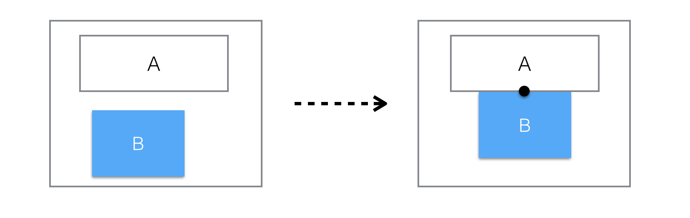


```swift
	viewB.pin.below(of: viewA, aligned: .center)
```
This is an equivalent solution using anchors:

```swift
	viewB.pin.topCenter(to: viewA.anchor.bottomCenter)
```

###### Example:
The following example layout the view A **below the UIImageView and the UILabel**.
View A should be left aligned to the UIImageView and right aligned to the UILabel, with a top margin of 10 pixels.

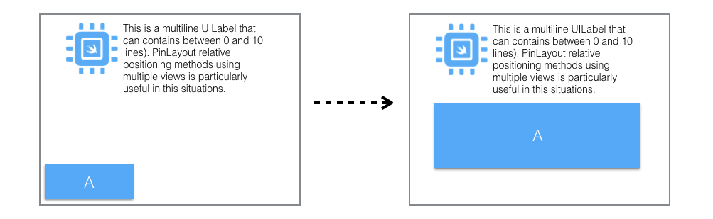


```swift
	a.pin.below(of: [imageView, label], aligned: .left).right(to: label.edge.right).marginTop(10)
```
This is an equivalent solutions using other methods:

```swift
   let maxY = max(imageView.frame.maxY, label.frame.maxY)  // Not so nice
   a.pin.top(maxY).left(to: imageView.edge.left).right(to: label.edge.right).marginTop(10)
```

### Positioning using only visible relative Views 

All PinLayout's relative methods can accept an array of Views (ex: `below(of: [UIView])`). Using these methods its possible to filter the list of relative Views before the list is used by PinLayout.

You can define your own filter methods, but PinLayout has a filter method called `visible` that can be used to layout a view related to only visible views. This can be really useful when some views may be visible or hidden depending on the situation.

```swift
   view.pin.below(of: visibles([ageSwitch, ageField])).horizontally().
``` 

Note that the **Form** example use this filter method, see [Examples App](#examples_app).

<br/>


<a name="layout_between"></a>
## Layout between other views 

PinLayout has methods to position a view between two other views, either horizontally or vertically. These methods layout 2 edges simultaneously.

**Methods:**

* **`horizontallyBetween(:UIView, and: UIView)`**  
Position the view between the two specified views horizontally. The method layout the view's left and right edges. The order of the reference views is irrelevant.
Note that the layout will be applied only if there is horizontal space between the specified views. 

* **`verticallyBetween(:UIView, and: UIView)`**  
Position the view between the two specified views vertically. The method layout the view's top and bottom edges. The order of the reference views is irrelevant. Note that the layout will be applied only if there is vertical space between the specified views. 
  
:pushpin: These methods can use references to any views, even if they don't have the same direct superview/parent! It works with any views that have a shared ancestor. 

###### Usage examples:
```swift
	view.pin.horizontallyBetween(viewA, and: viewB)
	view.pin.verticallyBetween(viewC, and: viewD)
```

###### Example:
This example position a view between two other views horizontally with a left and right margins of 5 pixels, and set its top edge at 10 pixels.

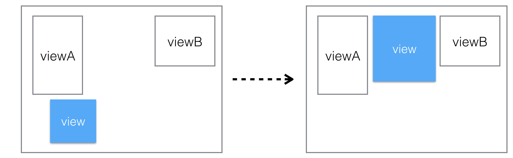


```swift
   view.pin.horizontallyBetween(viewA, and: viewB).top(10).marginHorizontal(5)
```

Note that the same result can also be achieved using an alignment parameter, describe in the [next section](#layout_between_w_alignment):

```swift
   view.pin.horizontallyBetween(viewA, and: viewB, aligned: .top).marginHorizontal(5)
```

Or using [Relative Edges layout](#relative_edges_layout):

```swift
   view.pin.after(of: viewA).before(of: viewB).top(10).marginHorizontal(5)
```


 
<a name="layout_between_w_alignment"></a>
### Layout between other views with alignment

PinLayout has also methods to position a view between two other views, either horizontally or vertically, but with also the ability to specify an **alignment**.

This is really similar to the [previous section methods](#layout_between) except that here an alignment is specified and **three edges** are being layouted simultaneously. 

**Methods:**

* **`horizontallyBetween(:UIView, and: UIView, aligned: VerticalAlign)`**  
Position the view between the two specified views horizontally and aligned it using the specified VerticalAlign. The view will be aligned related to the first specified reference view. Note that the layout will be applied only if there is horizontal space between the specified views. 

* **`verticallyBetween(:UIView, and: UIView, aligned: HorizontalAlign)`**  
Position the view between the two specified views vertically and aligned it using the specified HorizontalAlign. The view will be aligned related to the first specified reference view. Note that the layout will be applied only if there is vertical space between the specified views. 

:pushpin: These methods will apply the alignment related to the first specified reference view. If you want to align it using the second reference view, simply swap views parameters. 
  
:pushpin: These methods can use references to any views, even if they don't have the same direct superview/parent! It works with any views that have a shared ancestor. 

**HorizontalAlignment values:**

* **`.left`**: The view's left edge will be left-aligned with the first view.
* **`.center`**: The view's will be horizontally centered with the first view.
*  **`.right`**: The view's right edge will be right-aligned with the first view.
* **`.start`**:left_right_arrow::  
In LTR direction, similar to using `.left`.
In RTL direction, similar to using `.right`.
* **`.end`**:left_right_arrow::  
In LTR direction, similar to using `.right`.
In RTL direction, similar to using `.left`.

**VerticalAlignment values:**

*  **`.top`**: The view's top edge will be top-aligned with the first view.
*  **`.center`**: The view's will be vertically centered with the first view.
*  **`.bottom`**: The view's bottom edge will be bottom-aligned with the first view.

###### Usage examples:
```swift
	view.pin.horizontallyBetween(viewA, and: viewB, aligned: .top)
	view.pin.verticallyBetween(viewC, and: viewD, aligned: .center)
```

###### Example:
This example position a view between two other views vertically, and center it relative to the first view with an top and bottom margin of 10 pixels.


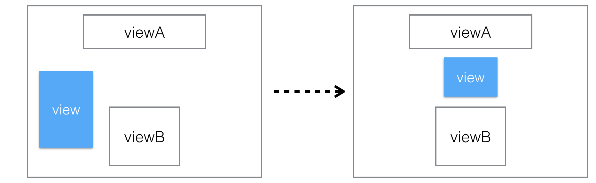


```swift
   view.pin.verticallyBetween(viewA, and: viewB, aligned: .center).marginVertical(10)
```

<br/>

<a name="edges"></a>
## Edges 

### PinLayout UIView’s edges

PinLayout adds edges properties to UIView/NSView. These properties are used to reference other view’s edges.

**PinLayout View’s edges**:

* `UIView.edge.top`
* `UIView.edge.vCenter`
* `UIView.edge.bottom`
* `UIView.edge.left`
* `UIView.edge.hCenter`
* `UIView.edge.right`
* `UIView.edge.start`:left_right_arrow:
* `UIView.edge.end`:left_right_arrow:

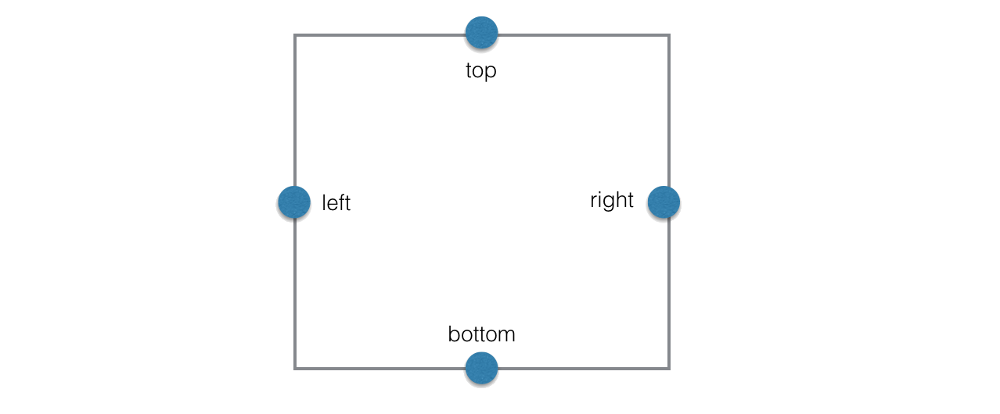


### Layout using edges

PinLayout has methods to attach a View's edge (top, left, bottom, right, start or end edge) to another view’s edge.

**Methods:**

* **`top(to edge: ViewEdge)`**:  
Position the view's top edge directly on another view’s edge (top/vCenter/bottom).

* **`vCenter(to edge: ViewEdge)`**:  
Position vertically the view's center directly on another view’s edge (top/vCenter/bottom).

* **`bottom(to edge: ViewEdge)`**:  
Position the view's bottom edge directly on another view’s edge (top/vCenter/bottom).

* **`left(to: edge: ViewEdge)`**:  
Position the view's left edge directly on another view’s edge (left/hCenter/right).

* **`hCenter(to: edge: ViewEdge)`**:  
Position horizontally the view's center directly on another view’s edge (left/hCenter/right).

* **`right(to: edge: ViewEdge)`**:  
Position the view's right edge directly on another view’s edge (left/hCenter/right).

* **`start(to: edge: ViewEdge)`**:left_right_arrow:
In LTR direction it position the view's left edge directly on another view’s edge.  
In RTL direction it position the view's right edge directly on another view’s edge. 
 
* **`end(to: edge: ViewEdge)`**:left_right_arrow:  
In LTR direction it position the view's top edge directly on another view’s edge.  
In RTL direction it position the view's bottom edge directly on another view’s edge.  

:pushpin: These methods can pin a view’s edge to any other view's edge, even if they don't have the same direct superview! It works with any views that have a shared ancestor. 

###### Usage examples:
```swift
	view.pin.left(to: view1.edge.right)
	view.pin.left(to: view1.edge.right).top(to: view2.edge.right)
```

###### Example 1:
This example layout the view B left edge on the view A right edge. It only changes the view B left coordinate.


```swift
	viewB.pin.left(to: viewA.edge.right)
```

###### Example 2:
This example center horizontally the view B inside the view A with a top margin of 10 from the same view.
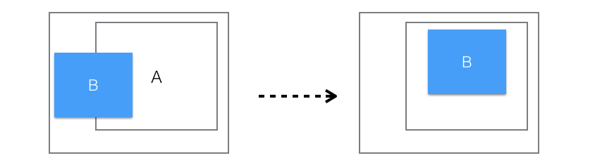


```swift
    aView.pin.top(to: bView.edge.top).hCenter(to: bView.edge.hCenter).marginTop(10)
``` 

<br/>

<a name="anchors"></a>
## Anchors 

### PinLayout View’s anchors

PinLayout adds anchors properties to UIView/NSView. These properties are used to reference other view’s anchors.

**PinLayout View’s anchors**:

* `UIView.anchor.topLeft` / `UIView.anchor.topCenter` / `UIView.anchor.topRight`
* `UIView.anchor.topStart` / `UIView.anchor.topEnd`:left_right_arrow:
* `UIView.anchor.centerLeft` / `UIView.anchor.centers` / `UIView.anchor.centerRight`
* `UIView.anchor.centerStart` /  `UIView.anchor.centerEnd`:left_right_arrow:
* `UIView.anchor.bottomLeft` / `UIView.anchor.bottomCenter` / `UIView.anchor.bottomRight`
* `UIView.anchor.bottomStart` /  `UIView.anchor.bottomEnd`:left_right_arrow:


### Layout using anchors

PinLayout can use anchors to position view’s related to other views.

Following methods position the corresponding view anchor on another view’s anchor.

**Methods:**

* `topLeft(to anchor: Anchor)`
* `topCenter(to anchor: Anchor)`
* `topRight(to anchor: Anchor)`
* `topStart(to anchor: Anchor)`:left_right_arrow:
* `topEnd(to anchor: Anchor)`:left_right_arrow:
* `centerLeft(to anchor: Anchor)`
* `center(to anchor: Anchor)`
* `centerRight(to anchor: Anchor)`
* `centerStart(to anchor: Anchor)`:left_right_arrow:
* `centerEnd(to anchor: Anchor)`:left_right_arrow:
* `bottomLeft(to anchor: Anchor)`
* `bottomCenter(to anchor: Anchor)`
* `bottomRight(to anchor: Anchor)`
* `bottomStart(to anchor: Anchor)`:left_right_arrow:
* `bottomEnd(to anchor: Anchor)`:left_right_arrow:

:pushpin: These methods can pin a view’s anchor to any other view's anchor, even if they don't have the same direct superview! It works with any views that have a shared ancestor. 

###### Usage examples:
```swift
    view.pin.topCenter(to: view1.anchor.bottomCenter)
    view.pin.topLeft(to: view1.anchor.topLeft).bottomRight(to: view1.anchor.center)
```

###### Example 1:

Layout using an anchor. This example pins the view B topLeft anchor on the view A topRight anchor.


```swift
	viewB.pin.topLeft(to: viewA.anchor.topRight)
``` 

###### Example 2:

This example center the view B on the view A's top-right anchor.

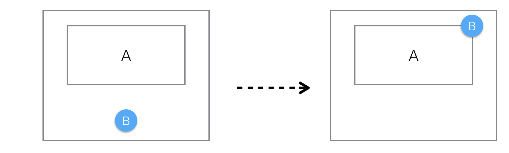


```swift
	viewB.pin.center(to: viewA.anchor.topRight)
``` 

###### Example 3:

Layout using multiple anchors. It is also possible to combine two anchors to pin the position and the size of a view. The following example will position the view C between the view A and B with horizontal margins of 10px.


```swift
	viewC.pin.topLeft(to: viewA.anchor.topRight)
	         .bottomRight(to: viewB.anchor.bottomLeft).marginHorizontal(10)
``` 

This is an another possible solution using [horizontallyBetween()](#layout_between_w_alignment):

```swift
	viewC.pin.horizontallyBetween(viewA, and: viewB, aligned: .top).height(of: viewA).marginHorizontal(10)
```

<br/>

<a name="width_height_size"></a>
## Width, height and size 

### Adjust view width, height and size
PinLayout has methods to set the view’s height and width.

**Methods:**

* **`width(:CGFloat)`** / **`width(:Percent)`**  
The value specifies the view's width in pixels (or in percentage of its superview). The value must be non-negative.

* **`width(of: UIView)`**  
Set the view’s width to match the referenced view’s width.

* **`height(:CGFloat)`** / **`height(:Percent)`**  
The value specifies the view's height in pixels (or in percentage of its superview). The value must be non-negative.
* **`height(of: UIView)`**  
Set the view’s height to match the referenced view’s height

* **`size(:CGSize)`** / **`size(:Percent)`**  
The value specifies view's width and the height in pixels (or in percentage of its superview). Values must be non-negative.
* **`size(_ sideLength: CGFloat)`**  
The value specifies the width and the height of the view in pixels, creating a square view. Values must be non-negative.
* **`size(of: UIView)`**  
Set the view’s size to match the referenced view’s size

:pushpin: width/height/size have a higher priority than edges and anchors positioning. 

###### Usage examples:
```swift
	view.pin.width(100)
	view.pin.width(50%)
	view.pin.width(of: view1)
	
	view.pin.height(200)
	view.pin.height(100%).maxHeight(240)
	
	view.pin.size(of: view1)
	view.pin.size(50%)
	view.pin.size(250)
```

<br/>

<a name="adjusting_size"></a>
### Adjusting size

PinLayout has methods to adjust the view’s size based on their content. 

The resulting size will always respect [`minWidth`/`maxWidth`/`minHeight`/`maxHeight`](#minmax_width_height_size) values.
 

**Methods:**

* **`sizeToFit()`**  
The method adjust the view's size based on it's content requirements so that it uses the most appropriate amount of space. This fit type has the same effect as calling **sizeToFit()** on a view. The resulting size come from sizeThatFits(..) being called with the current view bounds. Particularly useful for controls/views that have an intrinsic size (label, button, ...).

* **`sizeToFit(: FitType)`**  
The method adjust the view's size based on the result of the method `sizeThatFits(:CGSize)`.  
     PinLayout will adjust either the view's width or height based on the `fitType` parameter value.  
     If margins are specified, they will be applied before calling the view's `sizeThatFits(:CGSize)` method.
     
	**Parameter `fitType`:** Identify the reference dimension (width / height) that will be used to adjust the view's size.  

 * **`.width`**: The method adjust the view's size based on the **reference width**.  
     * If properties related to the width have been pinned (e.g: width, left & right, margins, ...), the **reference width will be determined by these properties**, if not the **current view's width** will be used.
     * The resulting width will always **match the reference width**.
     
 * **`.height`**: The method adjust the view's size based on the **reference height**.  
 
     * If properties related to the height have been pinned (e.g: height, top & bottom, margins, ...), the **reference height will be determined by these properties**, if not the **current view's height**  will be used.
     * The resulting height will always **match the reference height**.
     
 * **`.widthFlexible`**: Similar to `.width`, except that PinLayout won't constrain the resulting width to match the reference width. The resulting width may be smaller of bigger depending on the view's sizeThatFits(..) method result. For example a single line UILabel may returns a smaller width if it's string is smaller than the reference width.
     
 * **`.heightFlexible`**: Similar to `.height`, except that PinLayout won't constrain the resulting height to match the reference height. The resulting height may be smaller of bigger depending on the view's sizeThatFits(..) method result.
     
###### Usage examples:

```swift
     // Adjust the view's size based on the result of `UIView.sizeToFit()` and center it.
     view.pin.center().sizeToFit()

     // Adjust the view's size based on a width of 100 pixels.
     // The resulting width will always match the pinned property `width(100)`.
     view.pin.width(100).sizeToFit(.width)
 
     // Adjust the view's size based on view's current width.
     // The resulting width will always match the view's original width.
     // The resulting height will never be bigger than the specified `maxHeight`.
     view.pin.sizeToFit(.width).maxHeight(100)
 
     // Adjust the view's size based on 100% of the superview's height.
     // The resulting height will always match the pinned property `height(100%)`.
     view.pin.height(100%).sizeToFit(.height)
 
    // Adjust the view's size based on view's current height.
    // The resulting width will always match the view's original height.
    view.pin.sizeToFit(.height)

    // Since `.widthFlexible` has been specified, its possible that the resulting
    // width will be smaller or bigger than 100 pixels, based of the label's sizeThatFits()
    // method result.
    label.pin.width(100).sizeToFit(.widthFlexible)
```

###### Example:
The following example layout the UILabel on the right side of the UIImageView with a margin of 10px all around and also adjust the UILabel’t height to fit the text size. Note that the UILabel’s height has changed to fit its content.

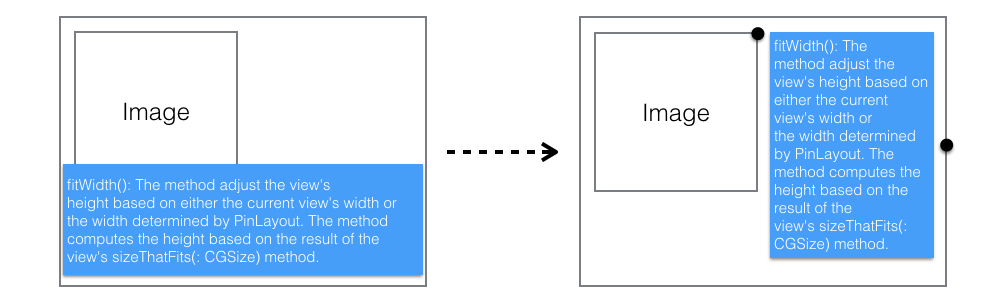


```javascript
	label.pin.after(of: image, aligned: .top).right().marginHorizontal(10).sizeToFit(.width)
```


<br/>

<a name="minmax_width_height_size"></a>
## minWidth, maxWidth, minHeight, maxHeight 

PinLayout has methods to set the view’s minimum and maximum width, and minimum and maximum height. 

:pushpin: minWidth/maxWidth & minHeight/maxHeight have the highest priority. Higher than sizes (width/height/size, sizeToFit, aspectRatio) and edges positioning (top/left/bottom/right). Their values are always fulfilled.  


**Methods:**

* **`minWidth(:CGFloat)`**  
**`minWidth(:Percent)`**  
The value specifies the view's minimum width of the view in pixels (or in percentage of its superview). The value must be non-negative.

* **`maxWidth(:CGFloat)`**  
**`maxWidth(:Percent)`**  
The value specifies the view's maximum width of the view in pixels (or in percentage of its superview). The value must be non-negative.

* **`minHeight(:CGFloat)`**  
**`minHeight(:Percent)`**  
The value specifies the view's minimum height of the view in pixels (or in percentage of its superview). The value must be non-negative.

* **`maxHeight(:CGFloat)`**  
**`maxHeight(:Percent)`**  
The value specifies the view's maximum height of the view in pixels (or in percentage of its superview). The value must be non-negative.
   
###### Usage examples:
```swift
	view.pin.left(10).right(10).maxWidth(200)
	view.pin.width(100%).maxWidth(250)
	
	view.pin.top().bottom().maxHeight(100)
	view.pin.top().height(50%).maxHeight(200)
```

###### Example:
This example layout a view 20 pixels from the top, and horizontally from left to right with a maximum width of 200 pixels. If the superview is smaller than 200 pixels, the view will take the full horizontal space, but for a larger superview, the view will be centered.

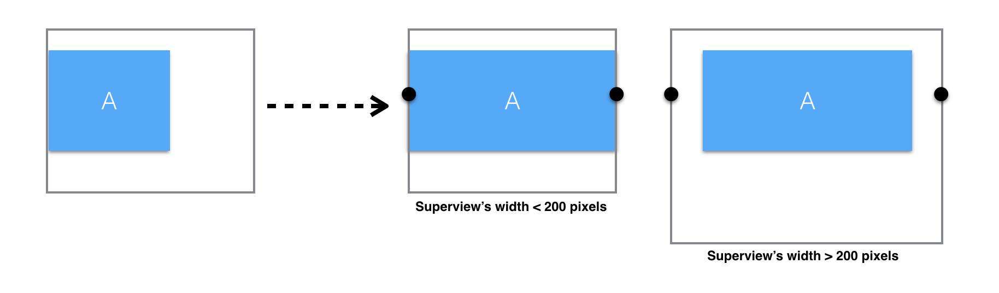


```swift
   viewA.pin.top(20).hCenter().width(100%).maxWidth(200)
``` 

This is an equivalent solutions using the `justify()` method. This method is explained in the next section:

```swift
   viewA.pin.top(20).horizontally().maxWidth(200).justify(.center)
```

<br/>

<a name="margins"></a>
## Margins 

PinLayout has methods to apply margins. PinLayout applies margins similar to CSS.

**Methods:**

* **`marginTop(:CGFloat)`** / **`marginTop(: Percent)`**  
Set the top margin in pixels or in percentage of its superview's height.
* **`marginLeft(:CGFloat)`** / **`marginLeft(: Percent)`**  
Set the left margin in pixels or in percentage of its superview's width.
* **`marginBottom(:CGFloat)`** / **`marginBottom(: Percent)`**  
Set the bottom margin in pixels or in percentage of its superview's height
* **`marginRight(:CGFloat)`** / **`marginRight(: Percent)`**  
Set the right margin in pixels or in percentage of its superview's width.
* **`marginStart(:CGFloat)`**  / **`marginStart(: Percent)`** :left_right_arrow:  
Set the start margin. Depends on the value of `Pin.layoutDirection(...)`. In LTR direction, start margin specify the **left** margin. In RTL direction, start margin specify the **right** margin.
* **`marginEnd(:CGFloat)`** / **`marginEnd(: Percent)`** :left_right_arrow:  
Set the end margin. Depends on the value of `Pin.layoutDirection(...)`. In LTR direction, end margin specify the **right** margin. In RTL direction, end margin specify the **left** margin.
* **`marginHorizontal(:CGFloat)`** / **`marginHorizontal(: Percent)`**  
Set the left, right, start and end margins to the specified value
* **`marginVertical(:CGFloat)`** / **`marginVertical(: Percent)`**  
Set the top and bottom margins to the specified value.
* **`margin(:CGFloat)`** / **`margin(: Percent)`**  
Apply the value to all margins (top, left, bottom, right), in pixels or in percentage of its superview's width/height.
* **`margin(:UIEdgeInsets)`**  
Set all margins using an UIEdgeInsets. This method is particularly useful to set all margins using [safeArea, readable and layout margins](#safeAreaInsets).
* **`margin(_ insets: NSDirectionalEdgeInsets) `**  
Set all margins using an NSDirectionalEdgeInsets. This method is useful to set all margins using iOS 11 `UIView. directionalLayoutMargins` when layouting a view supporting RTL/LTR languages.
* **`margin(_ vertical: CGFloat, _ horizontal: CGFloat)`**  
**`margin(_ vertical: Percent, _ horizontal: Percent)`**  
Set the individually vertical margins (top, bottom) and horizontal margins (left, right, start, end)
* **`margin(_ top: CGFloat, _ horizontal: CGFloat, _ bottom: CGFloat)`**  
  **`margin(_ top: Percent, _ horizontal: Percent, _ bottom: Percent)`**  
Set individually top, horizontal margins and bottom margin
* **`margin(_ top: CGFloat, _ left: CGFloat, _ bottom: CGFloat, _ right: CGFloat)`**  
  **`margin(_ top: Percent, _ left: Percent, _ bottom: Percent, _ right: Percent)`**

###### Usage examples:
```swift
	view.pin.top().left().margin(20)
	view.pin.bottom().marginBottom(20)
	view.pin.horizontally().marginHorizontal(20)
	view.pin.all().margin(10, 12, 0, 12)
```

<br>

### PinLayout margin rules
The following section explains how CSS/PinLayout margin rules are applied. 

#### When and how horizontal margins are applied in PinLayout?

This table explains how and when **left and right margins** are applied depending on which view’s attribute has been pinned.

| View’s pinned attributes | Left Margin                           | Right Margin                                   |
|--------------------------|:-------------------------------------:|:----------------------------------------------:|
| **Left**                 | Move view right                       | -                                              |
| **Left and Width**       | Move view right                       | -                                              |
| **Right**                | -                                     | Move view left                                 |
| **Right and Width**      | -                                     | Move view left                                 |
| **Left and Right**       | Reduce the width to apply the left margin | Reduce the width to apply the right margin |
| **hCenter**              | Move view right                       | Movie view left                                |

NOTE: `-` indicates that the margin is not applied.

<br>

#### When and how does vertical margins are applied in PinLayout?

This table explains how and when **top and bottom margins** are applied depending on which view’s attribute has been pinned.

| View’s pinned attributes | Top Margin                               | Bottom Margin                               |
|--------------------------|:----------------------------------------:|:-------------------------------------------:|
| **Top**                  | Move view down                           | -                                           |
| **Top and Height**       | Move view down                           | -                                           |
| **Bottom**               | -                                        | Move view up                                |
| **Bottom and Height**    | -                                        | Move view up                                |
| **Top and Bottom**       | Reduce the height to apply the top margin | Reduce the height to apply the bottom margin |
| **vCenter**              | Move view down                          | Movie view up                                |

<br>

### Margin examples

###### Example 1:
In this example, only the **left** margin is applied


```swift
	view.pin.left().margin(10)
```

###### Example 2:
In this example, only the **right** margin is applied


```swift
	view.pin.right().width(100).marginHorizontal(10)
```

###### Example 3:
In this example, the **left** and **right** margins are applied


```swift
	view.pin.left().right().margin(10)
```

###### Example 4:
In this example, **left**, **right** and **top** margins are applied. Note that the view’s width has been reduced to apply left and right margins.


```swift
	view.pin.top().left().right().height(100).margin(10)
```

###### Example 5:
In this example, **left**, **right**, **top** and **bottom** margins are applied.


```swift
	view.pin.top().bottom().left().right().margin(10)
```

<br>

### pinEdges() and margins
The `pinEdges()` method pins the four edges (top, left, bottom and right edges) before applying margins. 

This method is useful in situations where the width and/or the height attributes have been pinned.
This method is an add-on, there is no equivalent in CSS.


###### Example without `pinEdges`
Without `pinEdges()` margins rules would be applied and the view would be moved to the left.


```swift
	view.pin.left().width(100%).marginHorizontal(20)
```


###### Example with `pinEdges`

With `pinEdges()` the left and right margins are applied even if only the left and width has been set. The reason is the call to pinEdges() has pinned the two horizontal edges at their position before applying margins.

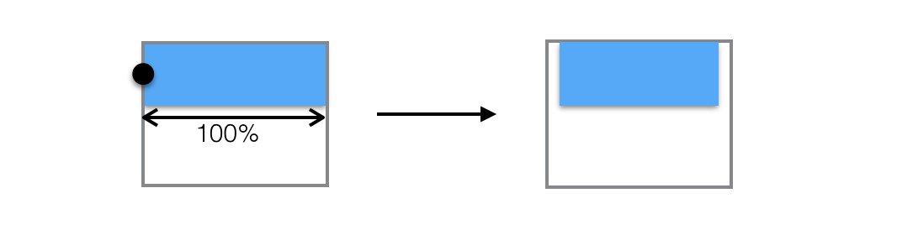


```swift
	view.pin.left().width(100%).pinEdges().marginHorizontal(20)
```

<br>

NOTE: In that in that particular situation, the same results could have been achieved differently too:


```swift
	view.pin.left().right().marginHorizontal(20)
```

</br>


<a name="aspect_ratio"></a>
## Aspect Ratio 
Set the view aspect ratio. 
AspectRatio solves the problem of knowing one dimension of an element and an aspect ratio, this is particularly useful for images. 
     
AspectRatio is applied only if a single dimension (either width or height) can be determined, in that case the aspect ratio will be used to compute the other dimension.

* AspectRatio is defined as the ratio between the width and the height (width / height).
* An aspect ratio of 2 means the width is twice the size of the height.
* AspectRatio respects the min (minWidth/minHeight) and the max (maxWidth/maxHeight) 
 dimensions of an item.
     
**Methods:**

* **`aspectRatio(_ ratio: CGFloat)`**:  
Set the view aspect ratio using a CGFloat. AspectRatio is defined as the ratio between the width and the height (width / height). 

* **`aspectRatio(of view: UIView)`**:  
Set the view aspect ratio using another UIView's aspect ratio.      

* **`aspectRatio()`**:  
If the layouted view is an UIImageView, this method will set the aspectRatio using the UIImageView's image dimension. For other types of views, this method as no impact.
     
###### Usage examples:
```swift
	aView.pin.left().width(100%).aspectRatio(2)
	imageView.pin.left().width(200).aspectRatio()
```

###### Example:
This example layout an UIImageView at the top and center it horizontally, it also adjust its width to 50%. The view’s height will be adjusted automatically using the image aspect ratio.

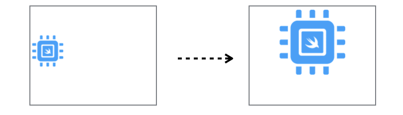


```swift
   imageView.pin.top().hCenter().width(50%).aspectRatio()
```

</br>


<a name="safeAreaInsets"></a>
## safeArea, readable and layout margins

UIKit expose 3 kind of areas/guides that can be used to layout views.
PinLayout expose them using these properties:

1. **`UIView.pin.safeArea`**: Expose UIKit `UIView.safeAreaInsets` / `UIView.safeAreaLayoutGuide`. 
2. **`UIView.pin.readableMargins`**: Expose UIKit `UIView.readableContentGuide`. 
3. **`UIView.pin.layoutMargins`**: Expose UIKit `UIView.layoutMargins` / `UIView.layoutMarginsGuide`. 

The following image display the 3 areas on an iPad in landscape mode. 

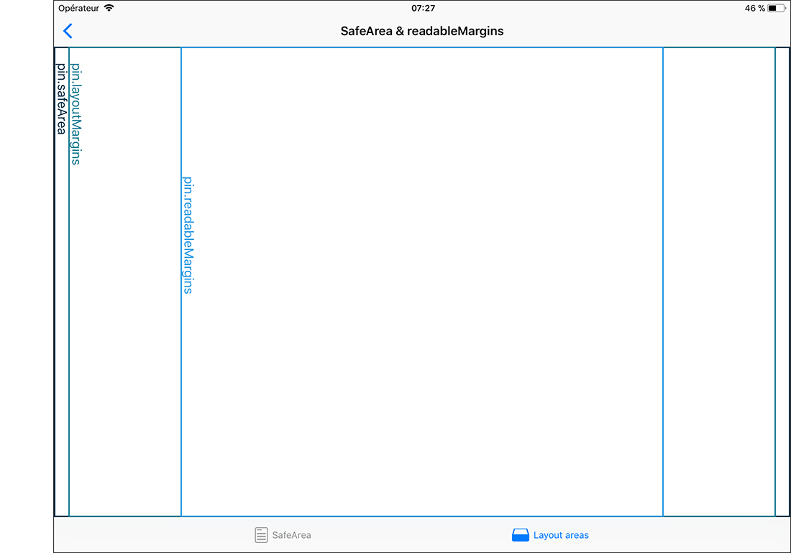

See the **SafeArea & readableMargins** example in the [Examples App](#examples_app). 

### 1. pin.safeArea 

PinLayout can handle easily iOS 11 `UIView.safeAreaInsets`, but it goes further by supporting safeAreaInsets for previous iOS releases (including iOS 7/8/9/10) by adding a property `UIView.pin.safeArea`. PinLayout also extends the support of `UIView.safeAreaInsetsDidChange()` callback on iOS 7/8/9/10.

##### Property:

* **`UIView.pin.safeArea`**  
The safe area of a view represent the area not covered by navigation bars, tab bars, toolbars, and other ancestors that obscure a view controller's view.  

	**PinLayout expose the view's safeAreaInsets through `UIView.pin.safeArea`**, this property is available on **iOS 11, but also on iOS 7/8/9/10!** This gives you immediately the opportunity to use this property for any iOS releases. `UIView.pin.safeArea` is available even if you don't use PinLayout to layout your views.

	While running on a iOS 11 devices, this property simply expose the UIKit `UIView.safeAreaInsets`. But on previous iOS releases, PinLayout use the information from the `UIViewController`'s topLayoutGuide and bottomLayoutGuide to compute the safeArea.

###### Usage examples:
```swift
   // Layout from a UIView
   view.pin.all(pin.safeArea)             // Fill the parent safeArea
   view.pin.top(pin.safeArea)             // Use safeArea.top to position the view
   view.pin.left(pin.safeArea.left + 10)  // Use safeArea.left plus offset of 10 px
   view.pin.horizontally(pin.safeArea)    // Fill horizontally the parent safeArea
	
   // Layout from a UIViewController(), you access 
   // its view safeArea using 'view.pin.safeArea'.
   button.pin.top(view.pin.safeArea)
```

##### UIView.safeAreaInsetsDidChange():

* iOS 11 has also introduced the method [`UIView.safeAreaInsetsDidChange()`](https://developer.apple.com/documentation/uikit/uiview/2891104-safeareainsetsdidchange) which is called when the safe area of the view changes. This method is called only when your app runs on a iOS 11 device. **PinLayout's extend that and support this method also on older iOS releases including iOS 9/10**.

* Note that if you handle the layout from `UIView.layoutSubviews()` or `UIViewController.viewDidLayoutSubviews()`, **you probably won't need to implement `safeAreaInsetsDidChange()`**. By default layout are invalidated and these methods are called when the safeAreaInsets changes.

* **Controlling PinLayout UIView.safeAreaInsetsDidChange() calls:**  
	You can control how PinLayout calls `UIView.safeAreaInsetsDidChange()` for iOS 7/8/9/10 (by default iOS 11 natively calls this method).  

	**The property `Pin.safeAreaInsetsDidChangeMode` supports 3 modes**:
	* **always**: (Default mode) In this mode, PinLayout will call your views `safeAreaInsetsDidChange()` method automatically for iOS releases 7/8/9/10. 

		```swift
		Pin.safeAreaInsetsDidChangeMode = .always // Default mode
		...
		
		class CustomerView: UIView {
		   override func safeAreaInsetsDidChange() {
             // This method will be called on iOS 11, but also on iOS 7/8/9/10 
             // because "Pin.safeAreaInsetsDidChangeMode" has been set to ".always".
             if #available(iOS 11.0, *) {
                super.safeAreaInsetsDidChange()
             }
             ...
          }
       }
		```
		
	* **optIn**: (Default mode) In this mode PinLayout will call your view's `safeAreaInsetsDidChange()` method only if the view implements the `PinSafeAreaInsetsUpdate` protocol. This ensure that PinLayout doesn't interfere with any source code that expect that `safeAreaInsetsDidChange()` is called only on iOS 11.

		```swift
		Pin.safeAreaInsetsDidChangeMode = .optIn
		...
		
		class CustomerView: UIView, PinSafeAreaInsetsUpdate {
		   override func safeAreaInsetsDidChange() {
             // This  method will be called on iOS 11, but also on iOS 7/8/9/10 
             // because the view implements the protocol PinSafeAreaInsetsUpdate
             if #available(iOS 11.0, *) {
                super.safeAreaInsetsDidChange()
             }
		      ...
          }
       }
		```
	* **disable**: In this mode PinLayout won't call `UIView.safeAreaInsetsDidChange` on iOS 8/9/10. Note that this is the default mode on iOS 8.

###### Example using  `UIView.pin.safeArea`
This example layout 4 subviews inside the safeArea. The UINavigationBar and UITabBar are translucent, so even if the container UIView goes under both, we can use its `UIView.pin.safeArea` to keeps its subviews within the safeArea.

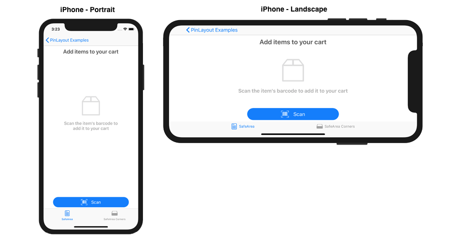

```swift
   topTextLabel.pin.top(pin.safeArea.top + 10).hCenter()
   iconImageView.pin.hCenter().vCenter(-10%)
   textLabel.pin.below(of: iconImageView).hCenter().width(60%).maxWidth(400).sizeToFit(.width).marginTop(20)
   scanButton.pin.bottom(pin.safeArea).hCenter().width(80%).maxWidth(300).height(40)
```

This example runs perfectly on a iPhone X (iOS 11), but it also runs on any devices with iOS 7, 8, 9 and 10.

:pushpin: This example is available in the [Examples App](#examples_app). See example complete [source code](https://github.com/layoutBox/PinLayout/blob/master/Example/PinLayoutSample/UI/Examples/SafeArea/SafeAreaView.swift)


<br/>

<a name="readableMargins"></a>
### 2. pin.readableMargins

##### Property:
* **`pin.readableMargins: UIEdgeInset`**:  
PinLayout's `UIView.pin.readableMargins` property expose UIKit [`UIView.readableContentGuide`](https://developer.apple.com/documentation/uikit/uiview/1622644-readablecontentguide) as an UIEdgeInsets. This is really useful since UIKit only expose the readableContent area to Auto Layout using UILayoutGuide.

###### Usage examples:
```swift
	label.pin.horizontally(pin.readableMargins)   // the label fill horizontally the readable area.
	view.pin.all(container.pin.readableMargins)   // the view fill its parent's readable area.
	view.pin.left(pin.readableMargins)
```

:pushpin: The [Examples App](#examples_app) contains some examples using `pin.readableMargins`.

<br/>

### 3. pin.layoutmargins

##### Property:
* **`pin.layoutmargins: UIEdgeInset`**  
PinLayout's `UIView.pin.layoutMargins` property expose directly the value of UIKit [`UIView.layoutMargins`](https://developer.apple.com/documentation/uikit/uiview/1622566-layoutmargins). The property exists only to be consistent with the other areas: `pin.safeArea`, `pin.readableMargins` and `pin.layoutmargins`. So its usage is not necessary.

###### Usage example:
```swift
	view.pin.left(container.pin.layoutmargins)
	view.pin.left(container.layoutmargins)     // Similar to the previous line
```

<br/>

<a name="wrapContent"></a>
## WrapContent

The following methods are useful to adjust view's width and/or height to wrap all its subviews. These methods also adjust subviews position to create a tight wrap.

**Methods:**

* **`wrapContent()`**  
**`wrapContent(padding: CGFloat)`**  
**`wrapContent(padding: UIEdgeInsets)`**   
Adjust the view's width and height to wrap all its subviews. The method also adjusts subviews's position to create a tight wrap. It is also possible to specify an optional padding around all subviews. 
* **`wrapContent(:WrapType)`**  
**`wrapContent(:WrapType, padding: CGFloat)`**  **`wrapContent(:WrapType, padding: UIEdgeInsets)`**  
Adjust the view's width AND/OR height to wrap all its subviews. Accept a WrapType parameter to define the wrapping type. It is also possible to specify an optional padding around all subviews.
 
**Types:** 

* **`WrapType`** values:
	* `.horizontally`: Adjust the view's width and update subviews's horizontal position.
	* `.vertically`: Adjust only the view's height and update subviews's vertical position.
	* `.all`: Adjust the view's width AND height and update subviews position. This is the default WrapType parameter value `wrapContent()` methods.

###### Usage examples:
```swift
	view.pin.wrapContent().center()   // wrap all subviews and centered the view inside its parent.
	view.pin.wrapContent(padding: 20) // wrap all subviews with a padding of 20 pixels all around
	view.pin.wrapContent(.horizontally)
```

###### Example:
This example show the result of different `wrapContent()` method calls.  
Here is the initial state:

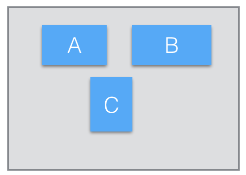

| Source code     | Result | Description |
|---------------------|----------|-------------------|
| `view.pin.wrapContent()` | 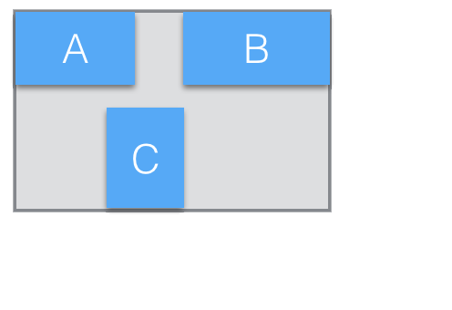 | Adjust the view's height and width to tight fit its subviews. |
| `view.pin.wrapContent(padding: 10)` | 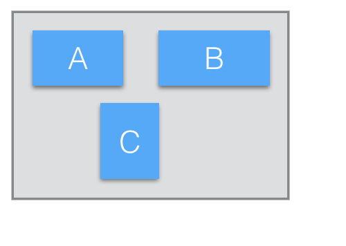 | Adjust the view's height and width and add a padding of 10 pixels around its subviews. |
| `view.pin.wrapContent(.horizontally)` | 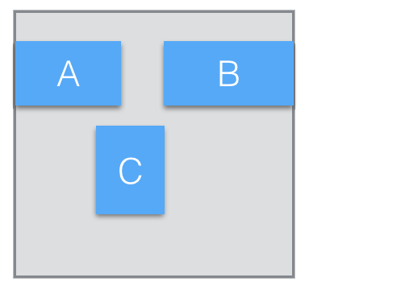 | Adjust only the view's width. |
| `view.pin.wrapContent(.vertically)` | 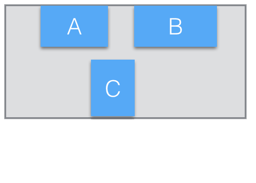 | Adjust only the view's height. |


###### Example:
This example shows how a view (`containerView`) that has subviews (`imageView` and `label`) can be adjusted to the size of its subviews and then centered inside its parent.

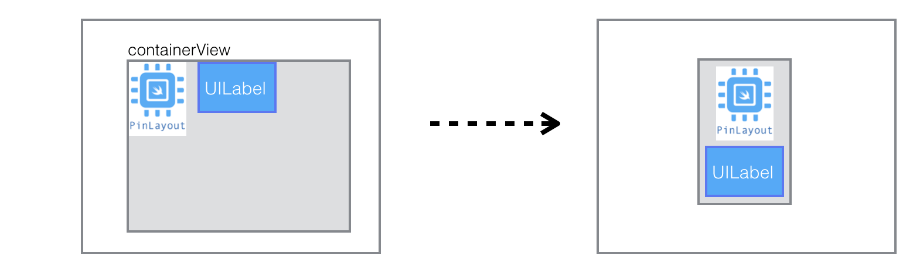

```swift
   label.pin.below(of: imageView, aligned: .center).marginTop(4)
   containerView.pin.wrapContent(padding: 10).center()
```
* Line 1: Position the label below the imageView aligned on its center with a top margin of 4 pixels. 
* Line 2: Adjust the `containerView`'s size and position its subviews to create a tight wrap around them with a padding of 10 pixels all around. The `containerView` is also centered inside its parent (superview).

<br/>


<a name="justify_align"></a>
## justify() / align()

**Methods:**

* **`justify(_ : HorizontalAlign)`**  
Justify the view horizontally. This method justifies horizontally a view in situations where the left, right and the width has been set (using either width/minWidth/maxWidth). In this situation, the view may be smaller than the space available between the left and the right edges. A view can be justified **left**, **center**, **right**, **start***, **end***. 

* **`align(_ : VerticalAlign)`**  
Align the view vertically. This method aligns vertically a view in situations where the top, bottom and the height has been set (using either height/minHeight/maxHeight). In this situation, the view may be smaller than the space available between the top and the bottom edges. A view can be aligned **top**, **center** or **bottom**. 

###### Usage examples:
```swift
	view.pin.horizontally().marginHorizontal(20).maxWidth(200).justify(.center)
	view.pin.below(of: A).above(of: B).width(40).align(.center)
```


###### Example:
This example layout a view between its superview left and right edges with a maximum size of 200 pixels. Without the usage of the `justify(:HorizontalAlign)` method, the view will be justified on the left:

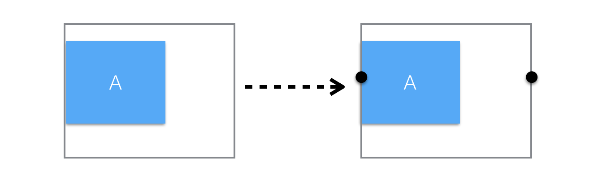


```swift
   viewA.pin.horizontally().maxWidth(200)
```


The same example, but using `justify(.center)`:

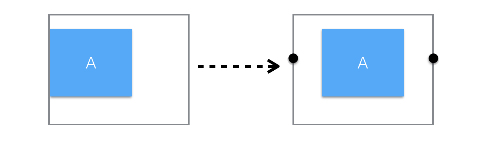


```swift
   viewA.pin.horizontally().maxWidth(200).justify(.center)
```

And finally using `justify(.right)`:

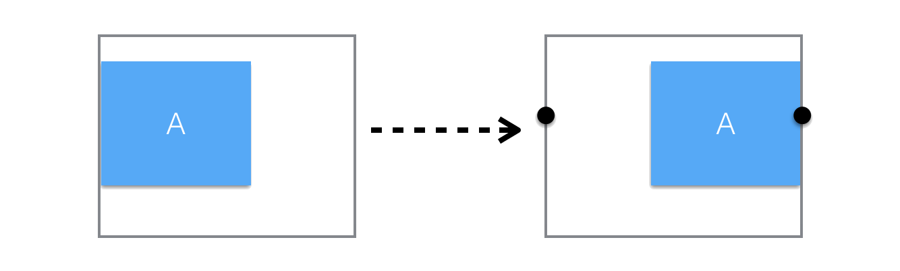


```swift
   viewA.pin.horizontally().maxWidth(200).justify(.right)
```

###### Example:
This example centered horizontally the view B in the space remaining at the right of the view A. The view B has a width of 100 pixels.

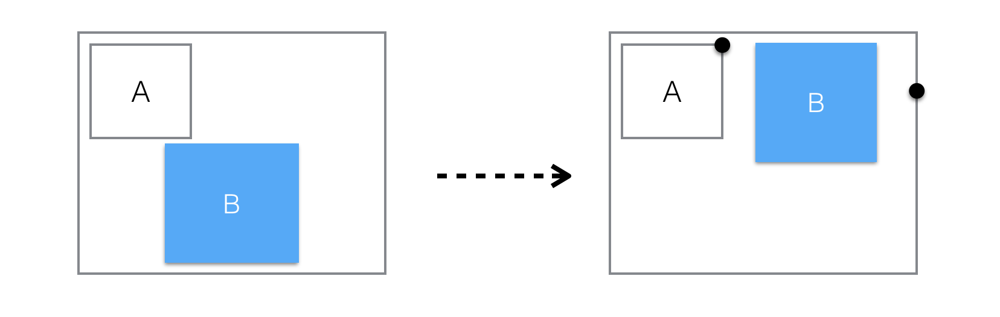


```swift
   viewB.pin.after(of: viewA, aligned: .top).right().width(100).justify(.center)
```

<br/>

<a name="uiview_transform"></a>
## UIView's transforms

#### **`UIView.pin`** versus **`UIView.pinFrame`**
Until now `UIView.pin` was used to layout views, but there's also another property called `UIView.pinFrame` that does something slightly different in situations where the view has a transform (`UIView.transform`, scaling, rotation, ...).

* `pin`: Set the position and the size of the **non-transformed view**. The layout is applied **before the transform**. This is particularly useful when you want to animate a view using a transform without modifying its layout.

* `pinFrame`: Set the position and the size on the **transformed view**. The layout is applied **after the transform**.


#### Examples 

The following examples use this view initial size and position:

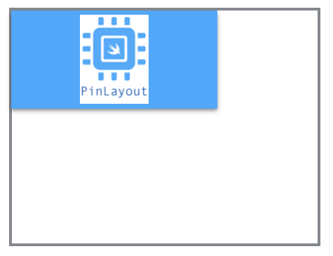


##### Example using a **Rotation transform**
Using `pin`:

```swift
  view.transform = .init(rotationAngle: CGFloat.pi / 2)
  view.pin.center().width(100).height(50)
```

Using `pinFrame`:

```swift
  view.transform = .init(rotationAngle: CGFloat.pi / 2)
  view.pinFrame.center().width(100).height(50)
```

| | Result using `pin` | result using `pinFrame` |
|---------------------|:------------------|:---------|
| **Rotation transform** | 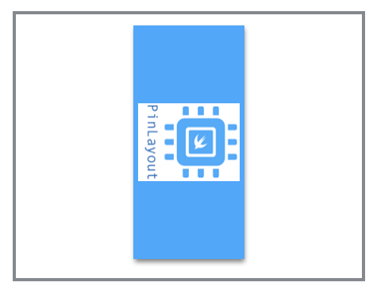  | 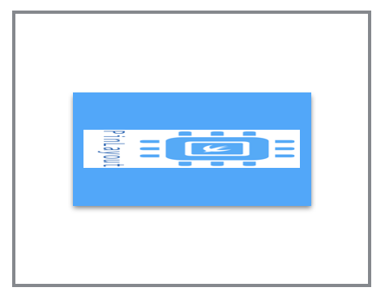  |


* Using `pin` the view is layouted and after the rotation transform is applied. 
* Using `pinFrame` the rotation transform is applied and after the view is layouted.


#### Layout relative to a view with a transform
When layouting a view relative to a view with a transform (ex: below(of:UIView), top(to edge: ViewEdge), ...), `pin` and `pinFrame` react also differently. 

* `pin`: PinLayout will use the untransformed size and the position of the relative view.
* `pinFrame`: PinLayout will use the transformed size and the position of the relative view.

##### Example using a **Scale transform**
In the following example the View A have a scale transform of 1.5x1.5. The view B is layouted below the view A. 

Using `pin`:

```swift
  aView.transform = .init(scaleX: 1.5, y: 1.5)
  aView.pin.width(100).height(50)
  bView.pin.below(of: aView, aligned: .left)
```

Using `pinFrame`:

```swift
aView.transform = .init(scaleX: 1.5, y: 1.5)
aView.pin.width(100).height(50)
bView.pinFrame.below(of: aView, aligned: .left)
```

| | Result using `pin` | result using `pinFrame` |
|---------------------|:------------------|:---------|
| **Scale transform** | 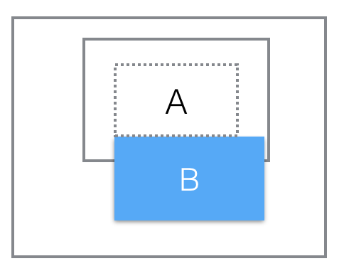  | 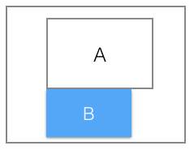  |

* Using `pin` the view B is layouted below the **untransformed view A** (shown in dotted lines). 
* Using `pinFrame` view B is layouted below the **transformed view A**.

</br>


<a name="warnings"></a>
## Warnings 
### PinLayout's warnings
PinLayout can display warnings in the console when pin rules cannot be applied or are invalid. 

**Here a list of fews warning:**

* The newly pinned attributes conflict with other already pinned attributes.   
Example:  
`view.pin.left(10).right(10).width(200)`  
👉 Layout Conflict: `width(200) won't be applied since it conflicts with the following already set properties: left: 0, right: 10.`


* The newly pinned attributes have already been set to another value.  
Example:  
`view.pin.width(100).width(200)`  
👉 Layout Conflict: `width(200) won't be applied since it value has already been set to 100.`
* The view being layout hasn’t been added yet into a superview  
Example:  
`view.pin.width(100)`  
👉 Layout Warning: `width(100) won't be applied, the view must be added as a sub-view before being layouted using this method.`
* A view is used as a reference, either directly or using its anchors or its edges, but hasn’t been added yet to a superview.   
Example:  
`view.pin.left(of: view2)`  
👉 Layout Warning: `left(of: view2) won't be applied, the view must be added as a sub-view before being used as a reference.`
* The width and the height must be positive values.  
Example:  
`view.pin.width(-100)`  
👉 Layout Warning: `The width (-100) must be greater or equal to 0.`
* `justify(.left|.center|.right)` is used without having set the left and the right coordinates.  
Example:  
`view.pin.left().width(250).justify(.center)`  
👉 PinLayout Warning: justify(center) won't be applied, the left and right coordinates must be set to justify the view.
* Layout must be executed from the **Main thread**.  
👉 PinLayout Warning: Layout must be executed from the Main Thread!
* Layout must be executed from the **Main thread**.  
* ...

### Enabling/Disabling warnings

##### Property:

* **`Pin.logWarnings: Boolean`**  
This property specifies if PinLayout's warnings are displayed in the console. In Debug (#if DEBUG) the default value is true, else its false. The value can be modified at runtime.

#### Enabling/Disabling warnings individually
Few individual warnings can also be enabled/disabled individually:

* **`Pin.activeWarnings.noSpaceAvailableBetweenViews: Boolean`**  
If true, a warning is displayed if there is no space available between views specified in a call to `horizontallyBetween(...)` or `verticallyBetween(...)`
* **`Pin.activeWarnings. aspectRatioImageNotSet: Boolean`**  
If true, a warning is displayed if 'aspectRatio()' is called on a UIImageView without a valid UIImage.

<br/>

## PinLayout style guide

* You should always specifies methods in the same order, it makes layout lines easier to understand. Here is our preferred ordering:  
`view.pin.[EDGE|ANCHOR|RELATIVE].[WIDTH|HEIGHT|SIZE].[pinEdges()].[MARGINS].[sizeToFit()]`  

   This order reflect the logic inside PinLayout. `pinEdges()` is applied before margins and margins are applied before `sizeToFit()`.    

	```swift
	view.pin.top().left(10%).margin(10, 12, 10, 12)
	view.pin.left().width(100%).pinEdges().marginHorizontal(12)
	view.pin.horizontally().margin(0, 12).sizeToFit(.width)
	view.pin.width(100).height(100%)
	```

* You should specify edges always in the same order, this is our proposed order:  
`TOP, BOTTOM, LEFT, RIGHT`

	```swift
	view.pin.top().bottom().left(10%).right(10%)
	```

* If the layout line is too long, you can split into multiple lines:  

	```swift
	textLabel.pin.below(of: titleLabel)
	   .before(of: statusIcon).after(of: accessoryView)
	   .above(of: button).marginHorizontal(10)
	```

:pushpin: PinLayout's method call order is irrelevant, the layout result will always be the same. 

<br/>

<a name="animations"></a>
## Animations using PinLayout

PinLayout can easily animates Views. Multiple strategies can be used to animate layout using PinLayout.

#### [See the section Animations using PinLayout for more details](docs/animations.md)

The following animation example is available in the [Examples App](#examples_app).

  <a href="https://github.com/layoutBox/PinLayout/blob/master/Example/PinLayoutSample/UI/Examples/Animations/AnimationsView.swift">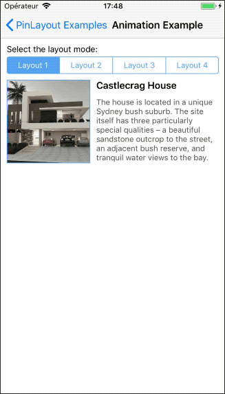</a> 

<br/>


<a name="more_examples"></a>
## More examples

### Adjust to container size
The following examples show how PinLayout can be used to adjust views size and position to the size of their container. In this case containers are cells.


Cell A:

* A1 is left aligned with a width of 50px
* A2 fills the remaining space

```swift
   a1.pin.vertically().left().width(50)
   a2.pin.after(of: a1, aligned: .top).bottomRight().marginLeft(10)
```

Cell B:

* B2 is right aligned with a fixed width of 50px
* B1 fills the remaining space

```swift
   b2.pin.vertically().right().width(50)
   b1.pin.before(of: b2, aligned: .top).bottom().left().marginRight(10)
```

Cell C:

* C2 is centered with a fixed width of 50px
* C1 fills the remaining left space
* C3 fills the remaining right space

```swift
   c2.pin.vertically().hCenter().width(50)
   c1.pin.before(of: c2, aligned: .top).bottom().left().marginRight(10)
   c3.pin.after(of: c2, aligned: .top).bottom().right().marginLeft(10)
```

Cell D:

* D1 takes 25% of its container width
* D2 takes 50% of its container width
* D3 fills the remaining space

```swift
   d1.pin.vertically().left().width(25%)
   d2.pin.after(of: d1, aligned: .top).bottom().width(50%).marginLeft(10)
   d3.pin.after(of: d2, aligned: .top).bottom().right().marginLeft(10)
```

<br>

<a name="installation"></a>
## Installation 

### CocoaPods

To integrate PinLayout into your Xcode project using CocoaPods, specify it in your `Podfile`:

```ruby
    pod 'PinLayout'
```

Then, run `pod install`.

### Carthage

To integrate PinLayout into your Xcode project using Carthage, specify it in your `Cartfile`:

```
github "layoutBox/PinLayout"
```

Then, run `carthage update` to build the framework and drag the built `PinLayout.framework` into your Xcode project.

<br>

<a name="examples_app"></a>
## Examples App 

The PinLayout's Example App exposes some usage example of PinLayout.   

#### [See the Example App section to get more information](docs/examples.md)

Included examples:

* The [introduction example](#intro_usage_example) presented previously in this README.	
* Example using a UITableView with variable height cells.
* Example using a UICollectionView with variable height cells.
* Example showing how to animate with PinLayout.
* Example using [`pin.safeArea`, `pin.readableMargins` and `pin.layoutMargins`](#safeAreaInsets)
* Example using [`wrapContent()`](#wrapContent)
* Example showing right-to-left (RTL) language support.
* Example showing a simple form example	
* Example showing Relative Edges layout.
* Example using Objective-C	
* ...

<p align="center">
  <a href="https://github.com/layoutBox/PinLayout/blob/master/Example/PinLayoutSample/UI/Examples/Intro/IntroView.swift"></a>
  <a href="https://github.com/layoutBox/PinLayout/blob/master/Example/PinLayoutSample/UI/Examples/AdjustToContainer/Subviews/ChoiceSelectorView.swift">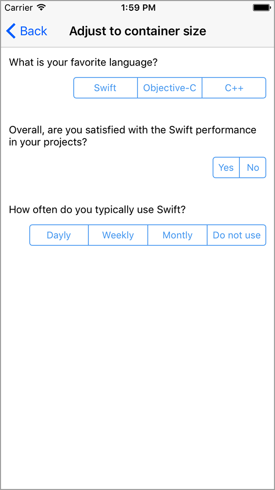</a>
  <a href="https://github.com/layoutBox/PinLayout/blob/master/Example/PinLayoutSample/UI/Examples/TableViewExample/TableViewExampleView.swift">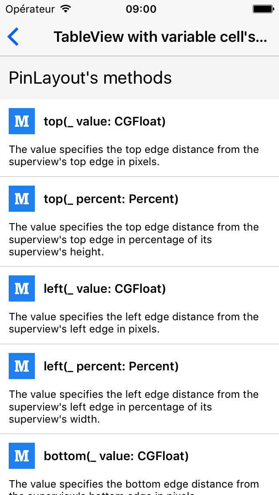</a>
  <a href="https://github.com/layoutBox/PinLayout/blob/master/Example/PinLayoutSample/UI/Examples/CollectionViewExample/HouseCell.swift">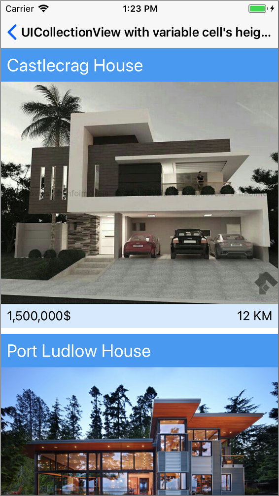</a>   
  <a href="https://github.com/layoutBox/PinLayout/blob/master/Example/PinLayoutSample/UI/Examples/Animations/AnimationsView.swift"></a> 
  <a href="https://github.com/layoutBox/PinLayout/blob/master/Example/PinLayoutSample/UI/Examples/Form/FormView.swift">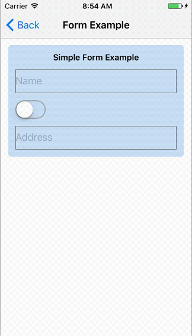</a>
  <a href="https://github.com/layoutBox/PinLayout/blob/master/Example/PinLayoutSample/UI/Examples/AutoAdjustingSize/AutoAdjustingSizeView.swift">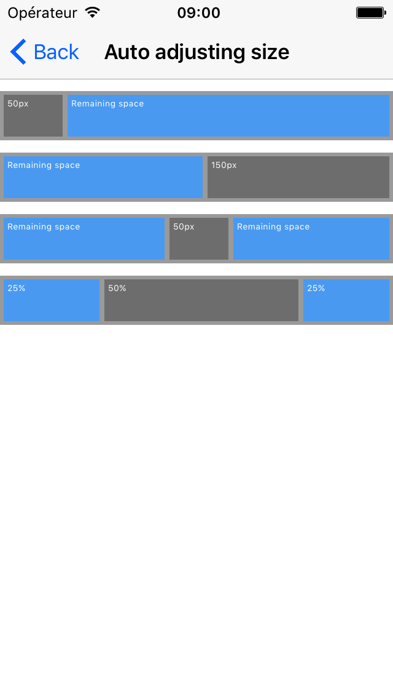</a>
  <a href="https://github.com/layoutBox/PinLayout/blob/master/Example/PinLayoutSample/UI/Examples/RelativeView/RelativeView.swift">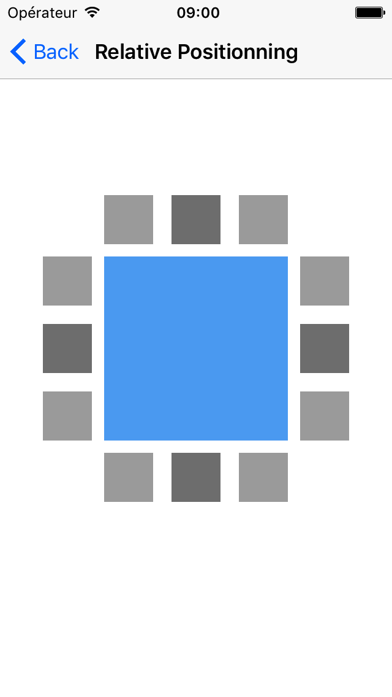 </a> 
  <a href="https://github.com/layoutBox/PinLayout/blob/master/Example/PinLayoutSample/UI/Examples/BetweenView/BetweenView.swift">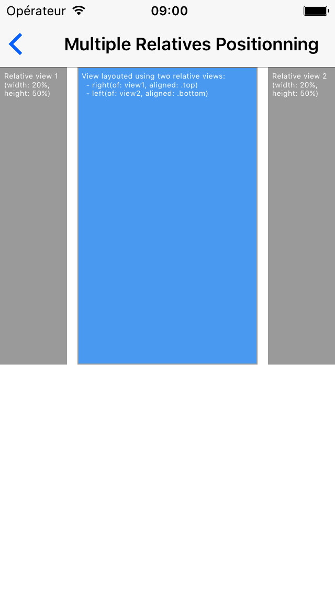</a>
</p>

<br>


<a name="macos_support"></a>
## macOS Support 

PinLayout can layout **NSView**'s on macOS. All PinLayout's properties and methods are available, with the following exceptions:

* PinLayout supports **only views that have a parent (superview) using a flipped coordinate system**, i.e. views for which  the computed property `var isFlipped: Bool` returns true. In a flipped coordinate system, the origin is in the upper-left corner of the view and y-values extend downward. UIKit use this coordinate system. In a non-flipped coordinate system (default mode), the origin is in the lower-left corner of the view and positive y-values extend upward. See [Apple's documentation for more information about `NSView.isFlipped`](https://developer.apple.com/documentation/appkit/nsview/1483532-isflipped). The support of non-flipped coordinate system will be added soon.

* [`sizeToFit(:FitType)`](#sizeToFit) is supported only for instances that inherits from NSControl. Support for [`sizeToFit(:FitType)`](#sizeToFit) can be added to your custom NSView subclasses, just make those views conform to the `SizeCalculable` protocol and implement the required `sizeThatFits(:CGSize)` function.

* [`NSView.pin.safeArea` and ](#safeAreaInsets) property is not available, AppKit doesn't have an `UIView.safeAreaInsets` equivalent.

* [`NSView.pin.readableMargins`](#safeAreaInsets) property is not available, AppKit doesn't have an `UIView.readableContentGuide` equivalent.

* [`aspectRatio()`](#aspect_ratio) with no parameters.

<br>


<a name="calayer_support"></a>
## CALayer Support 

PinLayout can layouts **CALayer**'s. All PinLayout's properties and methods are available, with the following exceptions:

* [`sizeToFit(:FitType)`](#sizeToFit) is not supported. Support for [`sizeToFit(:FitType)`](#sizeToFit) can be added to your custom CALayer subclasses, just make those layers conform to the `SizeCalculable` protocol and implement the required `sizeThatFits(:CGSize)` function.
* [`CALayer.pin.safeArea` and `CALayer.pin.readableMargins`](#safeAreaInsets) properties are not available.
* [`aspectRatio()`](#aspect_ratio) with no parameters

###### Usage Examples:

```swift
aLayer = CALayer()
bLayer = CALayer()
view.layer.addSublayer(aLayer)
view.layer.addSublayer(bLayer)
...

aLayer.pin.top(10).left(10).width(20%).height(80%)
bLayer.pin.below(of: aLayer, aligned: .left).size(of: aLayer)
```

<br>

<a name="playgrounds"></a>
## PinLayout in Xcode Playgrounds 

PinLayout layouts views immediately after the line containing `.pin` has been fully executed, thanks to ARC (Automatic Reference Counting) this works perfectly on iOS/tvOS/macOS simulators and devices. But in Xcode Playgrounds, ARC doesn't work as expected, object references are kept much longer. This is a well documented issue and have a little impact on the PinLayout behaviour.

#### [See here for more details about using PinLayout in Xcode playgrounds](docs/xcode_playground.md)

<br>

<a name="objective_c_interface"></a>
## PinLayout using Objective-C 
PinLayout also expose an Objective-C interface slightly different than the Swift interface. 

#### [See here for more details](docs/objective_c.md)

<br>

<a name="faq"></a>
## FAQ 

*  **Q: When the device rotation change, the layout is not updated.**  
   **R:** PinLayout doesn't use auto layout constraints, it is a framework that manually layout views. For that reason you need to update the layout inside either `UIView.layoutSubviews()` or `UIViewController.viewDidLayoutSubviews()` to handle container size's changes, including device rotation. You'll also need to handle UITraitCollection changes for app's that support multitasking.
   
*  **Q: How to handle new iOS 11 `UIView.safeAreaInsets` and the iPhone X .**  
   **R:** iOS 11 has introduced `UIView.safeAreaInsets` to particularly support the iPhone X landscape mode. In this mode `UIView.safeAreaInsets` has a left and right insets. The easiest way the handle this situation with PinLayout is to add a contentView that will contains all your view's child, and simply adjust this contentView view to match the `safeAreaInsets` or PinLayout's [`UIView.pin.safeArea`](#safeAreaInsets).
   
All example in the [Examples App](#examples_app) handle correctly the `safeAreaInsets` and works on iPhone X in landscape mode. Many PinLayout's method accept an UIEdgeInsets as parameter.
   
   Note that **only the UIViewController's main view** must handle the `safeAreaInsets`, sub-views don't have to handle it.  
   
*  **Q: How can we adjust a UIView container to match all its children?**  
   **R:** The proposed solution is used by the **Form** example for its rounded corner background. Suppose you want to adjust a container height to match all its child (subviews). 
   1. First set the container width and its position:  
`containerView.pin.topCenter().width(100%).marginTop(10)`
   2. Layout all its children.
   3. Finally, set the container height to match its last child Y position:  
`containerView.pin.height(child6.frame.maxY + 10)` 
   
* **Q: How to apply percentage from a CGFloat, a Float or an Int value?**  
  **R:** Many PinLayout's method has a parameter of type `Percent`. You can easily specify this type of parameter simply by adding the `%` operator to your value (eg: `view.pin.left(10%).width(50%)`. It is similar if you have a value of type  CGFloat, Float or Int, simply adds the `%` operator:  
  
	```swift
	let percentageValue: CGFloat = 50
	view.pin.width(percentageValue%)
	``` 
<br>

<a name="comments"></a>
## Questions, comments, ideas, suggestions, issues, .... 
If you have questions, you can checks already [answered questions here.](https://github.com/layoutBox/PinLayout/issues?q=is%3Aissue+is%3Aclosed+label%3Aquestion)

For any **comments**, **ideas**, **suggestions**, **issues**, simply open an [issue](https://github.com/layoutBox/PinLayout/issues).

If you find PinLayout interesting, thanks to **Star** it. You'll be able to retrieve it easily later.

If you'd like to contribute, you're welcome!

## Thanks
PinLayout was inspired by other great layout frameworks, including:

* HTML's CSS: Management of margins in absolute positioning and bottom/right position coordinates.
* [MCUIViewLayout](https://github.com/mirego/MCUIViewLayout): Nice absolute and relative positioning.
* Qt: Anchors and edges management.
* [SnapKit](https://github.com/SnapKit/SnapKit): Clean interface for anchors.

## History
PinLayout recent history is available in the [CHANGELOG](CHANGELOG.md) also in [GitHub Releases](https://github.com/layoutBox/PinLayout/releases).

### Recent breaking change

* `fitSize()` has been removed after being deprecated for 10 months. `sizeToFit(...)` should now be used instead. See [Adjusting size](#adjusting_size). (2018-08-21)

## License
MIT License
