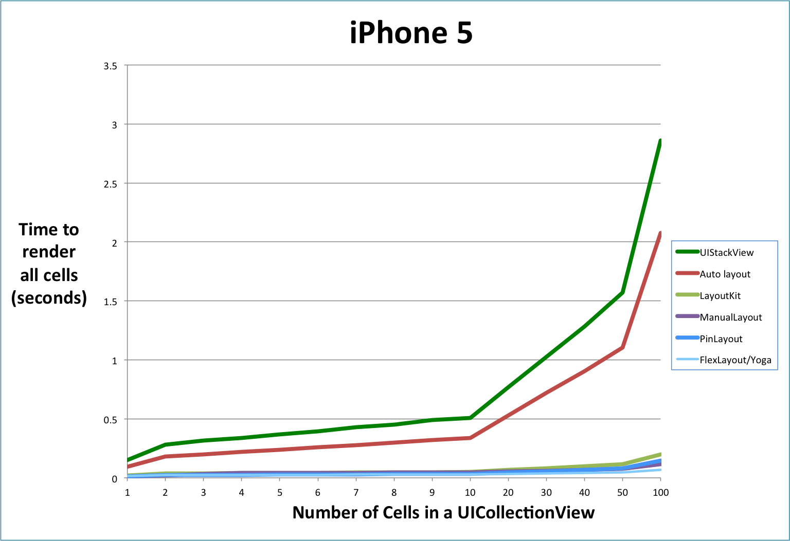
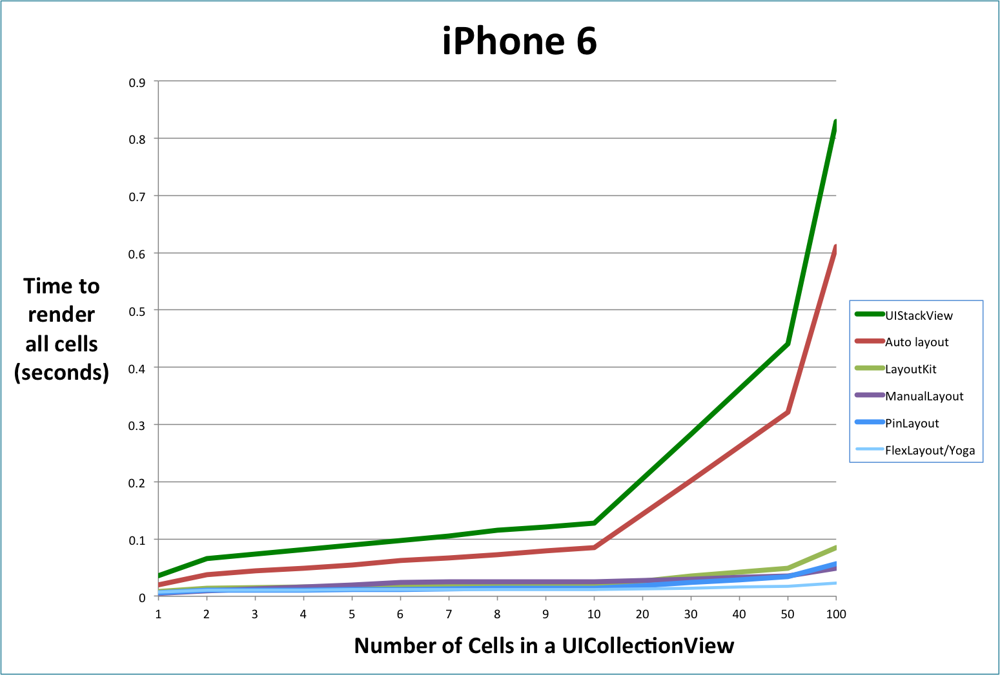

<p align="center">
	
</p>

<h1 align="center" style="color: #376C9D; font-family: Arial Black, Gadget, sans-serif; font-size: 1.5em">PinLayout Benchmark</h1>

* [Methodology](#methodology)
* [Results](#results)
* [Benchmark Source code](#source_code_compare)

<br>

## Methodology  <a name="methodology"></a>

##### LayoutKit Benchmark
PinLayout and [FlexLayout](https://github.com/lucdion/FlexLayout) performance has been tested using a [fork of LayoutKit](https://github.com/mirego/LayoutKit). LayoutKit include an example app with a really nice and simple benchmark. It is used to compare LayoutKit with Auto layout, UIStackViews and manual layouting. 

The benchmark has been modified to also include PinLayout ([source code](https://github.com/mirego/LayoutKit/blob/master/LayoutKitSampleApp/Benchmarks/FeedItemFlexLayoutView.swift)) and FlexLayout ([source code](https://github.com/mirego/LayoutKit/blob/master/LayoutKitSampleApp/Benchmarks/FeedItemPinLayoutView.swift)). You can remark in source code how PinLayout and FlexLayout implemantation is concise, clean and doesn't contain any computation [compared to Manual Layouting source code](#source_code_compare).

The benchmark include tests for the following layout systems:

* Auto layout
* Auto layout using UIStackViews
* Manual layout (i.e. set UIView's frame directly)
* [FlexLayout](https://github.com/lucdion/FlexLayout)
* [PinLayout](https://github.com/mirego/PinLayout)
* [LayoutKit](https://github.com/linkedin/LayoutKit)

Anyone who would like to integrate any other layout frameworks to this GitHub repository is welcome.

##### Benchmark details
The LayoutKit benchmark layout UICollectionView and UITableView cells in multiple pass, each pass contains more cells than the previous one. The **X axis** in following charts indicates the **number of cells** contained for each pass. The **Y axis** indicates the **number of seconds** to render all cells from one pass.

##### Benchmark cell layout
Here are the benchmark rendering results to compare visual results:
 
* [Auto layout rendering result](Benchmark/benchmark_result_Autolayout.png)
* [FlexLayout rendering result](Benchmark/benchmark_result_FlexLayout.png)
* [PinLayout rendering result](Benchmark/benchmark_result_PinLayout.png)
* [LayoutKit rendering result](Benchmark/benchmark_result_LayoutKit.png)

<br>

## Results <a name="results"></a>

As you can see in the following charts, PinLayout's performance is as fast as manual layouting, and **between 12x and 16x faster than auto layout**, for all types of iPhone (5/6/6S/7). [LayoutKit](https://github.com/linkedin/LayoutKit) is also really fast, slightly slower than PinLayout and manual layouting.

These results means that PinLayout and FlexLayout are faster than any layout frameworks that is built over auto layout (SnapKit, Stevia, PureLayout, ...). 

For example it took 611 miliseconds to render 100 UICollectionView's cells using Auto layout on a iPhone 6 compared to 53 miliseconds for PinLayout. Its 12 time faster.

<br>

### PinLayout and FlexLayout performance compared to Auto layout 

This table shows FlexLayout and PinLayout performance compared to  Auto layout when layouting UICollectionView's cells.

The table shows that **FlexLayout took 23 miliseconds** to render 100 UICollectionView's cells on a iPhone 6 compared to **53 miliseconds for PinLayout** and **611 ms for Auto layout**. Its 26 time faster for FlexLayout and 12 time faster for PinLayout.

|           | Auto layout time  (seconds) |  **PinLayout** time  (seconds) | **PinLayout** performance compared to Auto layout | **FlexLayout** time  (seconds) | **FlexLayout** performance compared to Auto layout |
|:---------:|:---------:|:---------:|:-----------------------------------------------------------------------:|:---------------------------:|:-------------------------:|
|  iPhone 5 | 2.074 |  0.126 | 16x Faster | 0.067 | 31x Faster | 
|  iPhone 6 | 0.611 |  0.053 | 12x Faster| 0.023 | 26x Faster  | 
| iPhone 6S | 0.344 |  0.029 | 12x Faster| NA | NA  | 
|  iPhone 7 | 0.293 |  0.021 | 14x Faster| 0.008 | 37x Faster  | 
<br>

#### Benchmark charts  

:pushpin: You can see the benchmark raw data in this [spreadsheet](Benchmark/benchmark.xlsx).


<p align="center">
  <a href=""></a>
  
<p align="center">
  <a href=""></a>

<p align="center">
  <a href=""></a>
  
<p align="center">
  <a href=""></a>
  

<br>

## Code source comparison <a name="code_source_comparison"></a>
This section shows the benchmark layout code for each type of layout framework.

Remark how PinLayout and FlexLayout code is concise and clean compared to Manual Layout and Auto layout source code.

### PinLayout source code

[See PinLayout source code on GitHub](https://github.com/mirego/LayoutKit/blob/master/LayoutKitSampleApp/Benchmarks/FeedItemPinLayoutView.swift)

```swift
override func layoutSubviews() {
    super.layoutSubviews()
    
    let hMargin: CGFloat = 8
    let vMargin: CGFloat = 2
    
    optionsLabel.pin.topRight().margin(hMargin)
    actionLabel.pin.topLeft().margin(hMargin)
    
    posterImageView.pin.below(of: actionLabel, aligned: .left).marginTop(10)
    posterNameLabel.pin.right(of: posterImageView, aligned: .top).margin(-6, 6).right(hMargin).sizeToFit()
    posterHeadlineLabel.pin.below(of: posterNameLabel, aligned: .left).right(hMargin).marginTop(1).sizeToFit()
    posterTimeLabel.pin.below(of: posterHeadlineLabel, aligned: .left).right(hMargin).marginTop(1).sizeToFit()
    
    posterCommentLabel.pin.below(of: posterTimeLabel).left(hMargin).right().right(hMargin)
        .marginTop(vMargin).sizeToFit()
    
    contentImageView.pin.below(of: posterCommentLabel).hCenter().width(100%).sizeToFit()
    contentTitleLabel.pin.below(of: contentImageView).left().right().marginHorizontal(hMargin).sizeToFit()
    contentDomainLabel.pin.below(of: contentTitleLabel, aligned: .left).right().marginRight(hMargin)
        .sizeToFit()
    
    likeLabel.pin.below(of: contentDomainLabel, aligned: .left).marginTop(vMargin)
    commentLabel.pin.top(to: likeLabel.edge.top).hCenter(50%)
    shareLabel.pin.top(to: likeLabel.edge.top).right().marginRight(hMargin)
    
    actorImageView.pin.below(of: likeLabel, aligned: .left).marginTop(vMargin)
    actorCommentLabel.pin.right(of: actorImageView, aligned: .center).marginLeft(4)
}
```

<br>

### FlexLayout source code

[See FlexLayout source code on GitHub](https://github.com/mirego/LayoutKit/blob/master/LayoutKitSampleApp/Benchmarks/FeedItemFlexLayoutView.swift)

```swift
flex.addItem(contentView).padding(8).define { (flex) in
    flex.addItem(contentView).padding(8).define { (flex) in
        flex.addContainer().direction(.row).justifyContent(.spaceBetween).define { (flex) in
            flex.addItem(actionLabel)
            flex.addItem(optionsLabel)
        }
        
        flex.addContainer().direction(.row).alignItems(.center).define({ (flex) in
            flex.addItem(posterImageView).width(50).height(50).marginRight(8)

            flex.addContainer().grow(1).define({ (flex) in
                flex.addItem(posterNameLabel)
                flex.addItem(posterHeadlineLabel)
                flex.addItem(posterTimeLabel)
            })
        })

        flex.addItem(posterCommentLabel)

        flex.addItem(contentImageView).aspectRatio(350 / 200)
        flex.addItem(contentTitleLabel)
        flex.addItem(contentDomainLabel)

        flex.addContainer().direction(.row).justifyContent(.spaceBetween).marginTop(4).define({ (flex) in
            flex.addItem(likeLabel)
            flex.addItem(commentLabel)
            flex.addItem(shareLabel)
        })

        flex.addContainer().direction(.row).marginTop(2).define({ (flex) in
            flex.addItem(actorImageView).width(50).height(50).marginRight(8)
            flex.addItem(actorCommentLabel).grow(1)
        })
    }
}
```

### Manual layout source code

[See Manual layout source code on GitHub](https://github.com/mirego/LayoutKit/blob/master/LayoutKitSampleApp/Benchmarks/FeedItemManualView.swift)


```swift 
override func layoutSubviews() {
    super.layoutSubviews()
    
    optionsLabel.frame = CGRect(x: bounds.width-optionsLabel.frame.width, y: 0, 
                                width: optionsLabel.frame.width, height: optionsLabel.frame.height)
    actionLabel.frame = CGRect(x: 0, y: 0, width: bounds.width-optionsLabel.frame.width, height: 0)
    actionLabel.sizeToFit()

    posterImageView.frame = CGRect(x: 0, y: actionLabel.frame.bottom, 
                                   width: posterImageView.frame.width, height: 0)
    posterImageView.sizeToFit()

    let contentInsets = UIEdgeInsets(top: 0, left: 1, bottom: 2, right: 3)
    let posterLabelWidth = bounds.width-posterImageView.frame.width - contentInsets.left - 
                           contentInsets.right
    posterNameLabel.frame = CGRect(x: posterImageView.frame.right + contentInsets.left, 
                                   y: posterImageView.frame.origin.y + contentInsets.top, 
                                   width: posterLabelWidth, height: 0)
    posterNameLabel.sizeToFit()

    let spacing: CGFloat = 1
    posterHeadlineLabel.frame = CGRect(x: posterImageView.frame.right + contentInsets.left, 
                                       y: posterNameLabel.frame.bottom + spacing, 
                                       width: posterLabelWidth, height: 0)
    posterHeadlineLabel.sizeToFit()

    posterTimeLabel.frame = CGRect(x: posterImageView.frame.right + contentInsets.left, 
                                   y: posterHeadlineLabel.frame.bottom + spacing, width: posterLabelWidth, 
                                   height: 0)
    posterTimeLabel.sizeToFit()

    posterCommentLabel.frame = CGRect(x: 0, y: max(posterImageView.frame.bottom, 
                                                   posterTimeLabel.frame.bottom + 
                                                   contentInsets.bottom), 
                                      width: frame.width, height: 0)
    posterCommentLabel.sizeToFit()

    contentImageView.frame = CGRect(x: frame.width/2 - contentImageView.frame.width/2, 
                                    y: posterCommentLabel.frame.bottom, width: frame.width, height: 0)
    contentImageView.sizeToFit()

    contentTitleLabel.frame = CGRect(x: 0, y: contentImageView.frame.bottom, width: frame.width, height: 0)
    contentTitleLabel.sizeToFit()

    contentDomainLabel.frame = CGRect(x: 0, y: contentTitleLabel.frame.bottom, width: frame.width, height: 0)
    contentDomainLabel.sizeToFit()

    likeLabel.frame = CGRect(x: 0, y: contentDomainLabel.frame.bottom, width: 0, height: 0)
    likeLabel.sizeToFit()

    commentLabel.sizeToFit()
    commentLabel.frame = CGRect(x: frame.width/2-commentLabel.frame.width/2, 
                                y: contentDomainLabel.frame.bottom, 
                                width: commentLabel.frame.width, height: commentLabel.frame.height)

    shareLabel.sizeToFit()
    shareLabel.frame = CGRect(x: frame.width-shareLabel.frame.width, y: contentDomainLabel.frame.bottom, 
                              width: shareLabel.frame.width, height: shareLabel.frame.height)

    actorImageView.frame = CGRect(x: 0, y: likeLabel.frame.bottom, width: 0, height: 0)
    actorImageView.sizeToFit()

    actorCommentLabel.frame = CGRect(x: actorImageView.frame.right, y: likeLabel.frame.bottom, 
                                     width: frame.width-actorImageView.frame.width, height: 0)
    actorCommentLabel.sizeToFit()
}
```

<br>

### Auto layout source code

[See Auto layout source code on GitHub](https://github.com/mirego/LayoutKit/blob/master/LayoutKitSampleApp/Benchmarks/FeedItemAutoLayoutView.swift)
