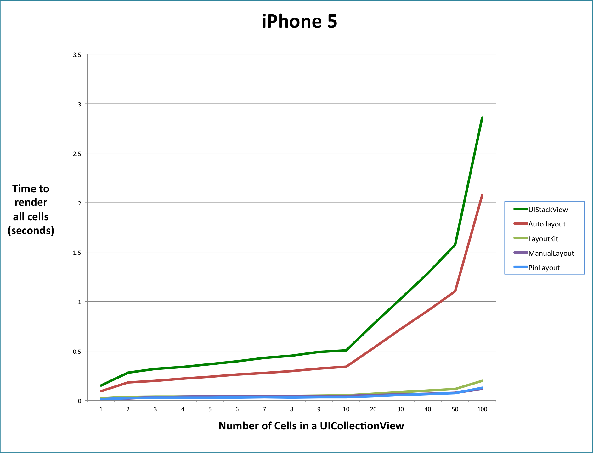
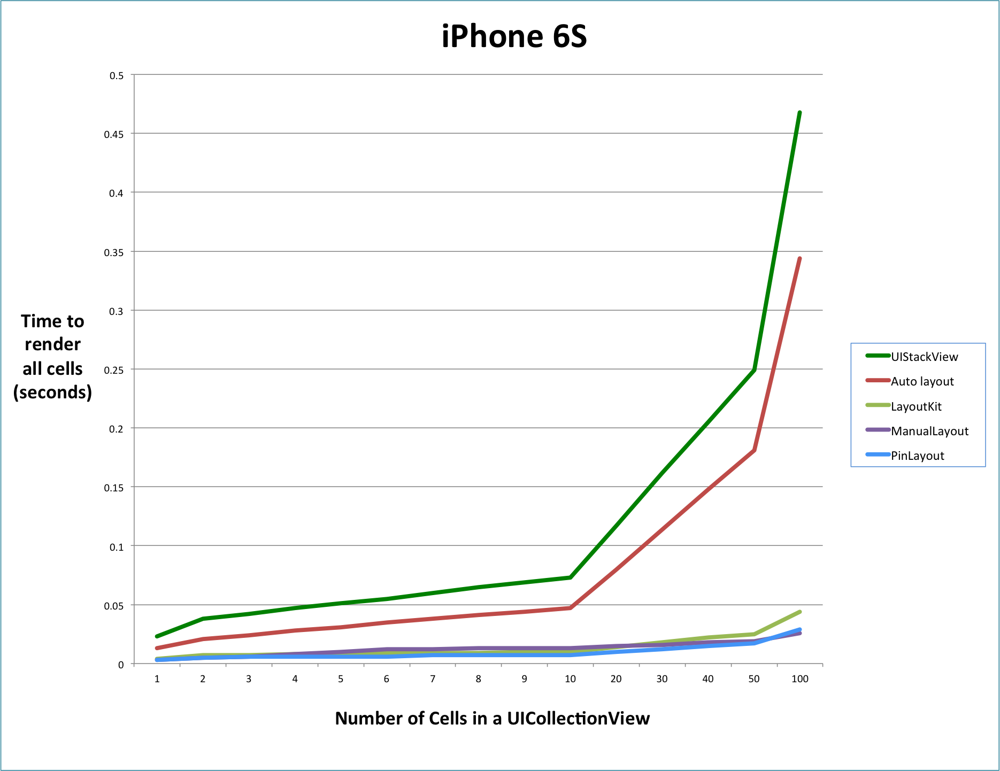
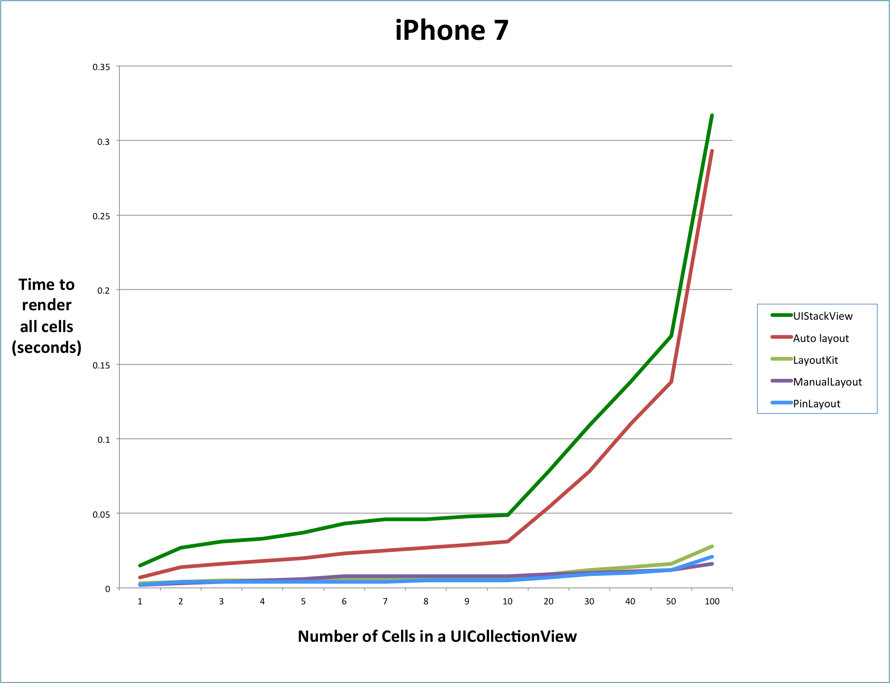

<p align="center">
	
</p>

<h1 align="center" style="color: #376C9D; font-family: Arial Black, Gadget, sans-serif; font-size: 1.5em">PinLayout Benchmark</h1>

* [Methodology](#methodology)
* [Results](#results)
* [Benchmark Source code](#source_code_compare)

<br>

## Methodology  <a name="methodology"></a>

##### LayoutKit Benchmark
PinLayout's performance has been tested using a fork of [LayoutKit](https://github.com/mirego/LayoutKit). LayoutKit include an example app with a really nice and simple benchmark. It is used to compare LayoutKit with Auto layout, UIStackViews and manual layouting. 

The benchmark has been modified to also include [PinLayout](https://github.com/mirego/LayoutKit/blob/master/LayoutKitSampleApp/Benchmarks/FeedItemPinLayoutView.swift). Remark in the implemantation that PinLayout's layout code is concise, clean and doesn't contain any computation [compared to Manual Layouting source code](#source_code_compare).


The benchmark include tests for the following layout systems:

* Auto layout
* Auto layout using UIStackViews
* LayoutKit
* Manual layout (i.e. set UIView's frame directly)
* PinLayout

Anyone who would like to integrate any other layout frameworks to this GitHub repository is welcome.

##### Benchmark details
The LayoutKit benchmark layout UICollectionView and UITableView cells in multiple pass, each pass contains more cells than the previous one. The **X axis** in following charts indicates the **number of cells** contained for each pass. The **Y axis** indicates the **number of seconds** to render all cells from one pass.

##### Benchmark cell layout
Here are the benchmark rendering results to compare visual results:
 
* [Auto layout rendering result](Benchmark/Benchmark-Autolayout.png)
* [PinLayout rendering result](Benchmark/Benchmark-PinLayout.png)
* [LayoutKit rendering result](Benchmark/Benchmark-LayoutKit.png)

<br>

## Results <a name="results"></a>

As you can see in the following charts, PinLayout's performance is as fast as manual layouting, and **between 12x and 16x faster than auto layout**, for all types of iPhone (5/6/6S/7). [LayoutKit](https://github.com/linkedin/LayoutKit) is also really fast, slightly slower than PinLayout and manual layouting.

These results means that PinLayout is faster than any layout frameworks that is built over auto layout (SnapKit, Stevia, PureLayout, ...). 

For example it took 611 miliseconds to render 100 UICollectionView's cells using Auto layout on a iPhone 6 compared to 53 miliseconds for PinLayout. Its 12 time faster.

<br>

#### PinLayout performance compared to  Auto layout when layouting 100 UICollectionView's cells

|           | PinLayout performance compared to  Auto layout | Auto layout time  (seconds) | PinLayout time  (seconds) |
|:---------:|:-----------------------------------------------------------------------:|:---------------------------:|:-------------------------:|
|  iPhone 5 |                                16x Faster                               |            2.074            |           0.126           |
|  iPhone 6 |                                12x Faster                               |            0.611            |           0.053           |
| iPhone 6S |                                12x Faster                               |            0.344            |           0.029           |
|  iPhone 7 |                                14x Faster                               |            0.293            |           0.021           |

<br>

#### Benchmark charts  

:pushpin: You can see the benchmark raw data in this [spreadsheet](Benchmark/Benchmark.xlsx).


<p align="center">
  <a href=""></a>
  
<p align="center">
  <a href=""></a>

<p align="center">
  <a href=""></a>
  
<p align="center">
  <a href=""></a>
  

<br>

## Benchmark Source code <a name="source_code_compare"></a>

[PinLayout's layout source code](#pinlayout_code) is concise, clean and doesn't contain any computation as [Manual Layouting source code](#manual_code)

### PinLayout benchmark source code <a name="pinlayout_code"></a>

```
override func layoutSubviews() {
    super.layoutSubviews()
    
    let hMargin: CGFloat = 8
    let vMargin: CGFloat = 2
    
    optionsLabel.pin.topRight().margin(hMargin)
    actionLabel.pin.topLeft().margin(hMargin)
    
    posterImageView.pin.below(of: actionLabel, aligned: .left).marginTop(10)
    posterNameLabel.pin.right(of: posterImageView, aligned: .top).margin(-6, 6).right(hMargin).sizeToFit()
    posterHeadlineLabel.pin.below(of: posterNameLabel, aligned: .left).right(hMargin).marginTop(1).sizeToFit()
    posterTimeLabel.pin.below(of: posterHeadlineLabel, aligned: .left).right(hMargin).marginTop(1).sizeToFit()
    
    posterCommentLabel.pin.below(of: posterTimeLabel).left(hMargin).right().right(hMargin)
        .marginTop(vMargin).sizeToFit()
    
    contentImageView.pin.below(of: posterCommentLabel).hCenter().width(100%).sizeToFit()
    contentTitleLabel.pin.below(of: contentImageView).left().right().marginHorizontal(hMargin).sizeToFit()
    contentDomainLabel.pin.below(of: contentTitleLabel, aligned: .left).right().marginRight(hMargin)
        .sizeToFit()
    
    likeLabel.pin.below(of: contentDomainLabel, aligned: .left).marginTop(vMargin)
    commentLabel.pin.top(to: likeLabel.edge.top).hCenter(50%)
    shareLabel.pin.top(to: likeLabel.edge.top).right().marginRight(hMargin)
    
    actorImageView.pin.below(of: likeLabel, aligned: .left).marginTop(vMargin)
    actorCommentLabel.pin.right(of: actorImageView, aligned: .center).marginLeft(4)
}
```

<br>

#### Manual layouting benchmark source code <a name="manual_code"></a>

``` 
override func layoutSubviews() {
    super.layoutSubviews()
    
    optionsLabel.frame = CGRect(x: bounds.width-optionsLabel.frame.width, y: 0, 
                                width: optionsLabel.frame.width, height: optionsLabel.frame.height)
    actionLabel.frame = CGRect(x: 0, y: 0, width: bounds.width-optionsLabel.frame.width, height: 0)
    actionLabel.sizeToFit()

    posterImageView.frame = CGRect(x: 0, y: actionLabel.frame.bottom, 
                                   width: posterImageView.frame.width, height: 0)
    posterImageView.sizeToFit()

    let contentInsets = UIEdgeInsets(top: 0, left: 1, bottom: 2, right: 3)
    let posterLabelWidth = bounds.width-posterImageView.frame.width - contentInsets.left - 
                           contentInsets.right
    posterNameLabel.frame = CGRect(x: posterImageView.frame.right + contentInsets.left, 
                                   y: posterImageView.frame.origin.y + contentInsets.top, 
                                   width: posterLabelWidth, height: 0)
    posterNameLabel.sizeToFit()

    let spacing: CGFloat = 1
    posterHeadlineLabel.frame = CGRect(x: posterImageView.frame.right + contentInsets.left, 
                                       y: posterNameLabel.frame.bottom + spacing, 
                                       width: posterLabelWidth, height: 0)
    posterHeadlineLabel.sizeToFit()

    posterTimeLabel.frame = CGRect(x: posterImageView.frame.right + contentInsets.left, 
                                   y: posterHeadlineLabel.frame.bottom + spacing, width: posterLabelWidth, 
                                   height: 0)
    posterTimeLabel.sizeToFit()

    posterCommentLabel.frame = CGRect(x: 0, y: max(posterImageView.frame.bottom, 
                                                   posterTimeLabel.frame.bottom + 
                                                   contentInsets.bottom), 
                                      width: frame.width, height: 0)
    posterCommentLabel.sizeToFit()

    contentImageView.frame = CGRect(x: frame.width/2 - contentImageView.frame.width/2, 
                                    y: posterCommentLabel.frame.bottom, width: frame.width, height: 0)
    contentImageView.sizeToFit()

    contentTitleLabel.frame = CGRect(x: 0, y: contentImageView.frame.bottom, width: frame.width, height: 0)
    contentTitleLabel.sizeToFit()

    contentDomainLabel.frame = CGRect(x: 0, y: contentTitleLabel.frame.bottom, width: frame.width, height: 0)
    contentDomainLabel.sizeToFit()

    likeLabel.frame = CGRect(x: 0, y: contentDomainLabel.frame.bottom, width: 0, height: 0)
    likeLabel.sizeToFit()

    commentLabel.sizeToFit()
    commentLabel.frame = CGRect(x: frame.width/2-commentLabel.frame.width/2, 
                                y: contentDomainLabel.frame.bottom, 
                                width: commentLabel.frame.width, height: commentLabel.frame.height)

    shareLabel.sizeToFit()
    shareLabel.frame = CGRect(x: frame.width-shareLabel.frame.width, y: contentDomainLabel.frame.bottom, 
                              width: shareLabel.frame.width, height: shareLabel.frame.height)

    actorImageView.frame = CGRect(x: 0, y: likeLabel.frame.bottom, width: 0, height: 0)
    actorImageView.sizeToFit()

    actorCommentLabel.frame = CGRect(x: actorImageView.frame.right, y: likeLabel.frame.bottom, 
                                     width: frame.width-actorImageView.frame.width, height: 0)
    actorCommentLabel.sizeToFit()
}
```

<br>


