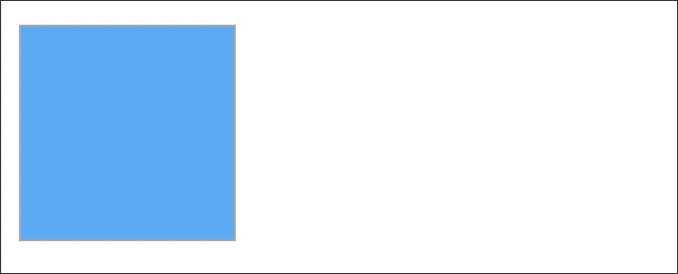

<p align="center">
	
</p>

<h1 align="center" style="color: #376C9D; font-family: Arial Black, Gadget, sans-serif; font-size: 1.5em">Animations using PinLayout</h1>

## Basic Swift animations
Before explaining how to use PinLayout to animate views, you can check these two nice tutorials to learn the basic of animations:

* [iOS Animation Tutorial: Getting Started](https://www.raywenderlich.com/363-ios-animation-tutorial-getting-started)
* [Basic UIView Animation Tutorial: Getting Started](https://www.raywenderlich.com/5255-basic-uiview-animation-tutorial-getting-started)


## PinLayout is stateless
It is important to remember that PinLayout is stateless, i.e. PinLayout always start from the view's current position and size (frame) when layouting a view. You don't need to reset anything to animate a view using PinLayout.

This also means that you can modify only the property you want to animate, for example the following code will only animate the view's width:
 
```
   UIView.animate(withDuration: 0.3) { 
      view.pin.width(30)
   }
``` 

</br>

## Layout strategies
Multiple strategies can be used to animate layout using PinLayout. The choice is  a question of preferences and the kind of animations you want to achieve.

Some possible strategies will be shown below using a simple example. The example animates a view position from left to right when the user tap a button.



Note that in the following source code the view's size was set to 150 px (`view.pin.size(150)`) in the initialization.


### Basic strategy: Using `UIView.setNeedsLayout` and  `UIView.layoutIfNeeded`
In this strategy, to force a call to layoutSubviews(), we call `UIView.setNeedsLayout` and  `UIView.layoutIfNeeded` from the animation block.

```swift
var isViewLeftDocked = true

override func layoutSubviews() {
   super.layoutSubviews()

   if isViewLeftDocked {
      view.pin.top().left()
   } else {
      view.pin.top().right()
   }
}

func didTapTogglePosition() {
   isViewLeftDocked = !isViewLeftDocked
      
   UIView.animate(withDuration: 0.3) {
      self.setNeedsLayout()
      self.layoutIfNeeded()
   }
}
```

### Using a layout method
This strategy use a private method to layout the animated view (`layoutAnimatedView()`). The advantage of this solution is that it is not required to call `UIView.setNeedsLayout` and  `UIView.layoutIfNeeded` to relayout the view. 

```swift
var isViewLeftDocked = true

override func layoutSubviews() {
   super.layoutSubviews()
   
   layoutAnimatedView()
}

private func layoutAnimatedView() {
   if isViewLeftDocked {
      view.pin.top().left()
   } else {
      view.pin.top().right()
   }
}

func didTapTogglePosition() {
   isViewLeftDocked = !isViewLeftDocked
   
   UIView.animate(withDuration: 0.3) { 
      self.layoutAnimatedView()
   }
}
```

### Using an animation state
This strategy is similar to the previous one, but use an enumeration to keep the animation state.

```swift
enum AnimationState {
   case leftDocked
   case rightDocked
}

var animationState = AnimationState.leftDocked

override func layoutSubviews() {
   super.layoutSubviews()
   
   layoutAnimatedView()
}

private func layoutAnimatedView() {
   switch animationState {
   case .leftDocked:
      view.pin.top().left()
   case .rightDocked:
      view.pin.top().right()
   }
}

func didTapTogglePosition() {
   switch animationState {
   case .leftDocked: animationState = .rightDocked
   case .rightDocked: animationState = .leftDocked
   }
   
   UIView.animate(withDuration: 0.3) {
      self.layoutAnimatedView()
   }
}
```

### Other strategies
It's really up to you to think of animation's strategies that match your situation. With PinLayout you are always in control of everything, including animations.

</br>

## Collision between animations and `layoutSubViews()`
In some particular situation it is possible that `layoutSubViews()` may be called during the animation is in progress, this can occur particularly on long animation. To handle this kind of situation it is possible to use a boolean indicating if an animation is in progress, and to block temporarely the layout of animated views in `layoutSubViews()`.

Here is an example: 

```swift
enum AnimationState {
   case leftDocked
   case rightDocked
}

var animationState = AnimationState.leftDocked
var isAnimating = false

override func layoutSubviews() {
   super.layoutSubviews()
   
   // If an animation of the view is in progress, we don't update animated views position.
   guard !isAnimating else { return }
   layoutAnimatedView()
}

private func layoutAnimatedView() {
   switch animationState {
   case .leftDocked:
      view.pin.top().left()
   case .rightDocked:
      view.pin.top().right()
   }
}

func didTapTogglePosition() {
   switch animationState {
   case .leftDocked: animationState = .rightDocked
   case .rightDocked: animationState = .leftDocked
   }
   
   UIView.animate(withDuration: 0.3, animations: {
      self.isAnimating = true
      self.layoutAnimatedView()
   }, completion: { (_) in
      self.isAnimating = false
   })
}
```

</br>

## Animation Example
You can check the animation example available in the [PinLayout's Example App](https://github.com/layoutBox/PinLayout/blob/master/docs/examples.md):

[Source code](https://github.com/layoutBox/PinLayout/blob/master/Example/PinLayoutSample/UI/Examples/Animations/AnimationsView.swift)


