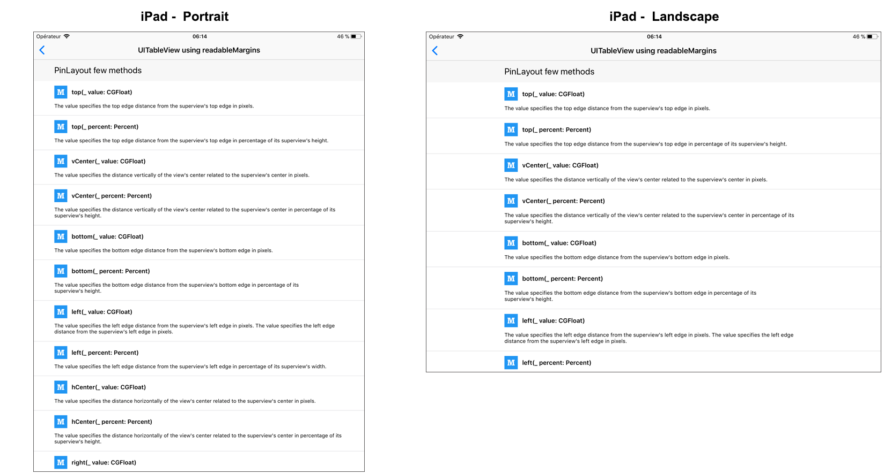
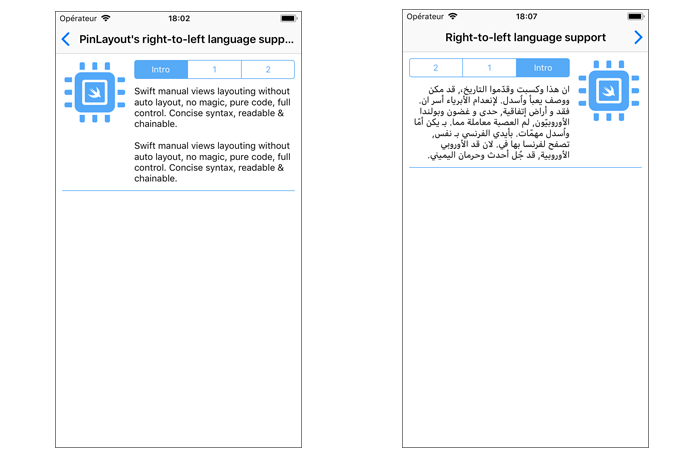
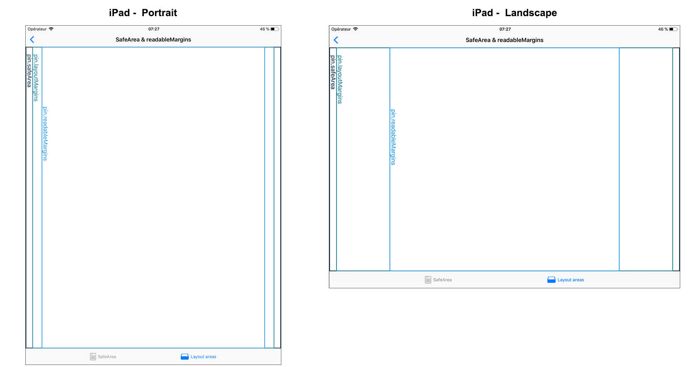
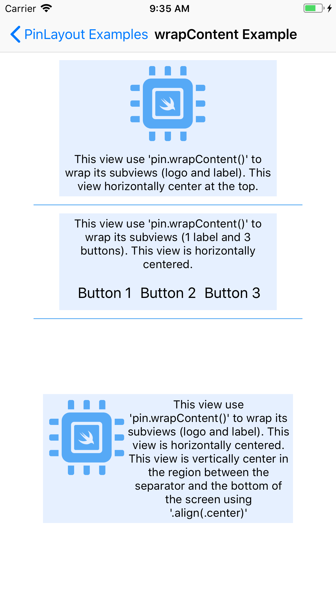
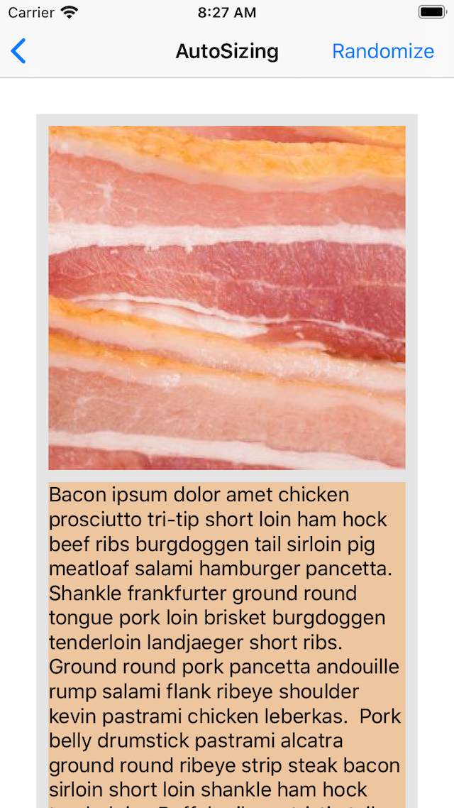

	

<h1 align="center" style="color: #376C9D; font-family: Arial Black, Gadget, sans-serif; font-size: 1.5em"> Examples </h1>

The PinLayout's Example exposes some usage example of PinLayout.

The Example App is available in the [`Example`](https://github.com/layoutBox/PinLayout/tree/master/Example) folder. 

### Running the Example app
1. Do a `pod install` from the PinLayout root directory.
2. Open the newly generated `PinLayout.xcworkspace` Xcode workspace.
3. Select the `PinLayoutSample` target.
4. Run the app on your device or simulator.

 

## Intro Example
PinLayout introduction example presented in the README.

[Source code](https://github.com/layoutBox/PinLayout/blob/master/Example/PinLayoutSample/UI/Examples/Intro/IntroView.swift)

## Relative Edges Layout Example 
Example showing how to layout views relative to other views.

[Source code](https://github.com/layoutBox/PinLayout/blob/master/Example/PinLayoutSample/UI/Examples/RelativeView/RelativeView.swift)

## Between Example
Example showing how to use [`horizontallyBetween()`](https://github.com/layoutBox/PinLayout#layout-between-other-views) to position a view between two other views.
[Source code](https://github.com/layoutBox/PinLayout/blob/master/Example/PinLayoutSample/UI/Examples/BetweenView/BetweenView.swift)

## UITableView Example
Example using a UITableView with variable height cells.

[Source code](https://github.com/layoutBox/PinLayout/blob/master/Example/PinLayoutSample/UI/Examples/TableViewExample/TableViewExampleView.swift)

## UITableView Example with cells using  `pin.readableMargins`
Similar to the UITableView Example, but in this one cells use `pin.readableMargins` to layout their content inside the zone defined by `UIView.readableContentGuide`.

[Source code](https://github.com/layoutBox/PinLayout/blob/master/Example/PinLayoutSample/UI/Examples/TableViewExample/TableViewExampleView.swift)

## UICollectionView Example
Example using a UICollectionView with variable height cells.

[Source code](https://github.com/layoutBox/PinLayout/blob/master/Example/PinLayoutSample/UI/Examples/CollectionViewExample/HouseCell.swift)

## Animations Example
Example showing how to animate views with PinLayout.

[Source code](https://github.com/layoutBox/PinLayout/blob/master/Example/PinLayoutSample/UI/Examples/Animations/AnimationsView.swift)

## Right to left language support Example
This example show how PinLayout can support simultaneously Left to right and right to left languages.

[Source code](https://github.com/layoutBox/PinLayout/blob/master/Example/PinLayoutSample/UI/Examples/IntroRTL/IntroRTLView.swift)

## pin.safeArea example
Example showing the usage of `UIView.pin.safeArea`] with UINavigationController and UITabViewController:

[Source code](https://github.com/layoutBox/PinLayout/blob/master/Example/PinLayoutSample/UI/Examples/SafeArea/SafeAreaView.swift)

Also display the usage of `pin.readableMargins` and `pin.layoutMargins`:

[Source code](https://github.com/layoutBox/PinLayout/blob/master/Example/PinLayoutSample/UI/Examples/SafeArea/SafeAreaAndMarginsView.swift)

## Adjust To Container Example
Example showing how PinLayout can be used to adjust the layout depending of the space available.

In this example the UISegmentedControl is shown below its label if the available width is smaller than 500 pixels, or on the same line as the label if the width is wider.

[Source code](https://github.com/layoutBox/PinLayout/blob/master/Example/PinLayoutSample/UI/Examples/AdjustToContainer/Subviews/ChoiceSelectorView.swift)

## wrapContent Example
This example show how to use the `wrapContent()` method. This method is particularly useful to wrap a group of views and center them.

[Source code](https://github.com/layoutBox/PinLayout/blob/master/Example/PinLayoutSample/UI/Examples/WrapContent/WrapContentView.swift)

## Form Example
This example is a basic form containing 4 fields. 

[Source code](https://github.com/layoutBox/PinLayout/blob/master/Example/PinLayoutSample/UI/Examples/Form/FormView.swift)

## Auto Adjusting Size Example
This example show how fixed size views and expandable views can be layouted using PinLayout to fill the available space.

[Source code](https://github.com/layoutBox/PinLayout/blob/master/Example/PinLayoutSample/UI/Examples/AutoAdjustingSize/AutoAdjustingSizeView.swift)

## Automatic Sizing Example
This example show how to use Automatic Sizing (`autoSizeThatFits()`) to compute views size. 
[Source code](https://github.com/layoutBox/PinLayout/tree/master/Example/PinLayoutSample/UI/Examples/AutoSizing)

